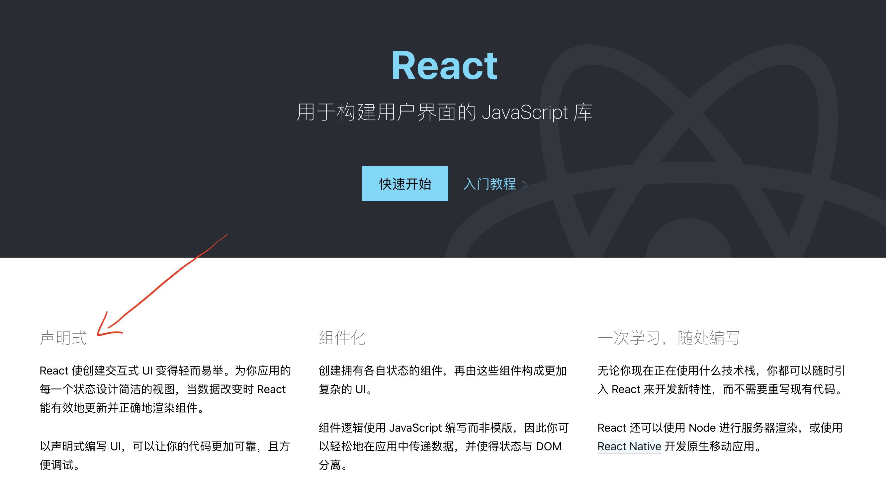

# 深入理解 JSX

> react 官网说 react 的特性之一就是“声明式”，react 正是使用 JSX 来声明的，JSX 是一个 JavaScript 的语法扩展。



## 1. 为什么是 JSX

### 1.1 JSX 直观且高效

如果不使用 JSX 进行 react 应用开发，你还可以使用原生 JS。

例如：需要构建一个链接

```js
<a class="link" href="https://github.com/facebook/react">React<a>
```

```js
// 原生js 创建元素
var a = document.createElement("a");
a.setAttribute("class", "link");
a.setAttribute("href", "https://github.com/facebook/react");
a.appendChild(document.createTextNode("React"));
```

```js
// 使用react的方法创建
var a = React.createElement(
  "a",
  {
    className: "link",
    href: "https://github.com/facebook/react",
  },
  "React"
);
```

```js
// 使用JSX创建
var root =(
  <a class="link" href="https://github.com/facebook/react">React<a>
);
```

**很明显，JSX 最像 HTML 语法，写起来直观、高效。**

### 1.2 React 为什么不用模板

> 大多数框架使用的是模板引擎来组织 dom，但是模板语言也是一门语言，会增加学习门槛。

#### Angular 中

```js
<div ng-if="person != null">
    Welcome back, <b>{{person.firstName}} {{person.lastName}}</b>!
</div>
<div ng-if="person == null">
    Please log in.
</div>
```

#### Vue 中

```html
// html模板
<div id="app">{{ message }}</div>
```

```js
var app = new Vue({
  el: "#app",
  data: {
    message: "Hello Vue!",
  },
});
```

渲染结果： Hello Vue！

（说明：vue 中也是可以使用 JSX 的，但是 vue 推荐使用模板。）

#### React 中

React 认为渲染逻辑本质上与其他 UI 逻辑内在耦合，比如，在 UI 中需要绑定处理事件、在某些时刻状态发生变化时需要通知到 UI，以及需要在 UI 中展示准备好的数据。

React 并没有采用将标记与逻辑进行分离到不同文件这种人为地分离方式，而是通过将二者共同存放在称之为“组件”的松散耦合单元之中，来实现关注点分离(HTML、CSS、JS 就是关注点分离的例子)。[关注点分离](https://zh.wikipedia.org/wiki/%E5%85%B3%E6%B3%A8%E7%82%B9%E5%88%86%E7%A6%BB)

所以，React 使用 JSX，在 JavaScript 代码中将 JSX 和 UI 放在一起时，会 **在视觉上有辅助作用**。

## 2. 使用 JSX

### 2.1 JSX 中嵌入表达式

直接在大括号中使用变量

```js
const name = "Josh Perez";
const element = <h1>Hello, {name}</h1>;

ReactDOM.render(element, document.getElementById("root"));
```

直接在大括号中使用函数

```js
function formatName(user) {
  return user.firstName + " " + user.lastName;
}

const user = {
  firstName: "Harper",
  lastName: "Perez",
};

const element = <h1>Hello, {formatName(user)}!</h1>;

ReactDOM.render(element, document.getElementById("root"));
```

### 2.2 JSX 本身就是表达式

> 表达式会返回结果，可以用来做判断、赋值等

在 if 语句和 for 循环的代码块中使用 JSX

```js
function getGreeting(user) {
  if (user) {
    return <h1>Hello, {formatName(user)}!</h1>;
  }
  return <h1>Hello, Stranger.</h1>;
}
```

### 2.2 JSX 特定属性

属性值指定为字符串字面量

```js
const element = <div tabIndex="0"></div>;
```

属性值中插入一个 JavaScript 表达式

```js
const element = </img>;
```

## 3. JSX 做了什么

JSX 在编译时会被 Babel 编译为 React.createElement 方法。

也就是说，这里的 JSX 就是 React.createElement 方法的语法糖。

以下两种示例代码完全等效：

```js
const element = <h1 className="greeting">Hello, world!</h1>;
```

```js
const element = React.createElement(
  "h1",
  { className: "greeting" },
  "Hello, world!"
);
```

实际最终返回的是一个“React 元素”,它们描述了你希望在屏幕上看到的内容。<span style="color: #ff5050">React 通过读取这些对象，然后使用它们来构建 DOM 以及保持随时更新</span>。

```js
// 最终返回的“React 元素”
{
  $$typeof: [object Symbol] { ... },
  _owner: null,
  _store: [object Object] { ... },
  key: null,
  props: [object Object] {
    children: "Hello World!"
  },
  ref: null,
  type: "div"
}
```

[Babel 编译 JSX 示例](https://babeljs.io/repl#?browsers=defaults%2C%20not%20ie%2011%2C%20not%20ie_mob%2011&build=&builtIns=false&spec=false&loose=false&code_lz=DwEwlgbgBGILwCIBOB7FAXBA-AUFKAEgKYA2JKUA6ikiSAIQ7AD04EWQA&debug=false&forceAllTransforms=false&shippedProposals=false&circleciRepo=&evaluate=false&fileSize=false&timeTravel=false&sourceType=module&lineWrap=true&presets=env%2Creact%2Cstage-2&prettier=false&targets=&version=7.12.10&externalPlugins=)

### 3.1 JSX 创建 React 元素(源码)

React.createElement 源码
[React.createElement](https://github.com/facebook/react/blob/cdfde3ae110844baf068706e7ed3fe97ec15f1d7/packages/react/src/ReactElement.js#L348)

可以看到，createElement 方法返回了 ReactElement()函数

```js
export function createElement(type, config, children) {
  let propName;

  // Reserved names are extracted
  const props = {};

  let key = null;
  let ref = null;
  let self = null;
  let source = null;

  ...

  // Children can be more than one argument, and those are transferred onto
  // the newly allocated props object.
  ...

  // Resolve default props
  ...

  return ReactElement(
    type,
    key,
    ref,
    self,
    source,
    ReactCurrentOwner.current,
    props,
  );
}
```

ReactElement 方法做了什么？

[ReactElement()方法](https://github.com/facebook/react/blob/cdfde3ae110844baf068706e7ed3fe97ec15f1d7/packages/react/src/ReactElement.js#L146)

```js
// 源码中的 ReactElement 方法
const ReactElement = function(type, key, ref, self, source, owner, props) {
  const element = {
    // This tag allows us to uniquely identify this as a React Element
    $$typeof: REACT_ELEMENT_TYPE,

    // Built-in properties that belong on the element
    type: type,
    key: key,
    ref: ref,
    props: props,

    // Record the component responsible for creating this element.
    _owner: owner,
  };

  ...

  return element;
};
```

再来多看一个元素类型 “REACT_ELEMENT_TYPE”:

```js
import { REACT_ELEMENT_TYPE } from "shared/ReactSymbols";
```

[REACT_ELEMENT_TYPE](https://github.com/facebook/react/blob/cdfde3ae110844baf068706e7ed3fe97ec15f1d7/packages/shared/ReactSymbols.js#L16)

“The Symbol used to tag the ReactElement-like types.” ，从源码中这句注释我们知道，packages/shared/ReactSymbols.js 导出的这些 tag 是为了标记一下"react 元素"的类型。

```js
export let REACT_ELEMENT_TYPE = 0xeac7;
```

### 3.2 如何实现一个 JSX 渲染器

## 参考

[JSX 简介](https://zh-hans.reactjs.org/docs/introducing-jsx.html)

[深入理解 JSX](https://react.iamkasong.com/preparation/jsx.html#jsx%E7%AE%80%E4%BB%8B)

[JSX 是什么鬼](https://zhuanlan.zhihu.com/p/27657808)
