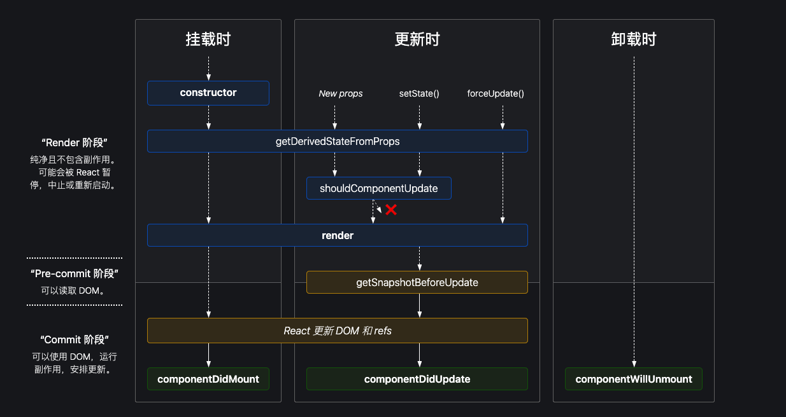
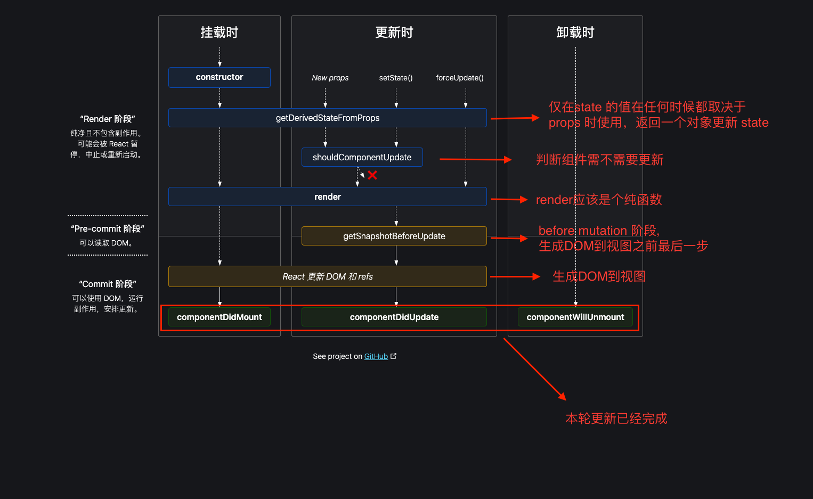

# React 生命周期方法

**说明：**

> 本文源码来之 React 17.0.2；
> 官方不推荐的一些生命周期方法这里不做讨论。

**React version >= 16.4 生命周期图**



## 1. 什么是 React 生命周期函数

React 的 **Class Component** 的在 render、commit 各个阶段会调用特定的方法，它们就是 React **Class Component** 的<span style="color: #ff0000; font-size: 16px;">生命周期方法</span>。

所以，说**React 生命周期方法**是不准确的，准确的说法应该是：**React 的 Class Component 的生命周期方法**。

上面 👆 的生命周期图可以清除地看到 Class Component 在不同状态下执行**生命周期方法**的过程。

## 2. 生命周期方法何时执行

在 react-dom 源码中有个 [beginWork](https://github.com/facebook/react/blob/master/packages/react-reconciler/src/ReactFiberBeginWork.old.js#L3228) 方法，它是 React 在 **Reconciler 阶段**递归 Fiber 节点的方法，任何类型的 Fiber 节点在 Mount 或 Update 时都要被它处理。对这个方法不熟悉的同学可以看一下我的另一篇文章[React 源码(一) 整体流程](https://www.shushuo.me/#/react/react_code1).

```js
function beginWork(current, workInProgress, renderLanes) {
  ...
  switch (workInProgress.tag) {
    ...
    // 处理 ClassComponent
    case ClassComponent:
      {
        var _Component2 = workInProgress.type;
        var _unresolvedProps = workInProgress.pendingProps;

        var _resolvedProps = workInProgress.elementType === _Component2 ? _unresolvedProps : resolveDefaultProps(_Component2, _unresolvedProps);

        return updateClassComponent(current, workInProgress, _Component2, _resolvedProps, renderLanes);
      }
      ...
  }
}
```

我们重点看一下 updateClassComponent 这个方法，重方法名可以看出，它的主要功能就是**更新 Class Component**.

_updateClassComponent 部分源码:_

```js
/*
 * current: 上次更新的当前 Fiber节点
 * workInProgress: 当前更新的 Fiber节点
 * Component：当前节点本次更新的 React Element(一般由 JSX转译而来)
 * nextProps：传入组件的 props
 * renderLanes： 更新优先级
 */
function updateClassComponent(
  current,
  workInProgress,
  Component,
  nextProps,
  renderLanes
) {
  ...

  // 处理 context 的，暂时不管
  if (isContextProvider(Component)) {
    hasContext = true;
    pushContextProvider(workInProgress);
  } else {
    hasContext = false;
  }

  prepareToReadContext(workInProgress, renderLanes);
  // instance 是 ClassCom实例
  // 一个instance实例如下：
  // {
  ///   name: "My name is ClassCom"
  //    props: {name: "123"}
  //    refs: {}
  //    state: {count: 2}
  //    updater: {
  //      enqueueForceUpdate: ƒ (inst, callback)
  //      enqueueReplaceState: ƒ (inst, payload, callback)
  //      enqueueSetState: ƒ (inst, payload, callback)
  //      isMounted:
  //    }
  // }
  var instance = workInProgress.stateNode;
  var shouldUpdate;

  // 挂载（Mount）时 instance 为 null
  if (instance === null) {
    // 挂载时 current 为 null
    if (current !== null) {
      current.alternate = null;
      workInProgress.alternate = null;

      workInProgress.flags |= Placement;
    }

    // 执行 Class Component 的 钩子方法 🪝 constructor 方法 🪝 🌟🌟
    // 执行 Class Component 的 钩子方法 🪝 getDerivedStateFromProps 🪝 🌟🌟
    //（ 如果想验证上面的结论，可以先在 Class Component 的 constructor 方法中随便打印一些东西，
    // 然后，在这里打断点，可以看到执行完这个断点后打印的东西会被输出。）
    constructClassInstance(workInProgress, Component, nextProps);
    mountClassInstance(workInProgress, Component, nextProps, renderLanes);
    shouldUpdate = true;
  } else if (current === null) { // update 时，且 current 为 null 会进入这里
    shouldUpdate = resumeMountClassInstance(
      workInProgress,
      Component,
      nextProps,
      renderLanes
    );
  } else { // update 时会进入这里
    // 更新 Class Component
    // 这里最终会调用 钩子方法 🪝 shouldComponentUpdate 🪝 🌟🌟，会返回一个 Boolean，用来确定是不是需要更新组件
    shouldUpdate = updateClassInstance(
      current,
      workInProgress,
      Component,
      nextProps,
      renderLanes
    );
  }

  // finishClassComponent 会调用生命周期钩子方法 🪝 render 🪝 🌟🌟
  // 返回 workInProgress.child
  var nextUnitOfWork = finishClassComponent(
    current,
    workInProgress,
    Component,
    shouldUpdate,
    hasContext,
    renderLanes
  );

  ...

  return nextUnitOfWork;
}
```

根据 React 工作流，我们知道，Render 阶段主要是获取 workInProgressFiber 的更新信息，然后交给 commit 阶段处理。

commit 阶段的详细情况可以看我的另一篇文章[React 源码(一) 整体流程](https://www.shushuo.me/#/react/react_code1)：

事实上，**commit 阶段又细分为 3 个阶段：**

- <code style="color: #708090; background-color: #F5F5F5; font-size: 18px">before mutation 阶段</code>
- <code style="color: #708090; background-color: #F5F5F5; font-size: 18px">mutation 阶段</code>： 会处理第一张生命周期图中的 <code style="color: #708090; background-color: #F5F5F5; font-size: 18px">“React 更新 ­D­O­M 和 refs”</code>,<span style="color: #ff0000; font-size: 16px;">会更新 DOM 到视图</span>
- <code style="color: #708090; background-color: #F5F5F5; font-size: 18px">layout 阶段</code>：会处理第一张生命周期图中的 <code style="color: #708090; background-color: #F5F5F5; font-size: 18px">componentDidMount</code>、<code style="color: #708090; background-color: #F5F5F5; font-size: 18px">componentDidUpdate</code>、<code style="color: #708090; background-color: #F5F5F5; font-size: 18px">componentWillUnmount</code>

这里所说的 **before mutation 阶段**就在第一张生命周期图中的 **“Pre-commit 阶段”**内。

[commitBeforeMutationEffects](https://github.com/facebook/react/blob/05ec0d7646b463dcbd64f3a2575f4bb992f7e423/packages/react-reconciler/src/ReactFiberCommitWork.old.js#L272)就是 **before mutation 阶段** 的入口函数。

经过一些列的处理，会调用 生命周期钩子方法 🪝 [getSnapshotBeforeUpdate](https://github.com/facebook/react/blob/05ec0d7646b463dcbd64f3a2575f4bb992f7e423/packages/react-reconciler/src/ReactFiberCommitWork.old.js#L411) 🪝 🌟🌟

**经过分析，我们给上面的图加一些注释**



## 3. 生命周期方法如何使用

### 3.1 constructor

**DO**

- 初始化 state

**DON'T**

- 任何副作用（如 AJAX 请求等）

### 3.2 static getDerivedStateFromProps()

**DO**

- 适用于罕见的用例，即 state 的值在任何时候都取决于 props

**DON'T**

- 任何其他事情

### 3.3 shouldComponentUpdate(nextProps, nextState)

**DO**

- 只用于提高性能较差的组件的性能

**DON'T**

- 副作用（如 AJAX 请求等）
- 要企图依靠此方法来“阻止”渲染
- 在这里进行深层比较或使用 JSON.stringify()，这样非常影响效率，且会损害性能

### 3.4 render

**DO**

- 纯函数，返回 JSX

**DON'T**

- 任何其他事情

### 3.5 getSnapshotBeforeUpdate(prevProps, prevState)

**DO**

- 最近一次渲染输出（提交到 DOM 节点）之前调用，它使得组件能在发生更改之前从 DOM 中捕获一些信息（例如，滚动位置）

**DON'T**

- 任何其他事情

### 3.6 componentDidMount()

**DO**

- 副作用（如 AJAX 请求等）

**DON'T**

- 调用 this.setState，因为这会导致重新渲染

### 3.7 componentDidUpdate(prevProps, prevState, snapshot)

**DO**

- 副作用（如 AJAX 请求等）

**DON'T**

- 调用 this.setState，因为这会导致重新渲染

### 3.8 componentWillUnmount()

**DO**

- 删除所有在组件生命周期内创建的**定时器**或**监听器**

**DON'T**

- 调用 this.setState，创建**监听器**或**定时器**

## 参考

官网 -- [State & 生命周期](https://zh-hans.reactjs.org/docs/state-and-lifecycle.html)

经典的 React 生命周期图 -- [react lifecycle methods diagram](https://projects.wojtekmaj.pl/react-lifecycle-methods-diagram/)

不错的 React 17 生命周期 Blog -- [React 17 lifecycle](https://medium.com/@valerii.sukhov/react-17-lifecycle-5b68946c813c)

总结很到位的 Blog -- [React Lifecycle Methods – A Deep Dive](https://programmingwithmosh.com/javascript/react-lifecycle-methods/)
