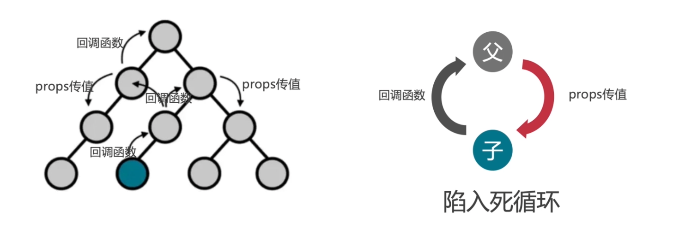

# React 组件之间的通信

> 组件组成了应用，一个应用中，组件的协同运作就需要通信。

## 1. 各组件间的通信方式

\*\*组件间的通信共 4 种类：

- 父组件 -> 子组件

  1. Props 传递
  2. Instance Methods

- 子组件 -> 父组件

  1. Callback Function
  2. Event 冒泡

- 兄弟组件之间：

  1. Parent Component

- 无嵌套的组件间通信
  1. Context
  2. Portals
  3. 全局变量
  4. 观察者模式
  5. Redux、Mobx 等

## 2. 子组件 -> 父子组

Redux 用自己的方式实现了应用的**全局状态管理**。

## 3. 兄弟组件之间

## 4. 无嵌套的组件间通信

## 参考

[30 分钟精通十种 React 组件之间通信的方法](https://segmentfault.com/a/1190000023585646)
