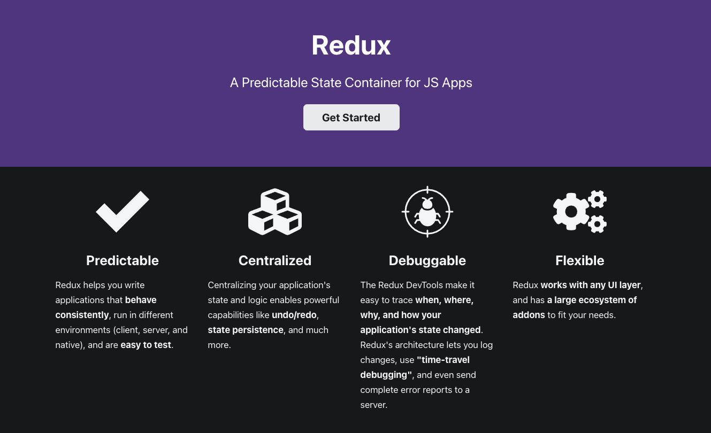

# Redux 和 React Redux

## 1. 何时需要 Redux？

> React 是一个 UI 库，只能做 UI 相关的工作，它没有架构、没有模板、没有设计模式、没有路由，也没有数据管理。

[官方答案](https://redux.js.org/faq/general#when-should-i-use-redux)

- 你有大量的应用状态，而这些状态在应用中很多地方都是需要的
- 应用状态频繁更新
- 更新该状态的逻辑可能很复杂
- 该应用有一个中等或大型的代码库，可能会有很多人在工作
- 你需要看到这个状态是如何随着时间的推移而更新的

一句话总结就是：<span style="color: #ff0000; font-size: 16px;">当应用的 state 变得不可控时，我们需要一个统一的管理器</span>。

然而，还有两个回答：

Pete Hunt，一位 React 的早期贡献者：

> If you aren't sure if you need it, you don't need it.

Dan Abramov，这家伙厉害了，Redux 作者之一，React 团队核心成员：

> Don't use Redux until you have problems with vanilla React.

这两个回答听着有点像劝退的意思 🤔 ，不过从侧面说明了一个问题：**使用 Redux 是要付出代价的，用之前要搞清利弊**。

## 2. Redux 核心概念

_官网截图：_



Redux 要做的只有一件事，<span style="color: #ff0000; font-size: 16px;">管理可预见的 State</span>.

为了达到**可预见**的目的，Redux 引入了三个核心概念，和一系列原则，

### 2.1 Redux 三个核心概念

- **Store（存放 state tree）**: 一个存放了应用所有更改的内容的**JS 对象**

- **Action**: 一个 **JS 对象**

- **Reducer**: 一个**函数**，根据上一个 state 和 action 生成一个新的 state

_Redux 三个核心概念工作流程：_


_工作流程描述：_

- 首先有个 Store，用来存储 state
- state 可以由 Reducer 初始化
- 然后 UI 组件订阅需要的 state
- state 的改变只能通过 Reducer 根据 旧的 state 和 Action 来完成，然后生成新的 state
- UI 组件通过 dispatch 方法发送 action 给 store
- store 会把 旧的 state 和 Action 发送给 Reducer
- 红色箭头代表数据传递方向

<span style="color: #ff0000; font-size: 16px;">正是 store、action、reducers 三者按照规则来运行，才保证了 state 的可预测。</span>

### 2.2 Redux 原则 🌟🌟🌟

> 本小节根据 Dan 的课程总结而来。

1. 🌟 应用程序中所有更改的内容（包括数据和 UI 状态）都包含在一个对象中，我们称其为 <code style="color: #708090; background-color: #F5F5F5; font-size: 18px">state</code> 或 <code style="color: #708090; background-color: #F5F5F5; font-size: 18px">state tree</code>。

2. 🌟 <code style="color: #708090; background-color: #F5F5F5; font-size: 18px">state tree</code>是只读的，不能写和修改

3. 🌟 想改变<code style="color: #708090; background-color: #F5F5F5; font-size: 18px">state tree</code><span style="color: #ff0000; font-size: 16px;">只能通过 action</span>，action 是个 JS 对象，**以最小的方式描述应用程序中的变化**。action 必须有 “type”属性，且其值不为 “undefined”.

4. 🌟 Reducer 必须是个**纯函数**（不能有副作用，如请求数据、修改 DOM 等）

## 3. Redux 有什么用

<span style="color: #ff0000; font-size: 16px;">Redux 统一保存状态数据，在隔离了数据与 UI 的同时，负责处理数据的绑定</span>。

**作用**：

- 组件间共享数据（state）
- 某个状态需要在任何地方都可以被随时访问
- 某个组件需要改变另一个组件的状态的时候

**应用场景：**

- 语言切换
- 黑暗模式切换
- 用户登录全局数据共享等
- 全局数据联动

## 4. 使用 Redux

### 4.1 简单的使用 Redux

```js
import { createStore } from "redux";

// 1. 创建 Reducer
function counterReducer(state = { value: 0 }, action) {
  switch (action.type) {
    case "counter/incremented":
      return { value: state.value + 1 };
    case "counter/decremented":
      return { value: state.value - 1 };
    default:
      return state;
  }
}

// 2. 生成 Store
let store = createStore(counterReducer);

// 3. 定义 Action
let actions = {
  incremented: { type: "counter/incremented" },
  decremented: { type: "counter/decremented" },
};

// 4. dispatch action
store.dispatch(actions.incremented);
store.dispatch({ type: "counter/incremented" });
store.dispatch(actions.incremented);

// 5. 订阅 store，然后做处理（如：更新 UI）
store.subscribe(() => console.log(store.getState())); // store.getState() 获取 state
```

### 4.2 严格遵守 Redux 原则

Redux 原则中说了具体要遵守的规则。

为了避免写 Redux 相关业务时忘记遵守相关规则，社区有一些不错的解决方案。

#### 原则 1: state 不可修改

**方案:**

- 使用 <code style="color: #708090; background-color: #F5F5F5; font-size: 18px">[Immutable.js](https://immutable-js.github.io/immutable-js/)</code>

_使用 immutable 定义 state：_

```js
import { Map, List } from "immutable";

// 使用
const state = {
  cats: Map({ a: 1, b: 2 }),
  names: List(["John", "kobe"]),
};

function reducer(state = state, action) {
  switch (action.type) {
    catch "":
    break;
    default:
    break;
  }
}
```

### 4.3 项目中使用 Redux

_项目中的 Redux 架构：_


显然，项目中使用 Redux 比 Demo 中会复杂的多。

例如，上面的简单示例中所有变量都在同一个文件中，真实项目中的文件往往在不同的文件下。

**项目中首先要解决的是 <span style="color: #ff0000; font-size: 16px;">store 如何传递给各个组件</span>的问题：**

- 将 store 注入顶级组件中的 props

  缺点：必须逐级传递 store，即使这一曾记得的组件并没有使用到 store

- 利用 context 特性，将 store 放在 context 的 value 中

  主流方式，React Redux 有实现该功能（\<Provider\>）

## 5. Redux 工具

写 Redux 代码会产生

### 5.1 React Redux

## 6. 使用 Redux 的取舍

Redux 官网里写的很清楚了，看这里或许能解决你很多疑惑 👉 [Should You Use Redux](https://redux.js.org/introduction/getting-started#should-you-use-redux)。

**舍：**

- 由于其特殊架构（柯里化的函数式编程、State 不可变），需要写很多繁琐的**模式代码**
- state 的管理会不太清晰（如：所有的 state 都放在 store? 需要更多考虑）

**得：**

- 便于调试（chrome 插件）
- 及其方便的 Undo(撤销)、Redo(重做)
- 协作环境
- 持久化和从状态启动（如视频播放进度等）

## 7. 手写一个简单的 Redux

## 教程推荐

Redux 作者 Dan Abramov 的教程，够权威 -- [Fundamentals of Redux Course from Dan Abramov](https://app.egghead.io/playlists/fundamentals-of-redux-course-from-dan-abramov-bd5cc867)

Youtube 上精简教程 -- [Learn Redux from Scratch](https://www.youtube.com/watch?v=poQXNp9ItL4&t=112s&ab_channel=ProgrammingwithMosh)

## 参考

Redux 一手资源聚集之地 -- [Redux 官网](https://redux.js.org/api/api-reference)

[深入理解并实现 redux 与 react-redux](https://blog.naice.me/article/5d1dc7f012455e43083aabda)

[深入理解 redux 及其中间件原理](https://zhuanlan.zhihu.com/p/148303595)

生动形象地介绍了 Redux -- [从设计的角度看 Redux](https://segmentfault.com/a/1190000018943038)

[Redux 入坑进阶-源码解析](https://github.com/ecmadao/Coding-Guide/blob/master/Notes/React/Redux/Redux%E5%85%A5%E5%9D%91%E8%BF%9B%E9%98%B6-%E6%BA%90%E7%A0%81%E8%A7%A3%E6%9E%90.md)
