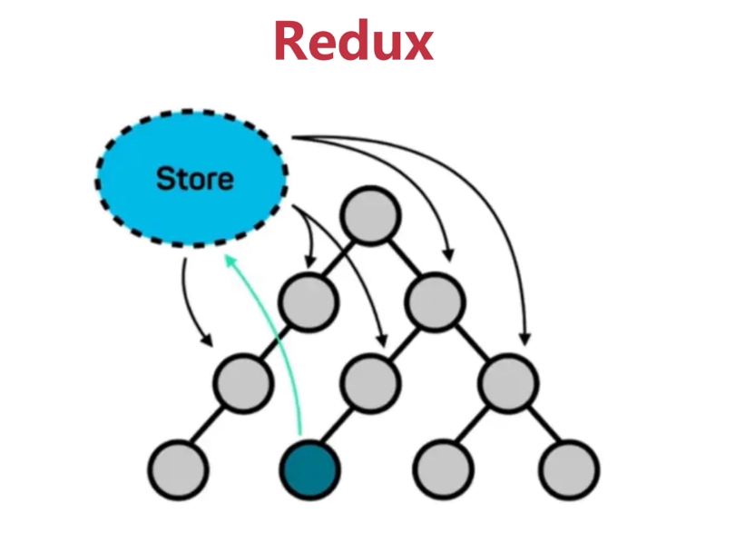
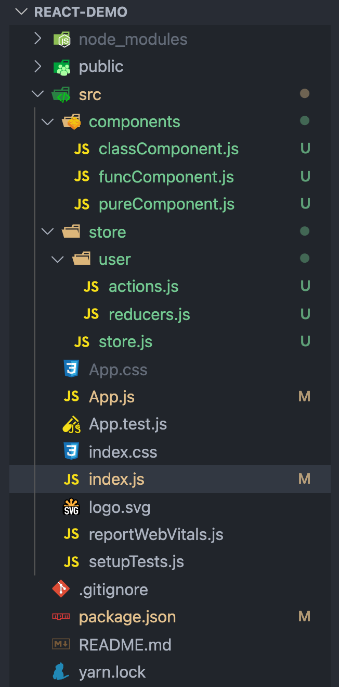
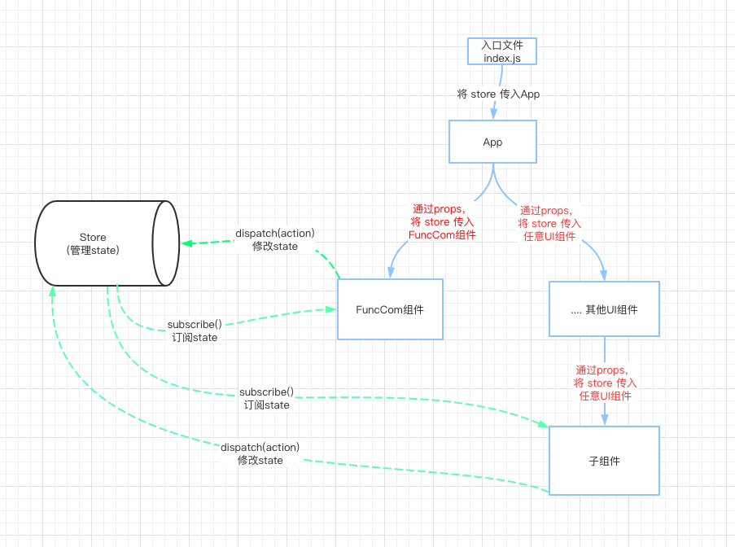

# React 状态管理与 Redux、 React Redux

> React 是一个 UI 库，只能做 UI 相关的工作，它没有架构、没有模板、没有设计模式、没有路由，也没有数据管理。

## 1. 如何有效管理 React 应用的 state

通常，一个 React 应用是由多个组件组成的，组件是由 <code style="color: #708090; background-color: #F5F5F5; font-size: 18px">UI</code> 和 <code style="color: #708090; background-color: #F5F5F5; font-size: 18px">数据</code> 组成。 通常，UI 部分不需要我们来关心，毕竟 React 本事就是一个 UI 库。

那么，**数据**就显得格外重要了，尤其是大型 React 应用。

数据可以是简单的，也可以是复杂的。

如果数据比较简单，我们可以直接获取数据后，设置 state 就行了。

_伪代码，处理简单数据：_

```js
function ComponentA(props) {
  const [dataList] = useEffect(() => {
    fetch("https://XXXX/data", {}).then((err, data) => {
      setData(data);
    });
  }, []);

  return (
    <div className="App">
      <FuncCom></FuncCom>
    </div>
  );
}

export default ComponentA;
```

假如这是个比较复杂的组件，我们需要获取用户权限、用户手动获取多个来源的数据（如，购物车、优惠券信息等）、支付状态，那么，这时的**状态**
管理就会比较棘手。

多人协作的任务，如多人编辑的文档。通常需要保存所有用户的所有操作，文档的数据也在不断的更新。这时，**状态**管理也会比较麻烦。

假如有一个复杂的表单页面（中后台有很多类似的需求），里面有数十个组件，组件之间是需要联动的，例如，用户将付款方式由微信改为支付宝，表单其他的组件可能就需要修改字段、将微信二维码替换为支付宝二维码。**大量的联动往往会导致组件的复杂性成倍增加**。

**总结一下就是：**

> 组件的状态很复杂，需要进行特别的管理。


## 3. 何时需要 Redux？

由于上面两个问题，我们可能需要**状态管理工具**来帮助我们管理 State.

何时需要 Redux?

[官方答案](https://redux.js.org/faq/general#when-should-i-use-redux)

- 你有大量的应用状态，而这些状态在应用中很多地方都是需要的
- 应用状态频繁更新
- 更新该状态的逻辑可能很复杂
- 该应用有一个中等或大型的代码库，可能会有很多人在工作
- 你需要看到这个状态是如何随着时间的推移而更新的

一句话总结就是：<span style="color: #ff0000; font-size: 16px;">当应用的 state 变得不可控时，我们需要一个统一的管理器</span>。

然而，还有两个回答：

Pete Hunt，一位 React 的早期贡献者：

> If you aren't sure if you need it, you don't need it.

Dan Abramov，这家伙厉害了，Redux 作者之一，React 团队核心成员：

> Don't use Redux until you have problems with vanilla React.

这两个回答听着有点像劝退的意思 🤔 ，不过从侧面说明了一个问题：**使用 Redux 是要付出代价的，用之前要搞清利弊**。

## 4. Redux 核心概念

_官网截图：_


Redux 要做的只有一件事，<span style="color: #ff0000; font-size: 16px;">管理可预见的 State</span>.

为了达到**可预见**的目的，Redux 引入了三个核心概念，和一系列原则，

### 4.1 Redux 三个核心概念

- **Store（存放 state tree）**: 一个存放了应用所有更改的内容的**JS 对象**

- **Action**: 一个 **JS 对象**

- **Reducer**: 一个**函数**，根据上一个 state 和 action 生成一个新的 state

_Redux 三个核心概念工作流程：_


_工作流程描述：_

- 首先有个 Store，用来存储 state
- state 可以由 Reducer 初始化
- 然后 UI 组件订阅需要的 state
- state 的改变只能通过 Reducer 根据 旧的 state 和 Action 来完成，然后生成新的 state
- UI 组件通过 dispatch 方法发送 action 给 store
- store 会把 旧的 state 和 Action 发送给 Reducer
- 红色箭头代表数据传递方向

<span style="color: #ff0000; font-size: 16px;">正是 store、action、reducers 三者按照规则来运行，才保证了 state 的可预测。</span>

### 4.2 Redux 原则 🌟🌟🌟

> 本小节根据 Dan 的课程总结而来。

1. 🌟 应用程序中所有更改的内容（包括数据和 UI 状态）都包含在一个对象中，我们称其为 <code style="color: #708090; background-color: #F5F5F5; font-size: 18px">state</code> 或 <code style="color: #708090; background-color: #F5F5F5; font-size: 18px">state tree</code>。

2. 🌟 <code style="color: #708090; background-color: #F5F5F5; font-size: 18px">state tree</code>是只读的，不能写和修改

3. 🌟 想改变<code style="color: #708090; background-color: #F5F5F5; font-size: 18px">state tree</code><span style="color: #ff0000; font-size: 16px;">只能通过 action</span>，action 是个 JS 对象，**以最小的方式描述应用程序中的变化**。action 必须有 “type”属性，且其值不为 “undefined”.

4. 🌟 Reducer 必须是个**纯函数**（不能有副作用，如请求数据、修改 DOM 等）

## 5. Redux 有什么用

<span style="color: #ff0000; font-size: 16px;">Redux 统一保存状态数据，在隔离了数据与 UI 的同时，负责处理数据的绑定</span>。



**作用**：

- 组件间共享数据（state）
- 某个状态需要在任何地方都可以被随时访问
- 某个组件需要改变另一个组件的状态的时候

**应用场景：**

- 语言切换
- 黑暗模式切换
- 用户登录全局数据共享等
- 全局数据联动

## 6. 使用 Redux

### 6.1 简单的使用 Redux

```js
import { createStore } from "redux";

// 1. 创建 Reducer
function counterReducer(state = { value: 0 }, action) {
  switch (action.type) {
    case "counter/incremented":
      return { value: state.value + 1 };
    case "counter/decremented":
      return { value: state.value - 1 };
    default:
      return state;
  }
}

// 2. 生成 Store
let store = createStore(counterReducer);

// 3. 定义 Action
let actions = {
  incremented: { type: "counter/incremented" },
  decremented: { type: "counter/decremented" },
};

// 4. dispatch action
store.dispatch(actions.incremented);
store.dispatch({ type: "counter/incremented" });
store.dispatch(actions.decremented);

// 5. 订阅 store，然后做处理（如：更新 UI）
store.subscribe(() => console.log(store.getState())); // store.getState() 获取 state
```

### 6.2 严格遵守 Redux 原则

Redux 原则中说了具体要遵守的规则。

为了避免写 Redux 相关业务时忘记遵守相关规则，社区有一些不错的解决方案。

#### 原则 1: state 不可修改

**方案:**

- 使用 <code style="color: #708090; background-color: #F5F5F5; font-size: 18px">[Immutable.js](https://immutable-js.github.io/immutable-js/)</code>

_使用 immutable 定义 state：_

```js
import { Map, List } from "immutable";

// 使用
const state = {
  cats: Map({ a: 1, b: 2 }),
  names: List(["John", "kobe"]),
};

function reducer(state = state, action) {
  switch (action.type) {
    catch "":
    break;
    default:
    break;
  }
}
```

### 6.3 项目中使用 Redux

_项目中的 Redux 架构：_


显然，项目中使用 Redux 比 Demo 中会复杂的多。

例如，上面的简单示例中所有变量都在同一个文件中，真实项目中的文件往往在不同的文件下。

**项目中首先要解决的是 <span style="color: #ff0000; font-size: 16px;">store 如何传递给各个组件</span>的问题：**

- 将 store 注入顶级组件中的 props

  缺点：必须逐级传递 store，即使这一层级的组件并没有使用到 store

- 利用 context 特性，将 store 放在 context 的 value 中

  主流方式，React Redux 有实现该功能（\<Provider\>）

#### 6.3.1 将 store 注入顶级组件中的 props

**项目目录：**



_1. 定义 reducer:_

```js
import { ChangeLoginStatus } from "./actions";

// 定义初始化状态,为 immutable，不可修改
const defaultState = {
  login: false,
  username: null,
};

const Reducers = (state = defaultState, action) => {
  switch (action.type) {
    case ChangeLoginStatus:
      return { username: action.payload };
    default:
      return state;
  }
};

export default Reducers;
```

_2. 定义 actions:_

```js
// 定义action type
export const ChangeLoginStatus = "user/changeLoginStatus";

// 定义 actionCreator 用于创建 action
export const changeLoginStatusActionCreator = (username) => {
  return {
    type: ChangeLoginStatus,
    payload: username,
  };
};
```

_3. 创建 store:_

```js
import { createStore, combineReducers } from "redux";
import userReducer from "./user/reducers.js";

const reducers = combineReducers({
  user: userReducer,
});

// 处理后的 reducers 需要作为参数传递在 createStore 中
export const store = createStore(reducers);
```

_4. 将 store 注入项目入口文件 index.js 的 props:_

```js
import React from "react";
import ReactDOM from "react-dom";
import "./index.css";
import App from "./App";
import { store } from "./store/store.js";

// 这里注入 store
ReactDOM.render(<App store={store} />, document.getElementById("root"));
```

_5. app.js 中使用 store:_

```js
import "./App.css";
import FuncCom from "./components/funcComponent";

function App(props) {
  // 打印看看 store 是什么
  console.log("store:", props.store);
  return (
    <div className="App">
      // 将store传递给组件 FuncCom
      <FuncCom store={pros.store}></FuncCom>
    </div>
  );
}

export default App;

// 输出结果
// store: {
//   "dispatch": f e(n),
//   "getState": f f(),
//   "liftedStore": {},
//   "replaceReducer": ƒ (n),
//   "subscribe": ƒ subscribe(listener)
// }
```

**我们可以得到如下示意图：**



**说明：**

- 蓝色框代表我们的视图组件
- 组件之间通过 props 传递 store
- 左侧的 Store 代表 Redux 管理的 state
- 绿色箭头代表视图组件和 state 交互(至于如何交互，后面会讨论)

这样有一个很大的问题，就是 **必须层层通过 props 传递 store**⚠️，哪怕这个组件没有使用 state 也要传递，否则，他的所有子组件都没法使用 state.

#### 6.3.2 利用 Context 跨组件传递 Store

[Context](https://zh-hans.reactjs.org/docs/context.html) 可以解决层层传递的问题。

_1. 创建 context 文件:_

```js
// context.js
import React from "react";

// 定义 context 初始化数据
const context = {
  user: {
    name: "",
    isLogin: false,
  },
};

// 创建 Context
export const Context = React.createContext(context);
```

_2. 入口文件中使用 Context:_

```js
// index.js
import React from "react";
import ReactDOM from "react-dom";
import App from "./App";
import { Context } from "./context/context";
import { store } from "./store/store";

// 将 store 赋值给 Context.Provider 的 value
  <Context.Provider value={store}>
    <App />
  </Context.Provider>,
  document.getElementById("root")
);
```

_3. 在子组件中使用 Context 传递的值:_

```js
import React, { useState } from "react";
import { Context } from "../context/context";

let Func = () => {
  // Context.Consumer 里的函数获取默认参数 value, value 就是 Context.Provider里提供的 value
  return (
    <Context.Consumer>
      {(store) => (
        <div>
          <p>
            {`name: ${store.getState().user.username} , isLogin: ${
              store.getState().user.login
            }`}
          </p>
        </div>
      )}
    </Context.Consumer>
  );
};

export default Func;
```

可以看出，使用 <code style="color: #708090; background-color: #F5F5F5; font-size: 18px">Context.Consumer</code> 可以在**任意层级的组件中**获取到离他最近的<code style="color: #708090; background-color: #F5F5F5; font-size: 18px">Context.Provider</code>提供的 value.

## 7. Redux 工具

写 Redux 代码会产生

### 7.1 React Redux

## 8. 使用 Redux 的取舍

Redux 官网里写的很清楚了，看这里或许能解决你很多疑惑 👉 [Should You Use Redux](https://redux.js.org/introduction/getting-started#should-you-use-redux)。

**舍：**

- 由于其特殊架构（柯里化的函数式编程、State 不可变），需要写很多繁琐的**模式代码**
- state 的管理会不太清晰（如：所有的 state 都放在 store，别放在各个组件更难管理）

**得：**

- 便于调试（chrome 插件）
- 及其方便的 Undo(撤销)、Redo(重做)
- 协作环境
- 持久化和从状态启动（如视频播放进度等）

## 9. 手写一个简单的 Redux

## 教程推荐

Redux 作者 Dan Abramov 的教程，够权威 -- [Fundamentals of Redux Course from Dan Abramov](https://app.egghead.io/playlists/fundamentals-of-redux-course-from-dan-abramov-bd5cc867)

Youtube 上精简教程 -- [Learn Redux from Scratch](https://www.youtube.com/watch?v=poQXNp9ItL4&t=112s&ab_channel=ProgrammingwithMosh)

## 参考

Redux 一手资源聚集之地 -- [Redux 官网](https://redux.js.org/api/api-reference)

[Render Props -- Redux 官网](https://zh-hans.reactjs.org/docs/render-props.html)

[高阶组件 -- Redux 官网](https://zh-hans.reactjs.org/docs/higher-order-components.html)

[深入理解并实现 redux 与 react-redux](https://blog.naice.me/article/5d1dc7f012455e43083aabda)

[深入理解 redux 及其中间件原理](https://zhuanlan.zhihu.com/p/148303595)

生动形象地介绍了 Redux -- [从设计的角度看 Redux](https://segmentfault.com/a/1190000018943038)

[Redux 入坑进阶-源码解析](https://github.com/ecmadao/Coding-Guide/blob/master/Notes/React/Redux/Redux%E5%85%A5%E5%9D%91%E8%BF%9B%E9%98%B6-%E6%BA%90%E7%A0%81%E8%A7%A3%E6%9E%90.md)

[手写一个 Redux，深入理解其原理](https://cloud.tencent.com/developer/article/1717295)
