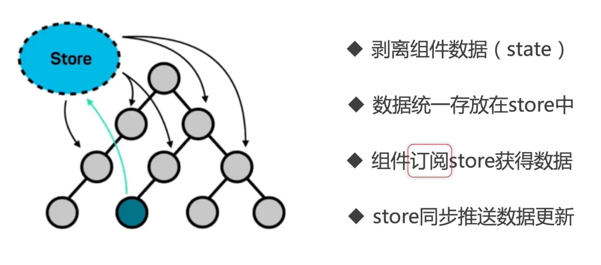

# Redux 和 React Redux

> 应用中的组件需要共享状态和通信，组件复杂的应用就需要统一管理整个应用的状态管理器。

## 1. 为什么需要 Redux

**React 是一个 UI 框架，只能做 UI 相关的工作，它没有架构、没有模板、没有设计模式、没有路由，也没有数据管理。**

一个应用肯定是有自己的架构的，如 MVC、MVVM 等。

一个应用中有多种设计模式，如：组件间的通信可以有不同的设计模式，可以看[这里]()。

Redux 用自己的方式实现了应用的全局状态管理，进而**实现组件间的通信问题**。

**遇到如下问题后我们可能需要考虑引入 Redux:**

- 应用中有着相当大量的、随时间变化的数据
- 应用中的 state 需要有一个单一可靠数据来源
- 你觉得把所有 state 放在最顶层组件中已经无法满足需要了

## 2. Redux 作用

Redux 统一保存状态数据，在隔离了数据与 UI 的同时，负责处理数据的绑定。

**作用**：

- 组件件共享数据（state）
- 某个状态需要在任何地方都可以被随时访问
- 某个组件需要改变另一个组件的状态的时候

**应用场景：**

- 语言切换
- 黑暗模式切换
- 用户登录全局数据共享等

## 3. Redux 要点

应用中所有的 state 都以一个对象树的形式储存在一个单一的 store 中。

惟一改变 state 的办法是触发 action，它是一个描述发生什么的对象。

为了描述 action 如何改变 state 树，你需要编写 reducers。

**Redux 工作流程：**

_工作流程：_

- 首先有个 Store，用来存储 state
- state 可以由 Reducer 初始化
- 然后 UI 组件订阅需要的 state
- state 的改变只能通过 Reducer 根据 旧的 state 和 Action 来完成，然后生成新的 state
- UI 组件通过 dispatch 方法发送 action 给 store
- store 会把 旧的 state 和 Action 发送给 Reducer
- 红色箭头代表数据传递方向

**项目中的 Redux 架构：**

## 3. Redux 使用

### 3.1 生成 store

### 3.2 使用 store

### 3.3 改变 store

## 4. 手写一个简单的 Redux

## 参考

[Redux 官网](https://redux.js.org/api/api-reference)

[Redux 中文文档](https://cn.redux.js.org/)

[深入理解并实现 redux 与 react-redux](https://blog.naice.me/article/5d1dc7f012455e43083aabda)

[深入理解 redux 及其中间件原理](https://zhuanlan.zhihu.com/p/148303595)
