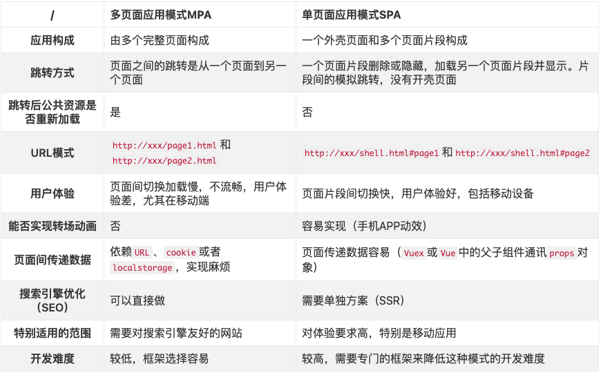
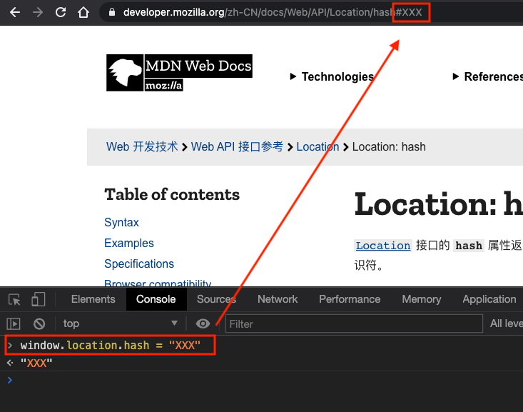
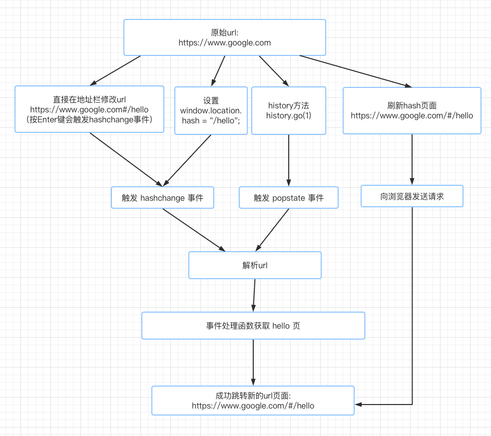
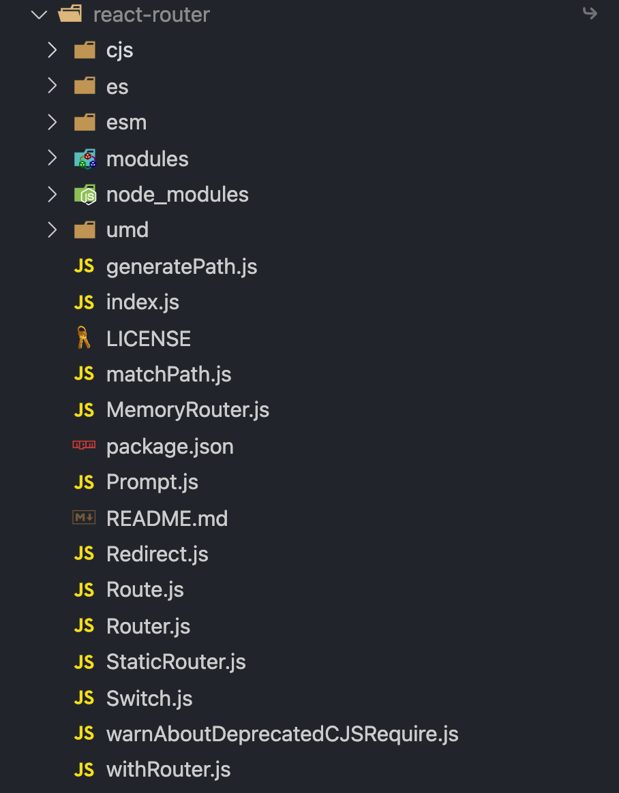

# 一次搞懂 React Router（含源码分析）

> 如果你的应用不止一个页面，那么，你就需要路由。

**说明：**本文 React Router 源码为 v5.2.0

## 1. 什么是 Router

[维基百科](https://zh.wikipedia.org/wiki/%E8%B7%AF%E7%94%B1%E5%99%A8)是这么定义的：

> 路由器（英语：Router，又称路径器）是一种电讯网络设备，提供路由与转送两种重要机制，可以决定数据包从来源端到目的端所经过的路由路径（host 到 host 之间的传输路径），这个过程称为路由；将路由器输入端的数据包移送至适当的路由器输出端（在路由器内部进行），这称为转送。路由工作在 OSI 模型的第三层——即网络层，例如网际协议（IP）。

这里说的 Router(路由器)就是你家用的路由器，设置 wifi 的那个设备。


假如你家里有 2 台电脑和 2 部手机，都要通过路由器来分发数据包到设备。

类似地，你的应用可能也会有多个页面，需要一个**导航组件（navigational components）**来根据 URL 的变化控制要显示哪一个页面。

在 Web 应用的开发中，这个**导航组件（navigational components）**的导航过程就是我们今天要说的<code style="color: #708090; background-color: #F5F5F5; font-size: 18px">路由(router)</code>。

简单说就是：**路由（router）根据 url 分配到对应的处理程序**.

## 2. 单页应用（SPA）和多页应用（MPA）

Web 应用分为<code style="color: #708090; background-color: #F5F5F5; font-size: 18px">多页面应用(MPA: Multi Page Application)</code>和<code style="color: #708090; background-color: #F5F5F5; font-size: 18px">单页面应用(SPA: Single Page Application)</code>。

由于 SPA 是主流的 React 开发方式，所以我们重点讨论 SPA 中的路由。

但你应该知道，React 和 Webpack 等组合是可以很好的开发多页应用（MPA）的。

_MPA 的 Webpack 配置文件应该是有多个入口_：

```js
module.exports = {
  entry: {
    page1: "./src/pages/page1/index.jsx",
    page2: "./src/pages/page2/index.jsx",
  },
  ...
}
```

_MPA 的文件目录一般是按页面区分的：_

```js
...
pages
├── page1
│   ├── app.jsx
│   ├── index.jsx
│   └── index.css
└── page2
    ├── app.js
    ├── index.jsx
    └── index.css
...
```

_SPA 的 Webpack 配置文件应该是一个入口文件_：

```js
module.exports = {
  entry: {
    page1: "./src/index.jsx",
  },
  ...
}
```

_SPA 的文件目录一般只有一个：_

```js
...
src
│── app.jsx
│── index.jsx
└── index.css
...
```

**SPA 和 MPA 对比：**

[详情](https://www.jianshu.com/p/a02eb15d2d70)



## 3. React 应用中如何设置路由？

一般前端路由的工作流程大致是：

1. 改变页面 URL（hash 或 history 方法）
2. 触发浏览器事件（hashChange 或 popstate 事件）
3. 监听事件，处理事件回调
4. 事件回调中处理应用中页面的显示隐藏

### 3.1 无刷新改变页面 URL

无刷新改变路由的方式有两种：

- 1. 通过 hash 改变路由
- 2. 通过 history 改变路由

#### 3.1.1 通过 hash 改变路由

```js
window.location.hash = "XXX";
```

直接设置 window.location.hash 属性，URL 后面会加上 “#XXX”，达到修改 URL 的目的。

如下图：直接修改 window.location.hash 属性为 “XXX”，页面的 URL 地址也发生了变化。



#### 3.1.2 通过 history 改变路由

直接调用 [history](https://developer.mozilla.org/zh-CN/docs/Web/API/History) 的方法，可以修改路由：

- history.beck() 返回浏览器会话历史中的上一页,等同于 history.go(-1)
- history.forward() 在浏览器历史记录里前往下一页,等同于 history.go(1)
- history.go() 比如：参数为-1 的时候为上一页，参数为 1 的时候为下一页
- history.pushState() 按指定的名称和 URL（如果提供该参数）将数据 push 进会话历史栈
- history.replaceState() 按指定的数据，名称和 URL(如果提供该参数)，更新历史栈上最新的入口

### 3.2 监听 hash 或 history 改变事件

**监听 Hash 变化：**

```js
window.onhashchange = funcRef;
// or

window.addEventListener("hashchange", funcRef, false);
```

**监听 hashtory back/forward/go 事件：**

```js
window.addEventListener("popstate", funcRef);
```

**监听 history pushState/replaceState 事件:**

浏览器没有实现它们的监听函数，需要手动实现：

_触发函数：_

```js
const _historyWrap = function (type) {
  const orig = history[type];
  const e = new Event(type);
  return function () {
    const rv = orig.apply(this, arguments);
    e.arguments = arguments;
    window.dispatchEvent(e);
    return rv;
  };
};

// 调用
history.pushState = _historyWrap("pushState");
```

_监听：_

```js
window.addEventListener("pushState", funcRef);
```

_URL 切换流程图：_



## 4. React Router 是什么

前面说了那么多，你应该猜到 React Router 想要干什么了。


从官网首页的介绍我们可以看到两点主要信息：

- 1. React Router 支持 **Web 和 Native**
- 2. React Router 是一个 **navigational components（导航组件）**

## 5. React Router 核心概念

- \<Router\> : 基础接口，下面组件都是基础于它

  \<MemoryRouter\>: 将“ URL”的历史记录保存在内存中，服务端渲染、React Native 比较有用

  \<StaticRouter\>: 静态路由

  <!-- <BrowserRouter>:  history 模式路由（基于 HTML5 的 history）

  <HashRouter>: hash 模式路由 -->

- \<Route\> : 这应该是 React Router 最核心的功能组件，<span style="color: #ff0000; font-size: 16px;">基本职责是在其路径与当前 URL 匹配时呈现某些 UI</span>

- Redirect: 重定向

- Switch: 匹配 url，使特定的 Route 生效

## 6. React Router 怎么用

本文主要讨论的是 WEB 端的使用方法，NATIVE 的使用后面有机会用到了再详细讨论。

### 6.1 Static Routing （静态路由） VS Dynamic Routing（动态路由）

**静态路由：**

有一个 **configuration（配置文件）** 或 **convention（约定）**，通过匹配 URL 信息（字符串）来根据 配置文件 做出处理。

_Express 中使用静态路由匹配请求：_

```js
app.get("/", handleIndex);
app.get("/invoices", handleInvoices);
app.get("/invoices/:id", handleInvoice);
app.get("/invoices/:id/edit", handleInvoiceEdit);

app.listen();
```

**动态路由：**

**应用渲染时进行路由**，这意味着**React Router 内的应用都是 React Router 的组件而已。**

### 6.2 React Router 的简单使用

Web 应用中使用 React Router 的简单方式是使用 “react-router-dom”，它封装了 React Router,专门为 Web 应用而设计.

_请看注释：_

```js
import React from "react";
// 1. 引入React Router (react-router-dom封装了 React Router)
import { BrowserRouter as Router, Route, Link } from "react-router-dom";

ReactDOM.render(
  // 2. 使用 BrowserRouter 包裹整个应用，使其成为 React Router 的一个组件
  <BrowserRouter>
    <App />
  </BrowserRouter>,
  el
);

const App = () => (
  <div>
    <nav>
      // 3. 使用 Link 组件，链接到新的地址 "/dashboard"
      <Link to="/dashboard">Dashboard</Link>
    </nav>
    <div>
      // 4. 当用户访问 "/dashboard"时，使用 Route组件 展示UI（组件Dashboard）
      <Route path="/dashboard" component={Dashboard} />
    </div>
  </div>
);
```

React Router 的全部大概就是这些：

- 1. 引入 React Router (react-router-dom 封装了 React Router)
- 2. 使用 BrowserRouter 包裹整个应用，使其成为 React Router 的一个组件
- 3. 使用 Link 组件，链接到新的地址 "/dashboard"
- 4. 当用户访问 "/dashboard"时，使用 Route 组件 展示 UI（组件 Dashboard）

详情请看[react-router-dom 基本使用示例](https://reactrouter.com/native/example/Basic)

### 6.3 react-router-dom 核心概念

安装 react-router-dom:

```js
npm install --save react-router-dom
```

_看一下 npm 安装的 react-router-dom 包的入口文件：_

```js
// node_modules/react-router-dom/cjs/react-router-dom.js

// 引入依赖
var reactRouter = require('react-router');
var React = _interopDefault(require('react'));
var history = require('history');

...
// exports直接复制了 React Router 上的方法（只读）
Object.defineProperty(exports, 'Route', {
  enumerable: true,
  get: function () {
    return reactRouter.Route;
  }
});
Object.defineProperty(exports, 'Router', {
  enumerable: true,
  get: function () {
    return reactRouter.Router;
  }
});
...

// react-router-dom 新增的方法
exports.BrowserRouter = BrowserRouter;
exports.HashRouter = HashRouter;
exports.Link = Link;
exports.NavLink = NavLink;
```

可以看出，react-router-dom 就是封装了一下 React Router，同时新增了几个方法：

- BrowserRouter: history 模式路由（基于 HTML5 的 history）,继承于 React Router 的 <code style="color: #708090; background-color: #F5F5F5; font-size: 18px">\<Router\> 模块</code>

- HashRouter：hash 模式路由，,继承于 React Router 的 <code style="color: #708090; background-color: #F5F5F5; font-size: 18px">\<Router\> 模块</code>

- Link： 导航组件，会被渲染为 \<a\>标签

- NavLink: Link 的特殊版本，当它与当前 URL 匹配时，它将为呈现的元素添加样式属性

## 8. 如何使用 react-router-dom

[官网给的例子](https://reactrouter.com/web/example/basic)太多了，而且还有注释，这里没有搬运的必要了 🤷‍♂️ ，请去自取食用吧。

## 9. react-router 是如何做的（源码分析）

_[React Router](https://github.com/ReactTraining/react-router) 源码目录:_


_项目中[node\_modules] 中的 react-router 安装包目录:_



对比两个文件目录我们发现，[node\_modules]中的 react-router 多了两个文件夹：

- cjs: 打包后生成的 CommonJS 模块文件（根据 package.json 中 "build" 配置打包后生成）
- esm: 打包后生成的 ES 模块文件（根据 package.json 中 "build" 配置打包后生成）

### 9.1 从 index.js 开始

我们是这样使用 React Router 的：

```js
import { Router, Switch, Route } from "react-router";
```

引入 “react-router” 这个包，

按照 ES 模块化的规则，我们会找到 node_modules 中的 react-router 文件夹，然后查找 package.json,

package.json 中的配置：

```json
{
  "name": "react-router",
  "version": "5.2.0",
  ...
  "main": "index.js",
  ...
}
```

可以看到，"main" 的值是 “index.js”，它就是我们引入的文件。

_index.js:_

```js
if (process.env.NODE_ENV === "production") {
  module.exports = require("./cjs/react-router.min.js");
} else {
  module.exports = require("./cjs/react-router.js");
}
```

"index.js"什么都没干，只是根据开发环境不同导出了两个不同的文件，生产环境会导出“react-router.min.js”，它是压缩后的 React Router 入口文件。

另一个是我们今天要讲的 ”react-router.js“，他就是开发环境的入口文件。

### 9.2 入口文件 react-router.js

_react-router/cjs/react-router.js 源码：_

```js
// 只要 exports.default
function _interopDefault (ex) { return (ex && (typeof ex === 'object') && 'default' in ex) ? ex['default'] : ex; }

// 引入依赖
var React = _interopDefault(require('react'));
var PropTypes = _interopDefault(require('prop-types'));
// 这个包很最重要，react-router很多方法就是依赖于它的
var history = require('history');
var warning = _interopDefault(require('tiny-warning'));
var createContext = _interopDefault(require('mini-create-react-context'));
var invariant = _interopDefault(require('tiny-invariant'));
var pathToRegexp = _interopDefault(require('path-to-regexp'));
var reactIs = require('react-is');
var hoistStatics = _interopDefault(require('hoist-non-react-statics'));

...
// 定义了一些内部私有方法
function _extends() {
  _extends = Object.assign || function (target) {
    ...
  };

  return _extends.apply(this, arguments);
}

...

var createNamedContext = function createNamedContext(name) {
  var context = createContext();
  context.displayName = name;
  return context;
};

// 创建 historyContext(一个 context)
var historyContext =
/*#__PURE__*/
createNamedContext("Router-History");

var createNamedContext$1 = function createNamedContext(name) {
  var context = createContext();
  context.displayName = name;
  return context;
};

// 创建 context(一个 context)
var context =
/*#__PURE__*/
createNamedContext$1("Router");

...
// Route 组件，继承自 React.Component
var Route =
/*#__PURE__*/
function (_React$Component) {
  _inheritsLoose(Route, _React$Component);

  function Route() {
    return _React$Component.apply(this, arguments) || this;
  }
  ...
  return Route;
}(React.Component);

...
// Switch 组件，继承自 React.Component
var Switch =
/*#__PURE__*/
function (_React$Component) {
  _inheritsLoose(Switch, _React$Component);

  function Switch() {
    return _React$Component.apply(this, arguments) || this;
  }
  ...
  return Switch;
}(React.Component);
...

// 说明：这里的导出顺序被我修改了
// 7个组件
exports.Router = Router;
exports.MemoryRouter = MemoryRouter;
exports.StaticRouter = StaticRouter;
exports.Prompt = Prompt;
exports.Redirect = Redirect;
exports.Route = Route;
exports.Switch = Switch;

// 2个内部方法，不是让你用的
exports.__HistoryContext = historyContext;
exports.__RouterContext = context;

// 3个方法
// 路由匹配，像 Route 一样匹配 url,一般用于服务端渲染
exports.matchPath = matchPath;
// withRouter不会在路由转换时重新渲染，除非它的父组件重新渲染
exports.withRouter = withRouter;
exports.generatePath = generatePath;

// 4个钩子函数
exports.useHistory = useHistory;
exports.useLocation = useLocation;
exports.useParams = useParams;
exports.useRouteMatch = useRouteMatch;
```

通过对 “react-router.js” 分析可以看出，React Router 的特点：🌟🌟

- \<Router\>、\<Route\>、\<Switch\>等就是继承了 React.Component 的 React <code style="color: #708090; background-color: #F5F5F5; font-size: 18px">Class Component 组件</code>

- 提供了 4 个钩子函数给我们使用，能更直接地在函数（组件）中控制路由

### 9.3 \<Router\>

<code style="color: #708090; background-color: #F5F5F5; font-size: 18px">\<Router\></code> 是 React Router 的基础，**MemoryRouter、StaticRouter 都继承自它，而且 React Router DOM 中的 BrowserRouter、HashRouter 同样继承自它**。

_Router 相关的源码解析：_

```js
var Router =
  /*#__PURE__*/
  (function (_React$Component) {
    // 简单的继承函数，Router继承自 React.Component
    _inheritsLoose(Router, _React$Component);

    Router.computeRootMatch = function computeRootMatch(pathname) {
      return {
        path: "/",
        url: "/",
        params: {},
        isExact: pathname === "/",
      };
    };

    // 定义 Router 函数
    function Router(props) {
      var _this;

      _this = _React$Component.call(this, props) || this;
      _this.state = {
        location: props.history.location,
      };

      // 监听位置变化，以防在初始渲染时有任何<Redirect>，如果有的话，它们会在挂载时替换/推送
      // 我们可能会在<Router>挂载之前得到一个新的位置
      _this._isMounted = false;
      _this._pendingLocation = null;

      ...

      return _this;
    }

    // 获取 Router 原型
    var _proto = Router.prototype;

    ...

    // 定义组件的 render 方法
    _proto.render = function render() {
      return React.createElement(
        // 创建 context 提供者，所有子元素（如：<Route>）都是 context消费者
        context.Provider,
        {
          // context.Provider 的 value 值，所有 context.Consumer 可以获取
          value: {
            history: this.props.history,
            location: this.state.location,
            match: Router.computeRootMatch(this.state.location.pathname),
            staticContext: this.props.staticContext,
          },
        },
        // 创建 historyContext 提供者
        React.createElement(historyContext.Provider, {
          children: this.props.children || null,
          // historyContext.Provider 的 value 值，所有 history.Consumer 可以获取
          value: this.props.history,
        })
      );
    };

    return Router;
  })(React.Component);
```

**结论：**

> \<Router\> 主要是作为一个 context.Provider，为其他组件提供了 context 和 historyContext。

### 9.4 \<Route\>

> The Route component is perhaps the most important component in React Router to understand and learn to use well.Its most basic responsibility is to render some UI when its path matches the current URL.

上面 👆 这句话来自[React Router - Route](https://reactrouter.com/web/api/Route)官方文档，翻译一下就是：“\<Route\>组件可能是 React Router 中最重要的组件，要理解并学会用好它。<span style="color: #ff0000; font-size: 16px;">它的最基本职责是在其路径与当前 URL 匹配时呈现某些 UI</span>。”

```js
import React from "react";
import ReactDOM from "react-dom";
import { BrowserRouter as Router, Route } from "react-router-dom";

ReactDOM.render(
  <Router>
    <div>

      // <Route> 匹配到 url路径 “/” 时会显示 组件<Home />
      <Route exact path="/">
        <Home />
      </Route>

      // <Route> 匹配到 url路径 “/news” 时会显示 组件<NewsFeed />
      <Route path="/news">
        <NewsFeed />
      </Route>
    </div>
  </Router>,
  node
);
```

_Route 相关的源码：_

```js
// Route 组件，继承自 React.Component
var Route =
  /*#__PURE__*/
  (function (_React$Component) {
    _inheritsLoose(Route, _React$Component);

    function Route() {
      return _React$Component.apply(this, arguments) || this;
    }

    var _proto = Route.prototype;

    // 定义 Route 的 render 方法
    _proto.render = function render() {
      var _this = this;

      // 返回一个 React Element
      /*
       * type： context.Consumer,一个 context的消费者
       * config: null,
       * children: func
       */
      return React.createElement(context.Consumer, null, function (context$1) {
        !context$1
          ? invariant(false, "You should not use <Route> outside a <Router>")
          : void 0;
        var location = _this.props.location || context$1.location;
        // 这里做路径匹配 🌟🌟🌟
        var match = _this.props.computedMatch
          ? _this.props.computedMatch // <Switch> already computed the match for us
          : _this.props.path
          ? matchPath(location.pathname, _this.props)
          : context$1.match;

        var props = _extends({}, context$1, {
          location: location,
          match: match,
        });

        var _this$props = _this.props,
          children = _this$props.children,
          component = _this$props.component,
          render = _this$props.render; // Preact uses an empty array as children by
        // default, so use null if that's the case.

        if (Array.isArray(children) && children.length === 0) {
          children = null;
        }

        // 创建一个 React Element,
        /*
         * type: context.Provider,
         * value: props,
         * children: 根据匹配值 props.match 做判断来创建 children 🌟🌟🌟
         */
        return React.createElement(
          context.Provider,
          {
            value: props,
          },
          props.match
            ? children
              ? typeof children === "function"
                ? evalChildrenDev(children, props, _this.props.path)
                : children
              : component
              ? React.createElement(component, props)
              : render
              ? render(props)
              : null
            : typeof children === "function"
            ? evalChildrenDev(children, props, _this.props.path)
            : null
        );
      });
    };

    return Route;
  })(React.Component);
```

**结论：**

> \<Route\> 主要作用是 匹配 url，然后判断是否显示相关子组件（UI）。

### 9.5 \<Switch\>

_Switch 部分的源码：_

```js
var Switch =
  /*#__PURE__*/
  (function (_React$Component) {
    _inheritsLoose(Switch, _React$Component);

    function Switch() {
      return _React$Component.apply(this, arguments) || this;
    }

    var _proto = Switch.prototype;

    _proto.render = function render() {
      var _this = this;

      return React.createElement(context.Consumer, null, function (context) {
        !context
          ? invariant(false, "You should not use <Switch> outside a <Router>")
          : void 0;
        var location = _this.props.location || context.location;
        var element, match;

        // 这里对 子组件 循环匹配
        React.Children.forEach(_this.props.children, function (child) {
          if (match == null && React.isValidElement(child)) {
            element = child;
            var path = child.props.path || child.props.from;
            match = path
              ? matchPath(
                  location.pathname,
                  _extends({}, child.props, {
                    path: path,
                  })
                )
              : context.match;
          }
        });
        // 匹配成功了 clone 该元素
        return match
          ? React.cloneElement(element, {
              location: location,
              computedMatch: match,
            })
          : null;
      });
    };

    return Switch;
  })(React.Component);
```

**结论：**

> \<Switch\> 主要作用是循环遍历子组件（\<Route\>）,判断是否 match，然后控制其显示。

### 9.6 useHistory

useHistory 是一个钩子函数，能帮我们获取到 historyContext 的值。

```js
function useHistory() {
  {
    !(typeof useContext === "function")
      ? invariant(
          false,
          "You must use React >= 16.8 in order to use useHistory()"
        )
      : void 0;
  }

  return useContext(historyContext);
}
```

**结论：**

> useHistory 主要作用是 获取并订阅 historyContext。

## 10. react-router-dom 是如何做的（源码分析）

在上面的 【6.3 react-router-dom 核心概念】 章节我们知道，react-router-dom 只是对 React Router 做了一个封装，多提供了 4 个组件，分别是：

- BrowserRouter：
- HashRouter：
- Link：
- NavLink：

_\<BrowserRouter\>:_

```js
// 引入 “history” 库
var history = require("history");
/**
 * The public API for a <Router> that uses HTML5 history.
 * 翻译一下：使用 HTML5 history 封装了 <Router> 的公共API
 */

var BrowserRouter =
  /*#__PURE__*/
  (function (_React$Component) {
    _inheritsLoose(BrowserRouter, _React$Component);

    function BrowserRouter() {
      var _this;

      for (
        var _len = arguments.length, args = new Array(_len), _key = 0;
        _key < _len;
        _key++
      ) {
        args[_key] = arguments[_key];
      }

      _this =
        _React$Component.call.apply(_React$Component, [this].concat(args)) ||
        this;
      // 创建 history 实例;
      _this.history = history.createBrowserHistory(_this.props);
      return _this;
    }

    var _proto = BrowserRouter.prototype;

    // 定义 BrowserRouter 的 render 方法
    _proto.render = function render() {
      // 这里创建了一个 React Router 的 Router类型 的元素
      // 所以说 BrowserRouter 是基于 Router 的
      return React.createElement(reactRouter.Router, {
        // React Router 的 Router 中，historyContext.Provider 里的 history 就是这里提供的
        // 所以，使用 useContext(中，historyContext) 可以获取到这个 history
        history: this.history,
        children: this.props.children,
      });
    };

    return BrowserRouter;
  })(React.Component);
```

**结论：**

> \<BrowserRouter\> 主要作用是创建了一个基于 reactRouter.Router 的 React Element，然后提供了一个 props -- history。

_\<Link\>:_

```js
// 格式化 “to”
var normalizeToLocation = function normalizeToLocation(to, currentLocation) {
  return typeof to === "string" ? history.createLocation(to, null, null, currentLocation) : to;
};
...
var Link = forwardRef(function (_ref2, forwardedRef) {
  var _ref2$component = _ref2.component,
    // 给 "component" 赋值，
    // 如果用户没有自定义 <Link> 的 component 属性，"component" = LinkAnchor
    component = _ref2$component === void 0 ? LinkAnchor : _ref2$component,
    replace = _ref2.replace,
    to = _ref2.to,
    innerRef = _ref2.innerRef,
    rest = _objectWithoutPropertiesLoose(_ref2, [
      "component",
      "replace",
      "to",
      "innerRef",
    ]);

  return React.createElement(
    reactRouter.__RouterContext.Consumer,
    null,
    function (context) {
      !context
        ? invariant(false, "You should not use <Link> outside a <Router>")
        : void 0;
      var history = context.history;
      var location = normalizeToLocation(
        resolveToLocation(to, context.location),
        context.location
      );
      var href = location ? history.createHref(location) : "";

      var props = _extends({}, rest, {
        href: href,
        // 定义 navigate方法
        navigate: function navigate() {
          var location = resolveToLocation(to, context.location);
          // 最终使用 history.replace 或 history.push 完成跳转工作
          var method = replace ? history.replace : history.push;
          method(location);
        },
      });

      if (forwardRefShim !== forwardRef) {
        props.ref = forwardedRef || innerRef;
      } else {
        props.innerRef = innerRef;
      }

      // 创建基于 “component” 的组件，
      // 如果是 LinkAnchor，最终会创建一个 <a> 标签，其 onClick 方法是 navigate
      return React.createElement(component, props);
    }
  );
});
```

**结论：**

> \<Link\> 组件主要功能是生成一个 \<a\>标签，然后定义其 props，主要是定义了 onClick 方法，会使用 history 跳转到 “to”属性的值。

## 总结

1. react-router 库使用了 history 库做了基础封装，为我们提供了自定义组件，用于“导航”;

2. react-router-dom 库，封装了 react-router，进一步为我们提供了基于浏览器导航的组件 Link、BrowserRouter 等；

3. react-router 使用了很多应用开发中不常用的 API，如 **React.createRef**，对我们开发基础组件很有用；

## 参考

官网示例非常丰富，值得去研究[React Router 官网](https://reactrouter.com/)

[React Router 4.x 开发，这些雷区我们都帮你踩过了 --> 京东设计中心 JDC](https://juejin.cn/post/6844903640839225358)
