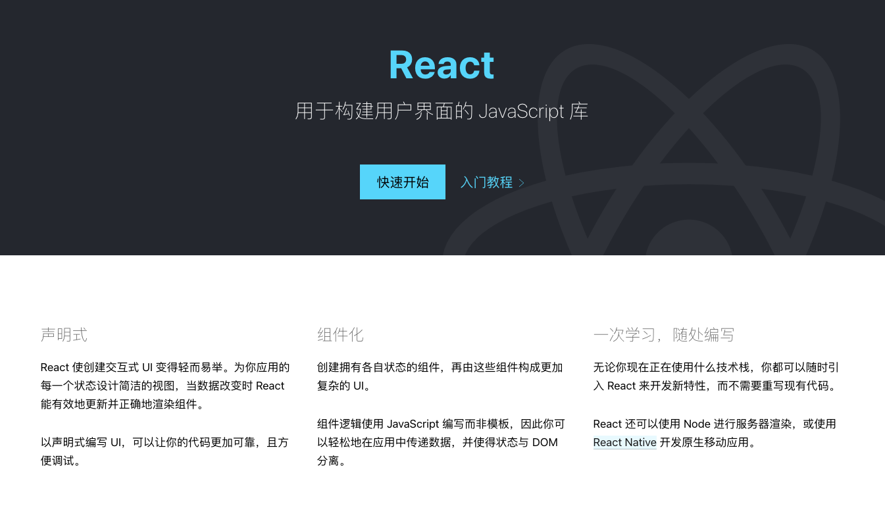

# 为什么需要 React

> 或许你从没想过这个问题，难道是因为大家都在用，所以你也要用 ❓
>
> 那大家为什么要用 React 呢 ❓

之所以有这样的疑问，是因为在看 React 源码时遇到了疑惑。

明明最后 React 还是要用原生 API，为什么不直接原生 JS 操作呢？少了一大堆东西，如 Diff 算法等。

如果嫌原生 JS 写起来效率低下，JQuery 和相关插件可以大大增加工作效率啊。

带着这样的疑问 🤔️，开始探索。

## 1. React 是什么

**React 是一个前端 JavaScript 库。**

它不是框架，和 React-Router、Redux 等结合起来可以组成一个前端框架。

## 2. React 架构组成

> React 官方并没有说自己的架构组成是什么，React 团队成员的演讲和源码中的注释都给出了答案。

React Core
scheduler 调度器
reconciler 协调器
renderer: 渲染器

## 3. React 基本工作原理

React 的基本思维模式是每次有变动就整个重新渲染整个应用。

对，你没看错。

变动 React 应用的方式有 3 种：

- setState()
- pure..
- update..

**他们都会导致整个应用重新渲染**。

## 4. 每次有变动就重新渲染整个应用，效率岂不是很低？

一般不会。

要知道 React 是用来构建<code style="color: #708090; background-color: #F5F5F5; font-size: 18px">前端应用</code>的，尤其是 SPA，如果你的需求就是只有三个页面的静态页面，那请直接原生 JS 写吧（JQuery 效率更高）。

原因之一是有 <code style="color: #708090; background-color: #F5F5F5; font-size: 18px">Virtual DOM</code> 和 <code style="color: #708090; background-color: #F5F5F5; font-size: 18px">Diff 算法</code>。

React 16 之后引进的 <code style="color: #708090; background-color: #F5F5F5; font-size: 18px">Fiber Reconciler</code> 架构，和未来的 <code style="color: #708090; background-color: #F5F5F5; font-size: 18px">concurrent 模式</code>会大大优化“快”的体验。

React 想要做的是让用户感觉到“更快”。

需要明确的是，代码运行的快是相对。

任何框架都没有原生 JS 运行效率高，“可维护性”和“性能”是要做取舍的。

但目前 React 是世界上做的做的最好的 JS 库之一。

## 5. Virtual DOM 是什么，让 React 更快吗

> 我觉得不应该这样问，应该问 Virtual DOM 是如何工作的。

Virtual DOM 是个对象。

看来 Virtual DOM 好像也就那样，并没有多么高大上。

Virtual DOM 的新架构 Fiber Reconciler（包含了 Diff 算法）才是 React 的精华。

这么说是显然对 Virtual DOM 有误解，因为设计 Virtual DOM 的目的重来都不是为了速度。

相关原因可以看这个知乎问答[网上都说操作真实 DOM 慢，但测试结果却比 React 更快，为什么？](https://www.zhihu.com/question/31809713)，尤雨溪 和 司徒正美 都做了相关回答，值得多读几遍。

**摘选几个经典回答：**

- 尤雨溪：

  > 在我看来 Virtual DOM 真正的价值从来都不是性能，而是它:
  >
  > 1. 为函数式的 UI 编程方式打开了大门；
  > 2. 可以渲染到 DOM 以外的 backend，比如 ReactNative

- 司徒正美：

  > 有了虚拟 DOM，我们是使用够轻量的对象代替超重对象作为直接操作主体，减少对超重对象的操作.
  >
  > 虚拟 DOM 不只是一个缓冲层，里面涉及大量算法，你可以使用 hash 或 KMP (Knuth-Morris-Pratt 算法），确保更新最少。

## 6. React 是用来干嘛的？什么时候需要用它

## 参考

详细论述了基于 JSON 的 VirtualDOM:[Your benefits of working with JSON based virtual DOM](https://medium.com/dataseries/your-benefits-of-working-with-json-based-virtual-dom-7318a983da9e)
