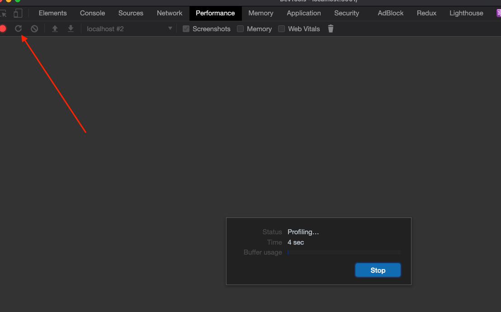
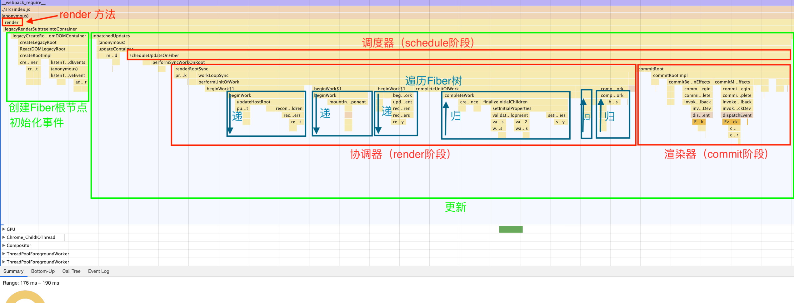
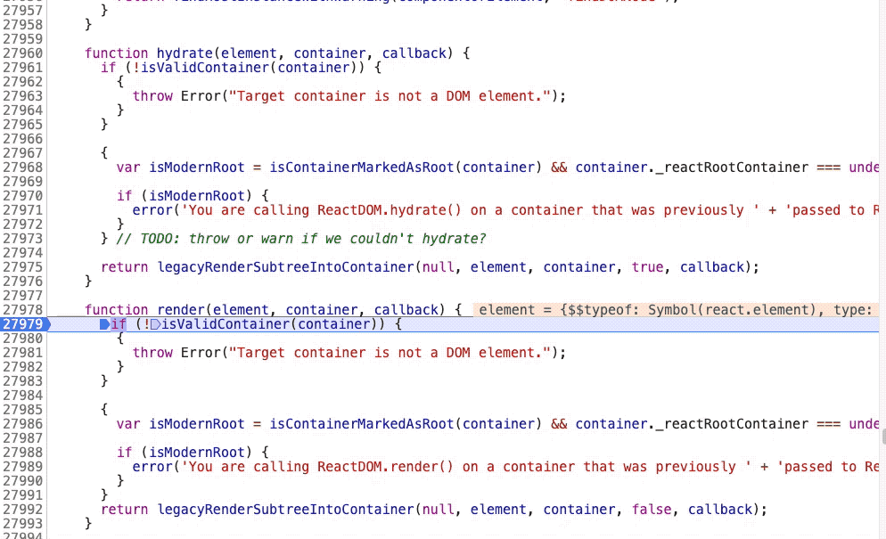
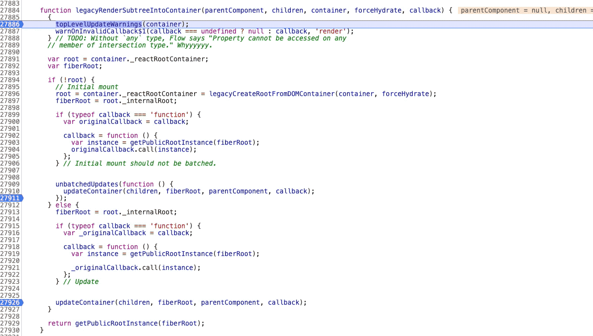
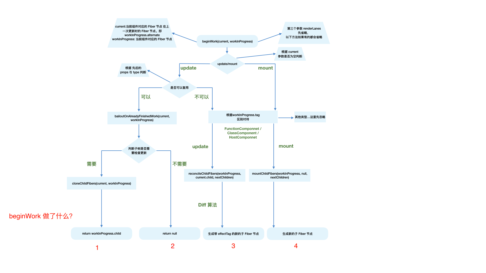
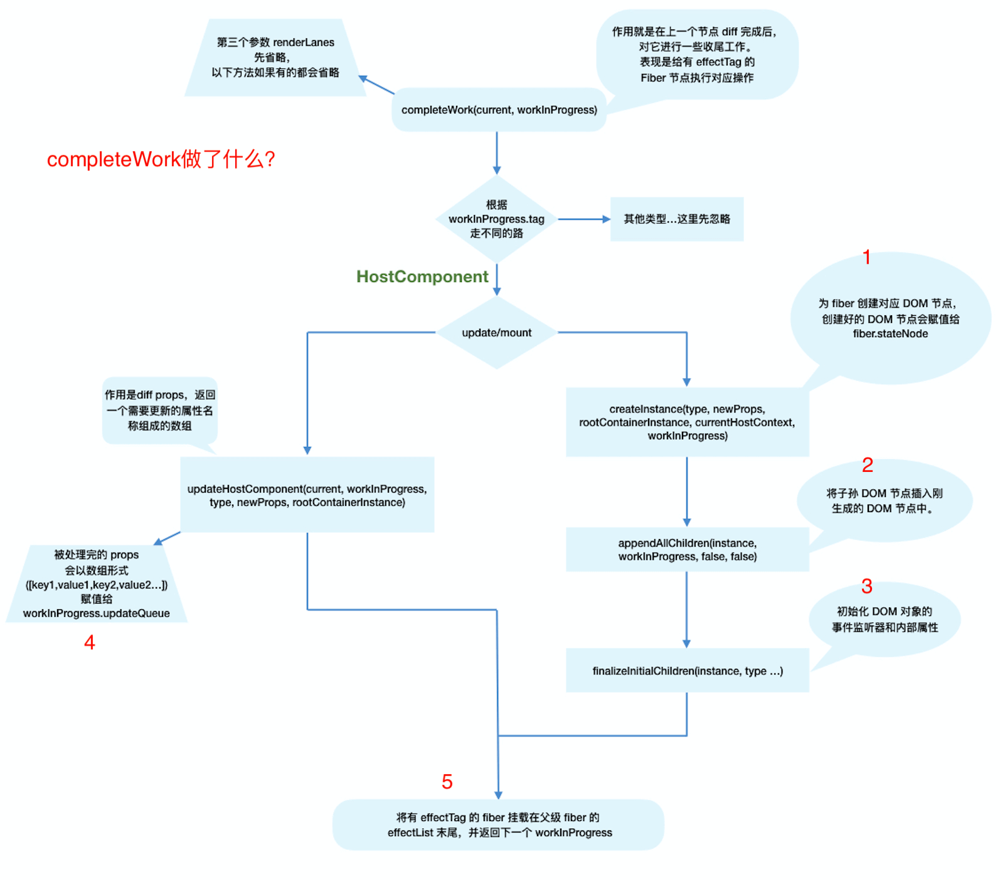

# React 源码(一) 整体流程

## 说明

- 源码系列文章基于 React 17.0.1
- 为了阅读体验，源码会截取一小部分
- 这里只是粗略地读了一遍，可能有很多细节每来得及理清楚，后面会不断补充

## 前置知识

- 需要了解源码文件目录请看[源码概览](https://zh-hans.reactjs.org/docs/codebase-overview.html)

## 1. 我是如何看源码的

无论你读或不读，React 源码都静静地躺在在[那里](https://github.com/facebook/react)，不好不坏。

需要说明的是，React 源码使用 TypeScript 写的且量很大，直接读起来估计那味道会很酸爽 😂。

因为是 TypeScript 写的源码，所以，在浏览器中调试时看到的都是解析打包的代码，要清楚这一点。

**如果把大致的流程清楚之后，还是建议直接读一下 React 没有任何打包的源码，主要原因有三点：**

- 1. React 源码中的文件和命名对理解 React 是很有帮助的，但是，打包后这些命名都不存在了
- 2. React 源码不仅是世界上最优秀的一批前端工程师的杰作，而且其中所涉猎的软件知识范围绝不止前端范畴，打包后的代码可能会有所偏离
- 3. 学习 React 源码不仅对我们自己开发基础组件也会有很大帮助，也可以学习 TypeScript

建议直接创建一个专门用来学习源码的小项目：

```shell
npx create-react-app react-code
cd react-code
npm start
```

此时，你的项目中已经有了最新的 React 和相关的 package。

---

如果你嫌每次到 node_modules 中查找文件太麻烦，可以使用 yarn 的 link 功能，将相关的包指向一个单独的 React 源码文件。

1. 拉取源码

```shell
git clone https://github.com/facebook/react.git
```

2. 安装依赖

```shell
# 进入到垃取的react项目文件夹
cd react
npm install
```

3. build 成 dev 环境使用的 cjs 包

```shell
yarn build react/index,react/jsx,react-dom/index,scheduler --type=NODE
```

4. 改变项目中依赖包的目录指向

```shell
cd build/node_modules/react
# 申明react指向
yarn link
cd build/node_modules/react-dom
# 申明react-dom指向
yarn link
```

5. 改变项目包的指向

```shell
# 进入我们上面创建的项目
cd react-code
# 将项目内的react react-dom指向之前申明的包
yarn link react react-dom
```

这样我们的 react-code 项目中使用的就是我们拉下来的 react 源码中的包了。

## 2. 启动项目

如果已经创建的项目，并安装了依赖，可以快速启动我们的项目：

```js
npm start
```

## 3. 一张必看的 React 渲染流程图

F2 打开浏览器的开发者工具（DevTools）;

找到 Performance 面板，点击刷新。



你会看到一张页面渲染的火焰图，找到有用的部分，"./src/index.js"所在的部分，其他的先不管。

图 2: 初次渲染，React 执行过程火焰图 🔥


对，这里的 render 就是我们代码里的 ReactDOM.render() 方法。

_注意 ⚠️_

> 这是使用 ReactDOM.render()方法时的流程，也就是默认的 legacy 模式，如果用的时 concurrent 模式就不是这样了。
>
> 如， concurrent 模式下 render 阶段的入口函数是 performConcurrentWorkOnRoot,而不是 performSyncWorkOnRoot。这一点可以在[这里](https://github.com/facebook/react/blob/master/packages/react-reconciler/src/ReactFiberWorkLoop.old.js#L721)看到。

## 4. 首次渲染的大致过程

### 4.1 执行入口调度

#### 4.1.1 执行 render()入口

一般 Web 应用的入口函数是：

```js
ReactDOM.render(<App />, document.getElementById("root"));
```

_在 render 函数处打断点：_



可以看到，render 的参数:

- element：处理后得到的 React Element（处理过程在 【深入理解 JSX】章节有介绍）
- container: 就是我们的容器元素 div#root

#### 4.1.2 执行 legacyRenderSubtreeIntoContainer()

从名称可以看出，这里是要开始渲染子树到容器中。

**主要功能：**

- 1. 初始化 fiberRoot 和 FiberNode

- 2. fiberRoot.current 指向了 child 为 null 的 RootFiber（组件树的根 Fiber）

```js
function legacyRenderSubtreeIntoContainer(
  parentComponent,
  children,
  container,
  forceHydrate,
  callback
) {
  ...
  var root = container._reactRootContainer;
  var fiberRoot;

  // 初始化时 root === undefined,会进入判断
  if (!root) {
    // Initial mount

    // root 是根节点 div#root
    root = container._reactRootContainer = legacyCreateRootFromDOMContainer(
      container,
      forceHydrate
    );
    // 给 fiberRoot 赋值，fiberRoot是全局唯一的 FiberRootNode 🌟
    // ⚠️：此时 fiberRoot.current === FiberNode {tag: 3,...}
    // fiberRoot.current 指向了一个空的 RootFiber（执行一次 ReactDOM.render 会生成一个 RootFiber）
    fiberRoot = root._internalRoot;
    ...

    unbatchedUpdates(function () {
      /* 执行更新容器
       * children：APP组件的 JSX解析值
       * fiberRoot: 全局唯一 FiberRootNode
       */
      updateContainer(children, fiberRoot, parentComponent, callback);
    });
  } else { // 这里处理更新逻辑
    fiberRoot = root._internalRoot;

    // Update
    updateContainer(children, fiberRoot, parentComponent, callback);
  }

  return getPublicRootInstance(fiberRoot);
}
```

_在 legacyRenderSubtreeIntoContainer 函数处打断点：_



#### 4.1.3 执行 updateContainer 函数

主要功能：

- 创建 update 对象
- 将 update 添加到队列 ？
- 开启调度

```js
function updateContainer(element, container, parentComponent, callback) {
  ...
  // current$1 赋值为 RootFiber（组件树的根 Fiber）
  var current$1 = container.current;
  ...
  // 创建 update对象
  var update = createUpdate(eventTime, lane);
  update.payload = {
    element: element,
  };
  callback = callback === undefined ? null : callback;
  ...
  // 将 update 添加到队列 ？
  enqueueUpdate(current$1, update);
  // 开启调度
  var root = scheduleUpdateOnFiber(current$1, lane, eventTime);

  if (root !== null) {
    entangleTransitions(root, current$1, lane);
  }

  return lane;
}
```

#### 4.1.4 执行 scheduleUpdateOnFiber 函数

主要功能：**做更新调度，获取优先级最高的更新**

- if (root === workInProgressRoot): 判断是不是要更新一个正在更新的 fiber 树
- if (lane === SyncLane)： 判断是不是做同步更新

```js
// fiber：RootFiber（组件树的根 Fiber）
function scheduleUpdateOnFiber(fiber, lane, eventTime) {
  ...
  // 标记 fiber更新到 root上，并返回 root
  var root = markUpdateLaneFromFiberToRoot(fiber, lane);
  ...
  // Mark that the root has a pending update.
  markRootUpdated(root, lane, eventTime);

  // 处理正在渲染中的 fiber树 的更新
  if (root === workInProgressRoot) {
    ...
  }

  // 同步更新
  if (lane === SyncLane) {
    // 挂载时进入条件
    if ((executionContext & LegacyUnbatchedContext) !== NoContext &&
     (executionContext & (RenderContext | CommitContext)) === NoContext) {
      schedulePendingInteractions(root, lane);

      // 调度器（schedule阶段）工作完成，开启下一步 render
      performSyncWorkOnRoot(root);
    } else { // 更新时进入条件
      ensureRootIsScheduled(root, eventTime);
      schedulePendingInteractions(root, lane);

      if (executionContext === NoContext) {
        // Flush the synchronous work now, unless we're already working or inside
        // a batch
        resetRenderTimer();
        flushSyncCallbackQueue();
      }
    }
  } else {
    // Schedule other updates after in case the callback is sync.
    ensureRootIsScheduled(root, eventTime);
    schedulePendingInteractions(root, lane);
  }

  return root;
}
```

### 4.2 协调器（render 阶段）

#### 4.2.1 执行 performSyncWorkOnRoot 函数

- renderRootSync(): **启动 render 阶段，获取需要渲染的 Fiber 树**
- commitRoot()：**启动 commit 阶段， 将获取的 Fiber 树渲染到页面**

<code style="color: #708090; background-color: #F5F5F5; font-size: 18px">renderRootSync</code>和<code style="color: #708090; background-color: #F5F5F5; font-size: 18px">commitRoot</code> 是同步执行的，先执行<code style="color: #708090; background-color: #F5F5F5; font-size: 18px">renderRootSync</code>，协调器工作（render 阶段）完成后得到要更新的结果，然后<code style="color: #708090; background-color: #F5F5F5; font-size: 18px">commitRoot</code>做渲染（commit 阶段）工作。

```js
function performSyncWorkOnRoot(root) {
  if (!((executionContext & (RenderContext | CommitContext)) === NoContext)) {
    {
      throw Error("Should not already be working.");
    }
  }

  flushPassiveEffects();
  var lanes;
  var exitStatus;

  // 优化处理，继续渲染一棵未完成的树
  if (
    root === workInProgressRoot &&
    includesSomeLane(root.expiredLanes, workInProgressRootRenderLanes)
  ) {
    lanes = workInProgressRootRenderLanes;
    exitStatus = renderRootSync(root, lanes);
  } else {
    // 正常的 mount 和 update执行这里
    lanes = getNextLanes(root, NoLanes);

    {
      var nextLanesPriority = returnNextLanesPriority();

      if (nextLanesPriority < InputDiscreteLanePriority) {
        return null;
      }
    }
    // 启动协调器（render 阶段）
    exitStatus = renderRootSync(root, lanes);
  }

  // 错误处理
  if (root.tag !== LegacyRoot && exitStatus === RootErrored) {
    ...
    // If something threw an error, try rendering one more time.
  }

  ...
  // We now have a consistent tree. Because this is a sync render, we will commit it even if something suspended.
  // 翻译下官网注释：现在我们得到了一个一致的 Fiber树. 因为渲染是同步进行的，就算有要暂停地方，我们仍要 commit 它。
  var finishedWork = root.current.alternate;
  root.finishedWork = finishedWork;
  root.finishedLanes = lanes;
  // 启动渲染器（commit阶段）
  commitRoot(root);

  ensureRootIsScheduled(root, now());
  return null;
}
```

#### 4.2.2 执行 renderRootSync 函数

**启动协调器（render 阶段）。**

```js
function renderRootSync(root, lanes) {
  ...
  /*
   * workInProgressRoot: 我们正在 working 的 root
   * workInProgressRootRenderLanes: 正在 rending 的 lanes
   */
  if (workInProgressRoot !== root || workInProgressRootRenderLanes !== lanes) {
    /*
     * 准备好要更新的栈 -- 新的 Fiber 树
     * 🌟 会调用 createWorkInProgress(root.current, null) 🌟 创建 workInProgress（The fiber we're working on）
     */
    prepareFreshStack(root, lanes);
    startWorkOnPendingInteractions(root, lanes);
  }
  ...
  do {
    try {
      workLoopSync();
      break;
    } catch (thrownValue) {
      handleError(root, thrownValue);
    }
  } while (true);
  ...
}
```

_有必要看下 prepareFreshStack():_

```js
function prepareFreshStack(root, lanes) {
  ...
  // 初始化 workInProgressRoot
  workInProgressRoot = root;
  // 创建当前 Fiber节点，然后赋值给变量 workInProgress 🌟
  workInProgress = createWorkInProgress(root.current, null);
  ...
}
```

_遍历执行 “递” 操作：_

```js
function workLoopSync() {
  // workInProgress 不为 null 时，循环♻️ 调用 performUnitOfWork
  while (workInProgress !== null) {
    performUnitOfWork(workInProgress);
  }
}
```

#### 4.2.3 执行 performUnitOfWork 函数

<span style="color: #ff0000; font-size: 16px;">会创建下一个 Fiber 节点并赋值给 workInProgress</span>.

这里执行 Fiber 树的深度优先**遍历工作**。

如果没有下一个需要“递”的节点，会终止上面 👆 的 循环 ♻️。

```js
// unitOfWork 是当前 workInProgress 节点
function performUnitOfWork(unitOfWork) {
  // alternate 是 双缓存Fiber 中对应的另一个 Fiber树 中相应的 Fiber节点
  // 只有初始化时 current 为 null，其他情况下 current指向上一次更新时对应的 Fiber节点 🌟
  var current = unitOfWork.alternate;
  setCurrentFiber(unitOfWork);
  var next;

  if ((unitOfWork.mode & ProfileMode) !== NoMode) {
    startProfilerTimer(unitOfWork);
    // 调用“递”工作 🌟🌟
    // next 代表下一个需要“递”的 Fiber节点
    next = beginWork$1(current, unitOfWork, subtreeRenderLanes);
    stopProfilerTimerIfRunningAndRecordDelta(unitOfWork, true);
  } else {
    next = beginWork$1(current, unitOfWork, subtreeRenderLanes);
  }

  // 重置 current = null等
  resetCurrentFiber();
  unitOfWork.memoizedProps = unitOfWork.pendingProps;

  // next 为 null 时开始“归”操作
  if (next === null) {
    // 调用“归”工作 🌟🌟
    completeUnitOfWork(unitOfWork);
  } else {
    // next 不为 null 时，将 next 赋值为新的 workInProgress，继续循环♻️
    workInProgress = next;
  }

  ReactCurrentOwner$2.current = null;
}
```

#### 4.2.4 执行 beginWork$1 函数

- 执行 beginWork 函数
- 如果出错就恢复为 beginWork 之前的 Fiber

```js
beginWork$1 = function (current, unitOfWork, lanes) {
  // 在进入 begin 阶段之前，将正在进行的工作复制到一个 dummyFiber 上
  var originalWorkInProgressCopy = assignFiberPropertiesInDEV(dummyFiber, unitOfWork);

  try {
    // 启动“递”阶段
    return beginWork(current, unitOfWork, lanes);
  } catch (originalError) {
    ...
    // 如果 beginWork 抛出，我们就用这个来重置状态
    assignFiberPropertiesInDEV(unitOfWork, originalWorkInProgressCopy);

    ...
    throw originalError;
  }
};
```

#### 4.2.5 执行 beginWork 函数

<span style="color: #ff0000; font-size: 16px;">就是要根据当前 Fiber 节点，创建子 Fiber 节点</span>。

beginWork 每次只会创建一个 子 Fiber 节点。

beginWork 做了大量的工，[源码地址](https://github.com/facebook/react/blob/master/packages/react-reconciler/src/ReactFiberBeginWork.old.js#L3228),源码中整个文件夹都是 beginWork 相关的函数。

```js
function beginWork(
  current: Fiber | null,
  workInProgress: Fiber,
  renderLanes: Lanes,
): Fiber | null {
  // 组件更新优先级
  let updateLanes = workInProgress.lanes;

  // 处理开发环境相关工作
  if (__DEV__) {...}

  // 处理 update(更新)阶段工作
  if (current !== null) {
    var oldProps = current.memoizedProps;
    var newProps = workInProgress.pendingProps;

    // 如果 props 或 context 发生了变化，则标明该 fiber 已进行工作
    if (oldProps !== newProps || hasContextChanged() || ( // Force a re-render if the implementation changed due to hot reload:
     workInProgress.type !== current.type )) {

      didReceiveUpdate = true;
    } else if (!includesSomeLane(renderLanes, updateLanes)) { // 当前Fiber节点优先级不够
      didReceiveUpdate = false;
      // 这根 Fiber 没有任何待处理的工作
      // 不再继续 beginWork,但是要是把东西推到堆栈上
      switch (workInProgress.tag) {...};

      // 复用 current
      return bailoutOnAlreadyFinishedWork(current, workInProgress, renderLanes);
  } else {
    // 可以直接复用前一次更新的子Fiber，不需要新建子Fiber
    didReceiveUpdate = false;
  }

  // 进入begin阶段前，清除待更新优先级
  workInProgress.lanes = NoLanes;

  // 匹配不同的 FiberNode，调用不同的方法做进一步处理
  switch (workInProgress.tag) {
    ...
    case FunctionComponent: {}
    case ClassComponent: {}
    case HostRoot: {}
    case HostComponent: {}
    case HostText: {}
    case SuspenseComponent: {}
    ...
  }
}
```

beginWork() 参数解析：

- current: 当前要做“递”操作的 FiberNode 在上一次更新时对应的 FiberNode，即 workInProgress.alternate
- workInProgress：当前要做“递”操作的 FiberNode
- renderLanes：优先级相关

**组件 mount 时： current === null;**
**update 时： current !== null;**

所以，beginWork 会用 if (current !== null) 判断来区分 <code style="color: #708090; background-color: #F5F5F5; font-size: 18px">mount</code> 和 <code style="color: #708090; background-color: #F5F5F5; font-size: 18px">update</code>.

**进入 update 时**: 会判断对 workInProgress 的创建进行优化。

**进入 mount 时**: 会根据不同的 tag 类型，创建不同的 Fiber 节点。

无论哪一种类型，都会进入 <code style="color: #708090; background-color: #F5F5F5; font-size: 18px">reconcileChildren</code> 方法。

_示例：_

```js
function App() {
  return (
    <div className="App">
      <FuncCom></FuncCom>
      <ClassCom></ClassCom>
    </div>
  );
}
```

_FuncCom 组件:_

```js
return (
  <div class="funcCom">
    <button onClick={() => click}>func click</button>
  </div>
);
```

div.APP 的 type = "div"，tag: 5, 属于 HostComponent；

FuncCom 组件是个函数组件，tag: 2, type = () => {name: FUNC, length: 0 ...}

”递“ FuncCom 组件的 div，

”递“ FuncCom 组件的 button, type: "button", tag: 5, 属于 HostComponent；

<span style="color: #ff0000; font-size: 16px;">由于 button 已经没有子节点（文本节点“func click”做了优化，不会去遍历）</span>，所以“深度优先”的遍历到了一个尾端，需要向上“归”了。

**“归”操作调用 completeWork()**

button 的 FiberNode.return 指向 div.funcCom。

由于 div.funcCom 没有其他兄弟节点，需要接续网上”归“，div.funcCom 的 FiberNode.return 指向 FuncCom 的 FiberNode。

下一步会查找 FuncCom 的兄弟节点，找到了 ClassCom。

FuncCom 组件是个类组件，tag: 2, type: class ClassCom {name: "ClassCom", length: 0 ...}

然后继续这样的递归操作，直到“归”到这 fiber 根节点（fiberRoot）， tag: 3, type: null。

这时，**就完成了 render 阶段的工作，协调器的工作做完了。**

<span style="color: #ff0000; font-size: 16px;">以上任务全部是发生在<code style="color: #708090; background-color: #F5F5F5; font-size: 18px">内存中</code>的，因此，用户不会有任何感知</span>。

调用栈会返回到 performSyncWorkOnRoot 函数，执行 commitRoot(root)。

**会进入下一个阶段（commit 阶段），渲染器开始做渲染工作**。

#### 4.2.7 执行 reconcileChildren

<code style="color: #708090; background-color: #F5F5F5; font-size: 18px">reconcileChildren</code> 会调用 <code style="color: #708090; background-color: #F5F5F5; font-size: 18px">reconcileChildFibers</code>,**这是协调器（render 阶段）最重要的方法。**

**mount 时:** 它会创建所有的 子 Fiber 节点.

update 时: 它会将 **”当前节点“** 与该节点在 **"上次更新时对应的 Fiber 节点"** 和 **newChild(React Element)** 做比较（这个比较就是 <span style="color: #ff0000; font-size: 16px;">diff 算法</span>），最终<span style="color: #ff0000; font-size: 16px;">生成新的需要渲染的 Fiber 节点<span>。🌟🌟🌟

newChild(React Element) 做比较之前最终会调用 createFiber()方法先生成 Fiber 节点。

_createFiber 方法生成 fiber 节点:_

```js
const createFiber = function (
  tag: WorkTag,
  pendingProps: mixed,
  key: null | string,
  mode: TypeOfMode
): Fiber {
  // $FlowFixMe: the shapes are exact here but Flow doesn't like constructors
  return new FiberNode(tag, pendingProps, key, mode);
};
```

_reconcileChildren 方法：_

```ts
reconcileChildren(
  current: Fiber | null,
  workInProgress: Fiber,
  nextChildren: any,
  renderLanes: Lanes,
) {
  // 如果这是一个尚未渲染的全新组件
  // 不会通过应用最小的副作用来更新其子集,会在渲染之前将它们全部添加到子集中
  if (current === null) {
    workInProgress.child = mountChildFibers(
      workInProgress,
      null,
      nextChildren,
      renderLanes,
    );
  } else {
    // 如果当 current.child 与 workInProgress 相同，说明我们还没有开始对这些 children 进行任何工作,
    // 我们使用 克隆算法 来创建所有 current.child 的副本

    // 如果有不同的变动，就挑出来
    workInProgress.child = reconcileChildFibers(
      workInProgress,
      current.child,
      nextChildren,
      renderLanes,
    );
  }
}
```

从<code style="color: #708090; background-color: #F5F5F5; font-size: 18px">mountChildFibers()</code>和<code style="color: #708090; background-color: #F5F5F5; font-size: 18px">reconcileChildFibers()</code>这两个方法的[源码](https://github.com/facebook/react/blob/master/packages/react-reconciler/src/ReactChildFiber.old.js#L1350)可以看到,它们都调用了 ChildReconciler 方法。

区别是 <code style="color: #708090; background-color: #F5F5F5; font-size: 18px">reconcileChildFibers()</code>方法生成的 Fiber 节点有 effectTag 属性，<span style="color: #ff0000; font-size: 16px;">commit 阶段渲染时，执行 DOM 操作的具体类型就保存在 fiber.effectTag 中</span>。🌟

_ReactChildFiber.old.js 里的源码：_

```ts
...
//省略各种处理具体逻辑
...
// 这是个包裹函数，返回一个新的函数，新的函数
function ChildReconciler(shouldTrackSideEffects) {
  function reconcileChildFibers(
    returnFiber: Fiber,
    currentFirstChild: Fiber | null,
    newChild: any,
    lanes: Lanes
  ): Fiber | null {
    // 处理 <>{[...]}</> and <>...</> 的片段
    const isUnkeyedTopLevelFragment =
      typeof newChild === "object" &&
      newChild !== null &&
      newChild.type === REACT_FRAGMENT_TYPE &&
      newChild.key === null;
    if (isUnkeyedTopLevelFragment) {
      newChild = newChild.props.children;
    }

    // 处理 object 类型
    const isObject = typeof newChild === "object" && newChild !== null;

    if (isObject) {
      ...
    }

    // 处理 string 和 number类型
    if (typeof newChild === "string" || typeof newChild === "number") {
      ...
    }

    // 处理数组
    if (isArray(newChild)) {
      ...
    }

    // 处理 迭代器函数
    if (getIteratorFn(newChild)) {
      ...
    }

    ...
    // 处理异常情况
    if (typeof newChild === "undefined" && !isUnkeyedTopLevelFragment) {
      ...
    }

    // 其他情况按清空处理
    return deleteRemainingChildren(returnFiber, currentFirstChild);
  }

  return reconcileChildFibers;
}
export const reconcileChildFibers = ChildReconciler(true);
export const mountChildFibers = ChildReconciler(false);
```

深度优先的递归遍历节点，“递”的工作会在二叉树的终点开始“归”操作，此时说明**当前节点的 child 为 null**.

最终，beginWork$1 会获取到这个结果，next 会被赋值为 null.

4.2.3 中的 performUnitOfWork 方法会执行 completeUnitOfWork():

```js
// next 为 null 时开始“归”操作
if (next === null) {
  // 调用“归”工作 🌟🌟
  completeUnitOfWork(unitOfWork);
} else {
  // next 不为 null 时，将 next 赋值为新的 workInProgress，继续循环♻️
  workInProgress = next;
}
```

_beginWork 流程图：_

> （来自-卡颂) 这张图画的挺好，红色为我的标注，后面有时间自己画一个更详细点的



#### 4.2.6 执行 completeWork 函数

```js
function completeWork(
  current: Fiber | null,
  workInProgress: Fiber,
  renderLanes: Lanes,
): Fiber | null {
  const newProps = workInProgress.pendingProps;

  switch (workInProgress.tag) {
    case IndeterminateComponent:
    case LazyComponent:
    case SimpleMemoComponent:
    case FunctionComponent:
    case ForwardRef:
    case Fragment:
    case Mode:
    case Profiler:
    case ContextConsumer:
    case MemoComponent:
      bubbleProperties(workInProgress);
      return null;
    case ClassComponent: {
      const Component = workInProgress.type;
      if (isLegacyContextProvider(Component)) {
        popLegacyContext(workInProgress);
      }
      bubbleProperties(workInProgress);
      return null;
    }
    case HostRoot: {
      const fiberRoot = (workInProgress.stateNode: FiberRoot);
      ...
      updateHostContainer(current, workInProgress);
      bubbleProperties(workInProgress);
      return null;
    }
    case HostComponent: {
      popHostContext(workInProgress);
      const rootContainerInstance = getRootHostContainer();
      const type = workInProgress.type;
      // update时
      if (current !== null && workInProgress.stateNode != null) {
        // 更新组件
        updateHostComponent(
          current,
          workInProgress,
          type,
          newProps,
          rootContainerInstance,
        );
        ...
      } else { // mount时
        ....
        const currentHostContext = getHostContext();
        // 为fiber创建对应DOM节点
        const instance = createInstance(
            type,
            newProps,
            rootContainerInstance,
            currentHostContext,
            workInProgress,
          );
        // 将子孙DOM节点插入刚生成的DOM节点中
        appendAllChildren(instance, workInProgress, false, false);
        // DOM节点赋值给fiber.stateNode
        workInProgress.stateNode = instance;

        // 与update逻辑中的updateHostComponent类似的处理props的过程
        if (
          finalizeInitialChildren(
            instance,
            type,
            newProps,
            rootContainerInstance,
            currentHostContext,
          )
        ) {
          markUpdate(workInProgress);
        }
      }
    }
    ...
    case CacheComponent: {
      if (enableCache) {
        const cache: Cache = workInProgress.memoizedState.cache;
        popCacheProvider(workInProgress, cache);
        bubbleProperties(workInProgress);
        return null;
      }
    }
  }
  ...
}
```

**HostComponent 是处理 tag: 5 （原生 DOM 组件生成的 Fiber 节点类型）时执行的函数。**

**update 时：**

---

当 update 时，Fiber 节点已经存在对应 DOM 节点，所以不需要生成 DOM 节点。需要做的主要是处理 props，比如：

- onClick、onChange 等回调函数的注册
- 处理 style prop
- 处理 DANGEROUSLY_SET_INNER_HTML prop
- 处理 children prop

<code style="color: #708090; background-color: #F5F5F5; font-size: 18px">updateHostComponent</code> 中，<span style="color: #ff0000; font-size: 16px;">被处理完的 props 会被赋值给 workInProgress.updateQueue，并最终会在 commit 阶段被渲染在页面上</span>。

**mount 时：**

---

由于 completeWork 属于“归”阶段调用的函数，**每次调用 appendAllChildren 时都会将已生成的子孙 DOM 节点插入当前生成的 DOM 节点下。**

<span style="color: #ff0000; font-size: 16px;">那么当“归”到 rootFiber 时，我们已经有一个构建好的离屏 DOM 树</span>。

_completeWork 流程图：_

> （来自-卡颂) 这张图画的挺好，红色为我的标注，后面有时间自己画一个更详细点的



### 4.3 渲染器（commit 阶段）

**渲染器（commit 阶段）**的主要工作是将 Fiber 树（虚拟 DOM）渲染到页面。

渲染器的工作可以分为三个阶段：

- before mutation 阶段（执行 DOM 操作前）
- mutation 阶段（执行 DOM 操作）
- layout 阶段（执行 DOM 操作后）

这三个阶段之外还做了一些额外工作，如 useEffect 触发、优先级重置、ref 绑定/解绑等。

【4.2.1 章节中的 performSyncWorkOnRoot 函数】里完成 render 阶段的工作（执行 renderRootSync）后调用 commitRoot 方法，

最终它会调用 commitRootImpl 方法。

启动 commit 阶段。

_源码中的 commitRootImpl 方法_

```js
// root：fiberRootNode
// renderPriorityLevel: 优先级
function commitRootImpl(root, renderPriorityLevel) {
  // ------------------------ before mutation 之前
  do {
    // `flushPassiveEffects`会在最后调用`flushSyncUpdateQueue`，
    // 这意味着`flushPassiveEffects`有时会导致额外的被动效果，如触发useEffect回调与其他同步任务
    // 所以我们需要一直循环刷新，直到没有更多待处理的效果
    flushPassiveEffects();
  } while (rootWithPendingPassiveEffects !== null);
  flushRenderPhaseStrictModeWarningsInDEV();

  ...
  // root.finishedWork 指当前应用的 rootFiber 🌟
  const finishedWork = root.finishedWork;
  const lanes = root.finishedLanes;

  ...
  root.finishedWork = null;
  root.finishedLanes = NoLanes;
  ...

  // 重置Scheduler绑定的回调函数
  root.callbackNode = null;
  root.callbackPriority = NoLanePriority;

  let remainingLanes = mergeLanes(finishedWork.lanes, finishedWork.childLanes);
  // 重置优先级相关变量
  markRootFinished(root, remainingLanes);

  // 重置全局变量
  if (root === workInProgressRoot) {
    // We can reset these now that they are finished.
    workInProgressRoot = null;
    workInProgress = null;
    workInProgressRootRenderLanes = NoLanes;
  } else {
  }

  // If there are pending passive effects, schedule a callback to process them.
  // 如果有待处理的被动效果，安排回调处理.
  // Do this as early as possible, so it is queued before anything else that might get scheduled in the commit phase.
  // 尽可能早地这样做，这样它就会插入 commit阶段 可能被安排的其他事情的 队列之前
  // 调度 useEffect 🪝🪝
  if (
    (finishedWork.subtreeFlags & PassiveMask) !== NoFlags ||
    (finishedWork.flags & PassiveMask) !== NoFlags
  ) {
    if (!rootDoesHavePassiveEffects) {
      rootDoesHavePassiveEffects = true;
      scheduleCallback(NormalSchedulerPriority, () => {
        flushPassiveEffects();
        return null;
      });
    }
  }

  // Check if there are any effects in the whole tree.
  // 检查整个树中是否有任何 effects
  const subtreeHasEffects =
    (finishedWork.subtreeFlags &
      (BeforeMutationMask | MutationMask | LayoutMask | PassiveMask)) !==
    NoFlags;
  const rootHasEffect =
    (finishedWork.flags &
      (BeforeMutationMask | MutationMask | LayoutMask | PassiveMask)) !==
    NoFlags;

  // 处理有 effects 的情况
  if (subtreeHasEffects || rootHasEffect) {
    ...

    // Reset this to null before calling lifecycles
    // 在调用 lifecycles 之前，将其重置为 null
    ReactCurrentOwner.current = null;

    /*
     * 官方注释：
     * commit阶段 分为几个子阶段
     * 我们对每个阶段的 effect list 进行单独的传递：所有的 mutation effects 在所有 layout effects 之前，以此类推
     */

    // ------------------------ before mutation 阶段----------------------------------


    // 我们在 mutation 之前使用这个阶段来读取 host tree 的状态
    // 调用 getSnapshotBeforeUpdate
    const shouldFireAfterActiveInstanceBlur = commitBeforeMutationEffects(
      root,
      finishedWork
    );

    ...

    // ------------------------ mutation 阶段----------------------------------

    // mutate host tree.
    // 页面视图更新在这个阶段 🌟🌟🌟
    commitMutationEffects(root, renderPriorityLevel, finishedWork);

    if (shouldFireAfterActiveInstanceBlur) {
      afterActiveInstanceBlur();
    }
    resetAfterCommit(root.containerInfo);

    // The work-in-progress tree is now the current tree. This must come after
    // the mutation phase, so that the previous tree is still current during
    // componentWillUnmount, but before the layout phase, so that the finished
    // work is current during componentDidMount/Update.
    root.current = finishedWork;

    // ------------------------ layout 阶段----------------------------------

    // 调用副作用（effects） 在 host tree mutation之后读取它
    // 这阶段主要用来完成 layout（布局）
    // 但由于传统原因，类组件的 🌟生命周期也会在这里启动🌟
    ...
    commitLayoutEffects(finishedWork, root, lanes);
    ...

    // Tell Scheduler to yield at the end of the frame, so the browser has an opportunity to paint.
    // 告诉 Scheduler 在帧结束时让步，这样浏览器就有机会绘制
    requestPaint();

    if (enableSchedulerTracing) {
      popInteractions(((prevInteractions: any): Set<Interaction>));
    }
    executionContext = prevExecutionContext;

    if (previousLanePriority != null) {
      // Reset the priority to the previous non-sync value.
      setCurrentUpdateLanePriority(previousLanePriority);
    }
  } else {
    // No effects.
    // 没有副作用直接切换 current 指向 finishedWork
    root.current = finishedWork;
    ...
  }

  // ------------------------ layout 阶段之后 做的其他工作

  const rootDidHavePassiveEffects = rootDoesHavePassiveEffects;

  // useEffect相关
  if (rootDoesHavePassiveEffects) {
    // This commit has passive effects. Stash a reference to them. But don't
    // schedule a callback until after flushing layout work.
    rootDoesHavePassiveEffects = false;
    rootWithPendingPassiveEffects = root;
    pendingPassiveEffectsLanes = lanes;
    pendingPassiveEffectsRenderPriority =
      renderPriorityLevel === NoLanePriority
        ? DefaultLanePriority
        : renderPriorityLevel;
  }

  // Read this again, since an effect might have updated it
  remainingLanes = root.pendingLanes;

  // 性能优化相关
  if (remainingLanes !== NoLanes) {
    ...
  } else {
    legacyErrorBoundariesThatAlreadyFailed = null;
  }

  // 性能优化相关
  if (enableSchedulerTracing) {
    if (!rootDidHavePassiveEffects) {
      finishPendingInteractions(root, lanes);
    }
  }

  // 检测无限循环的同步任务
  if (includesSomeLane(remainingLanes, (SyncLane: Lane))) {
    ...
  } else {
    nestedUpdateCount = 0;
  }

  ...

  // Always call this before exiting `commitRoot`, to ensure that any additional work on this root is scheduled.
  // 总是在退出' commitRoot '之前调用这个函数，确保任何附加的任务被调度
  ensureRootIsScheduled(root, now());

  if (hasUncaughtError) {
    hasUncaughtError = false;
    const error = firstUncaughtError;
    firstUncaughtError = null;
    throw error;
  }

  if ((executionContext & LegacyUnbatchedContext) !== NoContext) {
    ...
    return null;
  }

  // If layout work was scheduled, flush it now. -> 如果布局工作已经安排好了，现在就进行冲洗

  // 执行同步任务，这样同步任务不需要等到下次事件循环再执行
  // 比如在 componentDidMount 中执行 setState 创建的更新会在这里被同步执行
  // 或useLayoutEffect
  flushSyncCallbackQueue();

  ...

  return null;
}
```

从上面可以看出：

**before mutation 之前：**

- 1. 主要做一些变量赋值，状态重置的工作
- 2. 调度 useEffect

#### 4.3.1 before mutation 阶段

**主要功能：**

- 1. 处理 DOM 节点渲染/删除后的 autoFocus、blur 逻辑

- 2. 调用 getSnapshotBeforeUpdate 生命周期钩子

<code style="color: #708090; background-color: #F5F5F5; font-size: 18px">before mutation 阶段</code>从 [commitBeforeMutationEffects](https://github.com/facebook/react/blob/master/packages/react-reconciler/src/ReactFiberCommitWork.old.js#L270)开始。

_commitBeforeMutationEffects 方法：_

```js
export function commitBeforeMutationEffects(
  root: FiberRoot,
  firstChild: Fiber
) {
  // focus blur相关
  focusedInstanceHandle = prepareForCommit(root.containerInfo);

  nextEffect = firstChild;
  // 调用主函数
  commitBeforeMutationEffects_begin();

  // We no longer need to track the active instance fiber
  const shouldFire = shouldFireAfterActiveInstanceBlur;
  shouldFireAfterActiveInstanceBlur = false;
  focusedInstanceHandle = null;

  return shouldFire;
}
```

同步调用如下函数：
commitBeforeMutationEffects_begin ->
commitBeforeMutationEffects_complete ->
commitBeforeMutationEffectsOnFiber：主函数

```js
function commitBeforeMutationEffectsOnFiber(finishedWork: Fiber) {
  const current = finishedWork.alternate;
  const flags = finishedWork.flags;

  ...

  if ((flags & Snapshot) !== NoFlags) {
    // 处理不同的 tag, 单独处理 ClassComponent 和 HostRoot
    switch (finishedWork.tag) {
      case FunctionComponent:
      case ForwardRef:
      case SimpleMemoComponent: {
        break;
      }
      case ClassComponent: {
        if (current !== null) {
          const prevProps = current.memoizedProps;
          const prevState = current.memoizedState;
          const instance = finishedWork.stateNode;
          ...
          // 调用 🪝 getSnapshotBeforeUpdate生命周期钩子 🪝
          const snapshot = instance.getSnapshotBeforeUpdate(
            finishedWork.elementType === finishedWork.type
              ? prevProps
              : resolveDefaultProps(finishedWork.type, prevProps),
            prevState
          );
          ...
          instance.__reactInternalSnapshotBeforeUpdate = snapshot;
        }
        break;
      }
      case HostRoot: {
        if (supportsMutation) {
          const root = finishedWork.stateNode;
          clearContainer(root.containerInfo);
        }
        break;
      }
      case HostComponent:
      case HostText:
      case HostPortal:
      case IncompleteClassComponent:
        break;
      default: {
        ...
      }
    }

    resetCurrentDebugFiberInDEV();
  }
}
```

#### 4.3.2 mutation 阶段

mutation 阶段从 commitMutationEffects 方法开始.

最终调用主函数 commitMutationEffectsOnFiber 来处理不同类型（Flag 不同）的操作。

**主要函数调用流程：**

commitMutationEffects -> commitDeletion/commitMutationEffects_complete -> commitMutationEffectsOnFiber.

_处理需要删除的元素：_

```js
...
if (deletions !== null) {
  for (var i = 0; i < deletions.length; i++) {
    var childToDelete = deletions[i];

    {
      invokeGuardedCallback(null, commitDeletion, null, root, childToDelete, fiber, renderPriorityLevel);

      if (hasCaughtError()) {
        var error = clearCaughtError();
        captureCommitPhaseError(childToDelete, fiber, error);
      }
    }
  }
}
...
```

ClassComponent 的删除流程：

commitDeletion -> unmountHostComponents -> commitUnmount -> safelyCallComponentWillUnmount -> callComponentWillUnmountWithTimer

_删除时，classComponent 的卸载：_

生命周期钩子 🪝 componentWillUnmount 会被调用。

```js
var callComponentWillUnmountWithTimer = function (current, instance) {
  instance.props = current.memoizedProps;
  instance.state = current.memoizedState;

  {
    instance.componentWillUnmount();
  }
};
```

_处理 mutation 的元素：_

```js
function commitMutationEffects_complete(
  root: FiberRoot,
  renderPriorityLevel: LanePriority
) {
  // 遍历 nextEffect
  while (nextEffect !== null) {
    const fiber = nextEffect;
    if (__DEV__) {
      ...
    } else {
      try {
        // 调用 mutation 主函数
        commitMutationEffectsOnFiber(fiber, root, renderPriorityLevel);
      } catch (error) {
        captureCommitPhaseError(fiber, fiber.return, error);
      }
    }

    const sibling = fiber.sibling;
    if (sibling !== null) {
      ensureCorrectReturnPointer(sibling, fiber.return);
      nextEffect = sibling;
      return;
    }

    nextEffect = fiber.return;
  }
}
```

```js
function commitMutationEffectsOnFiber(
  finishedWork: Fiber,
  root: FiberRoot,
  renderPriorityLevel: LanePriority
) {
  const flags = finishedWork.flags;

  // 根据 ContentReset effectTag重置文字节点
  if (flags & ContentReset) {
    commitResetTextContent(finishedWork);
  }

  // 更新ref
  if (flags & Ref) {
    const current = finishedWork.alternate;
    if (current !== null) {
      commitDetachRef(current);
    }
    if (enableScopeAPI) {
      // TODO: This is a temporary solution that allowed us to transition away
      // from React Flare on www.
      if (finishedWork.tag === ScopeComponent) {
        commitAttachRef(finishedWork);
      }
    }
  }

  // 处理不同 flags 的 Fiber节点
  const primaryFlags = flags & (Placement | Update | Hydrating);
  outer: switch (primaryFlags) {
    // 插入 DOM
    case Placement: {
      commitPlacement(finishedWork);
      // Clear the "placement" from effect tag so that we know that this is
      // inserted, before any life-cycles like componentDidMount gets called.
      // 从 effect tag 中清除 "placement"，这样我们就可以在任何生命周期（如componentDidMount）被调用之前，知道这个被插入了。
      finishedWork.flags &= ~Placement;
      break;
    }
    // 插入DOM 并 更新
    case PlacementAndUpdate: {
      // Placement
      commitPlacement(finishedWork);
      finishedWork.flags &= ~Placement;

      // Update
      const current = finishedWork.alternate;
      commitWork(current, finishedWork);
      break;
    }
    // SSR
    case Hydrating: {
      finishedWork.flags &= ~Hydrating;
      break;
    }
    // SSR
    case HydratingAndUpdate: {
      finishedWork.flags &= ~Hydrating;

      // Update
      const current = finishedWork.alternate;
      commitWork(current, finishedWork);
      break;
    }
    // 更新
    case Update: {
      const current = finishedWork.alternate;
      commitWork(current, finishedWork);
      break;
    }
  }
}
```

可以看到，mutation 阶段对每个 Fiber 节点执行如下三个操作：

- 1. 重置文字节点（由 flags 类型决定）
- 2. 更新 ref
- 3. 根据 fiber 节点的 flags 做不同的处理（Placement | Update | Deletion | Hydrating)

_Placement Flags:_

```js
function commitPlacement(finishedWork: Fiber): void {
  if (!supportsMutation) {
    return;
  }

  // Recursively insert all host nodes into the parent.
  // 递归地将所有主机节点插入到父节点中
  const parentFiber = getHostParentFiber(finishedWork);

  // 注意：parent、isContainer 这两个变量必须一起更新
  let parent;
  let isContainer;
  const parentStateNode = parentFiber.stateNode;
  switch (parentFiber.tag) {
    case HostComponent:
      parent = parentStateNode;
      isContainer = false;
      break;
    case HostRoot:
      parent = parentStateNode.containerInfo;
      isContainer = true;
      break;
    case HostPortal:
      parent = parentStateNode.containerInfo;
      isContainer = true;
      break;
    // eslint-disable-next-line-no-fallthrough
    default:
      invariant(
        false,
        "Invalid host parent fiber. This error is likely caused by a bug " +
          "in React. Please file an issue."
      );
  }
  if (parentFiber.flags & ContentReset) {
    // 在进行任何插入之前，先重置父的文本内容
    resetTextContent(parent);
    // Clear ContentReset from the effect tag
    parentFiber.flags &= ~ContentReset;
  }

  // 获取插入位置之前的兄弟节点
  const before = getHostSibling(finishedWork);
  // 我们只有被插入的顶部Fiber，但我们需要向下递归它的子节点，以找到所有的终端节点
  if (isContainer) {
    // 处理 container（应用 Fiber根节点，FiberNode）
    insertOrAppendPlacementNodeIntoContainer(finishedWork, before, parent);
  } else {
    // 将需要插入的内容
    insertOrAppendPlacementNode(finishedWork, before, parent);
  }
}
```

**从 insertOrAppendPlacementNodeXXX 方法名可以看到，它是和具体的 DOM 操作相关的。**

```js
// 插入or添加 PlacementNode 到 container
function insertOrAppendPlacementNodeIntoContainer(node, before, parent) {
  var tag = node.tag;
  var isHost = tag === HostComponent || tag === HostText;

  // Host组件（类HTML，如 div）
  if (isHost) {
    var stateNode = isHost ? node.stateNode : node.stateNode.instance;

    if (before) {
      insertInContainerBefore(parent, stateNode, before);
    } else {
      appendChildToContainer(parent, stateNode);
    }
  } else if (tag === HostPortal);
  else {
    // 处理 复合元素（如 APP，自定义组件）
    var child = node.child;

    if (child !== null) {
      insertOrAppendPlacementNodeIntoContainer(child, before, parent);
      var sibling = child.sibling;

      while (sibling !== null) {
        insertOrAppendPlacementNodeIntoContainer(sibling, before, parent);
        sibling = sibling.sibling;
      }
    }
  }
}
```

```js
// 执行具体的 DOM 操作
function insertOrAppendPlacementNode(
  node: Fiber,
  before: ?Instance,
  parent: Instance
): void {
  const { tag } = node;
  const isHost = tag === HostComponent || tag === HostText;
  // 处理 Host 元素（HTML 元素）
  if (isHost) {
    const stateNode = isHost ? node.stateNode : node.stateNode.instance;
    if (before) {
      insertBefore(parent, stateNode, before);
    } else {
      appendChild(parent, stateNode);
    }
  } else if (tag === HostPortal) {
  } else {
    // 处理 复合元素（自定义组件）
    const child = node.child;
    if (child !== null) {
      // 递归处理 node.child
      insertOrAppendPlacementNode(child, before, parent);
      let sibling = child.sibling;
      while (sibling !== null) {
        insertOrAppendPlacementNode(sibling, before, parent);
        sibling = sibling.sibling;
      }
    }
  }
}
```

#### 4.3.3 layout 阶段

首先要知道，在 layout 阶段之前已经改变了 root.current 的指向。

```js
root.current = finishedWork;
```

**因为该阶段的代码都是在 DOM 渲染完成（mutation 阶段完成）后执行的。**

**该阶段触发的生命周期钩子和 hook 可以直接访问到已经改变后的 DOM.**

layout 阶段从 commitLayoutEffects() 开始。

函数调用顺序：

commitLayoutEffects ->
commitLayoutEffects_begin ->
commitLayoutMountEffects_complete ->
commitLayoutEffectOnFiber

**commitLayoutEffectOnFiber 方法：**

会根据 fiber.tag 对不同类型的节点分别处理.

- <span style="color: #ff0000; font-size: 16px;">执行了 ClassComponent 的生命周期钩子：</span>

  componentDidMount（mount 时执行） 或 componentDidUpdate（update 时执行）

## 参考

- 卡颂老师的 React 源码文章[React 技术揭秘](https://react.iamkasong.com/#%E5%AF%BC%E5%AD%A6%E8%A7%86%E9%A2%91)

- 你可能非常有必要读一下[stack reconciler 实现说明](https://zh-hans.reactjs.org/docs/implementation-notes.html)

- React 官网推荐文章[an in-depth overview of the new reconciliation algorithm in React](https://blog.ag-grid.com/inside-fiber-an-in-depth-overview-of-the-new-reconciliation-algorithm-in-react/)
