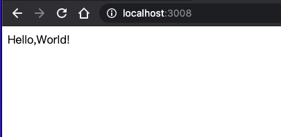
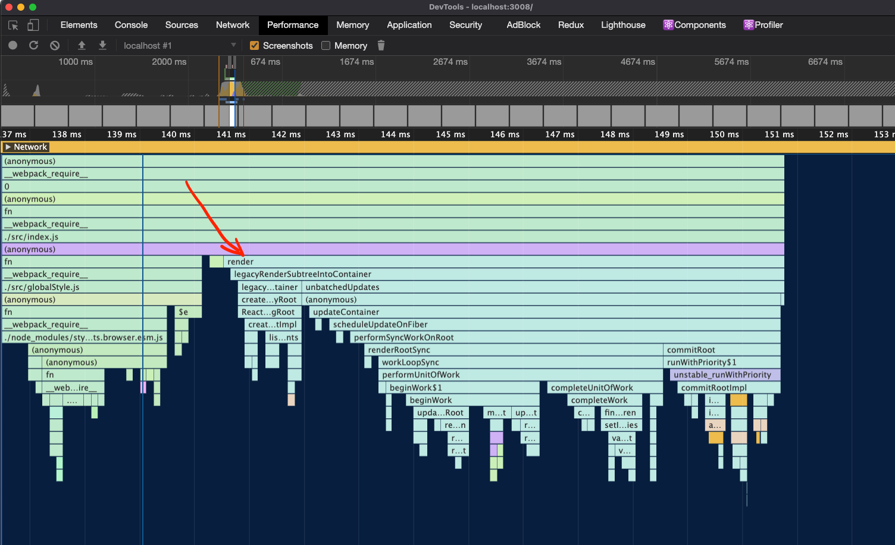
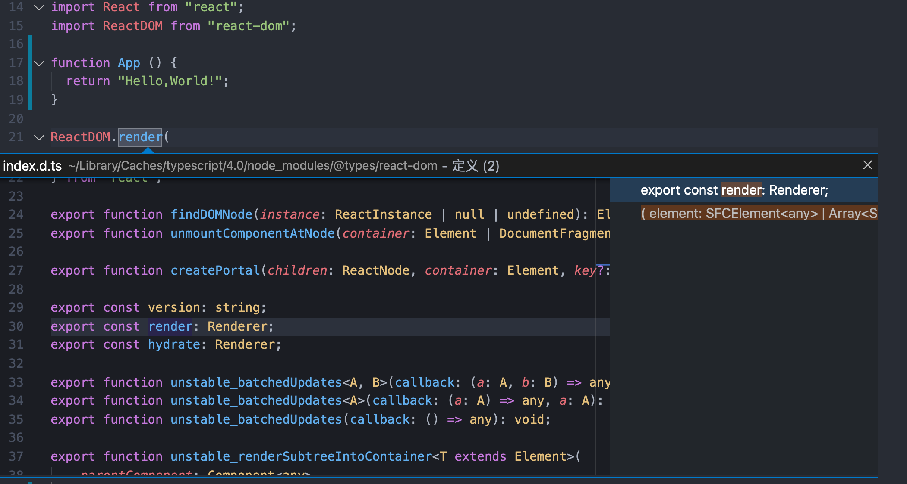
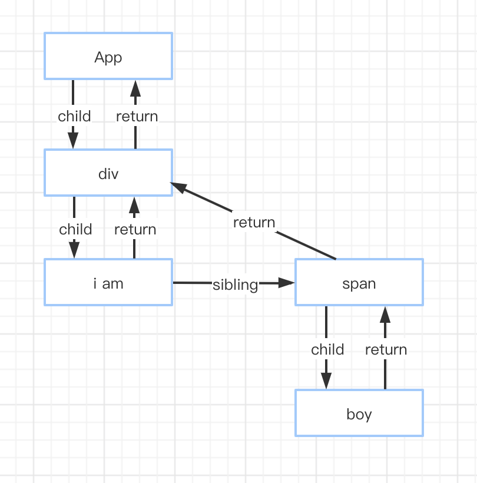

# React 创建

> 一步步看看React都做了些什么。

## 从 “Hello,World!” 开始

> 如果你不知道怎么使用React在屏幕显示一个“Hello,World!”,说明你不适合这篇文章，建议先从[这里](https://zh-hans.reactjs.org/)开始。

我们兴奋地开始写React,一切都是那么新奇。

```js
// 我会用React了
import React from "react";
import ReactDOM from "react-dom";

function App () {
  return "Hello,World!";
}

ReactDOM.render(
  <App></App>,
  document.getElementById("root")
);
```

我们使用 ReactDom 的 render方法 在屏幕构建了一个视图，如下：



打开浏览器的开发者工具，看看Performance 下的函数执行流程，别的先不管，直接从render方法开始看。这个render就是ReactDom模块里的render方法。

图2: react执行火焰图 🔥


我们来找找源码在哪里：

如果你是直接用npm 安装的 react 和 react-dom 等包的话，看到的就是下面这样的，这个是react团队打包放到npm供我们下载使用的。学习源码需要到github去拉取[react-源码](https://github.com/facebook/react),需要说明的是，react源码更新是直接更在master分支的，所以就算是同一个版本也可能略有差异。学习源码主要是思路，这点差异几乎是可以忽略的。

VS Code 按住Command 键，鼠标点击查看到的react-dom 包中 render方法：



上面的操作是不是有点太详细（啰嗦）了 😊 ，为了不给某些新来的小伙伴造成阅读困难，这里感觉有必要说一下，后面说的源码是指github拉取的 v17.0.1。

去源码中查找这个方法：

-> 到react-dom包中 的 index.js 找到了 render 方法

```js
// packages/react-dom/index.js
export {
  ...
  render,
  ...
} from './src/client/ReactDOM';
```

-> 到ReactDOM.js看看这个方法

```js
// packages/react-dom/src/client/ReactDOM.js
import {
  render,
  ...
} from './ReactDOMLegacy';
```

-> 到ReactDOMLegacy 看看

```js
// packages/react-dom/src/client/ReactDOMLegacy.js

/*
* 参数：
* element: ‘<App></App>’，即 React.CreateElement 的返回值，就是一个“React 元素”
* container: 根结点 “id=root” 的 dom 元素
*/
export function render(
  element: React$Element<any>,
  container: Container,
  callback: ?Function,
) {
  ...
  return legacyRenderSubtreeIntoContainer(
    null,
    element,
    container,
    false,
    callback,
  );
}
```

一通乱找，发现render方法返回了 legacyRenderSubtreeIntoContainer 方法的返回值。

我们看下这个方法的源码：

<details>
  <summary>查看源码 ✍️</summary>

```js
// packages/react-dom/src/client/ReactDOMLegacy.js

/*
* 第一次调用时的参数：
* parentComponent: null
* children: ‘<App></App>’，即 React.CreateElement 的返回值，就是一个“React 元素”
* container: 根结点 “id=root” 的 dom 元素
* forceHydrate: false
*/
function legacyRenderSubtreeIntoContainer(
  parentComponent: ?React$Component<any, any>,
  children: ReactNodeList,
  container: Container,
  forceHydrate: boolean,
  callback: ?Function,
) {
  ...
  // 初始化挂载时 container 为普通dom 节点，无_reactRootContainer属性
  // 所以 root = undefined
  let root: RootType = (container._reactRootContainer: any);
  let fiberRoot;
  // 进入判断，做初始化
  if (!root) {
    // Initial mount
    // 沿着下文的“第1路”可以看到
    // 初始化挂载，root = container._reactRootContainer = ReactDOMBlockingRoot 实例，
    root = container._reactRootContainer = legacyCreateRootFromDOMContainer(
      container,
      forceHydrate,
    );
    // fiberRoot = root._internalRoot 为 FiberRootNode 实例
    fiberRoot = root._internalRoot;
    if (typeof callback === 'function') {
      const originalCallback = callback;
      callback = function() {
        const instance = getPublicRootInstance(fiberRoot);
        originalCallback.call(instance);
      };
    }
    // Initial mount should not be batched.
    unbatchedUpdates(() => {
      // 开启“第2路”，调用 react-reconciler updateContainer ，传入 FiberRoot 和 ReactElement
      // 进入 react-reconciler 的掌控范围
      updateContainer(children, fiberRoot, parentComponent, callback);
    });
  } else {
    fiberRoot = root._internalRoot;
    if (typeof callback === 'function') {
      const originalCallback = callback;
      callback = function() {
        const instance = getPublicRootInstance(fiberRoot);
        originalCallback.call(instance);
      };
    }
    // Update
    updateContainer(children, fiberRoot, parentComponent, callback);
  }
  return getPublicRootInstance(fiberRoot);
}
```

</details>

"legacyRenderSubtreeIntoContainer" 看看这个方法名是不是比较眼熟？

对，没错。就是上面图2中render方法下面的那个方法。

函数名称起的也很直白，直译过来就是“传统的渲染子树到容器中”。

图2中也可以看到，legacyRenderSubtreeIntoContainer 方法中分别调用了 legacyCreateRootFromDOMContainer 和 updateContainer 这两个方法。

所以我们兵分两路往下看。

___

总结一下ReactDOM.render 逻辑：

- <span style="color: #ff0000; font-size: 16px;">创建了一个 ReactDOMBlockingRoot 类型的实例 root，记录到挂载节点的 _reactRootContainer 属性上，往后根据这个属性判断是否已有 React 应用挂载</span>

- <span style="color: #ff0000; font-size: 16px;">root 实例的 _internalRoot 属性是由 react-reconciler createContainer函数创建的 FiberRoot 实例 </span>

- <span style="color: #ff0000; font-size: 16px;">调用 react-reconciler updateContainer ，传入 FiberRoot 和 ReactElement</span>

- <span style="color: #ff0000; font-size: 16px;">进入 react-reconciler 的掌控范围，生成 Fiber 树，遍历优化，生成组件实例/原生节点，渲染到挂载节点上，做性能优化等</span>

代码可以简化为：

```js
function FiberNode(
  tag: WorkTag,
  pendingProps: mixed,
  key: null | string,
  mode: TypeOfMode,
) {
  // Instance
  // Fiber
  this.ref = null;
  ...
}

class ReactDOMBlockingRoot {
  _internalRoot: FiberRoot,
  render () {
    updateContainer()
  }
  // 卸载
  unmount () {
    updateContainer(null, root, null, () => {
        unmarkContainerAsRoot(container);
    });
  }
}

function legacyRenderSubtreeIntoContainer(
  parentComponent: ?React$Component<any, any>,
  children: ReactNodeList,
  container: Container,
  forceHydrate: boolean,
  callback: ?Function,
) {
  const root = container._reactRootContainer = new ReactDOMBlockingRoot(container, LegacyRoot, options); 
  fiberRoot = root._internalRoot;
  unbatchedUpdates(() => {
    updateContainer(children, fiberRoot, parentComponent, callback);
  });
```

___

## 第1路： legacyCreateRootFromDOMContainer

### 创建 fiberRoot

> 函数名直译过来是“传统的从DOMContainer创建Root”,这个Root是什么？

分解上面的legacyRenderSubtreeIntoContainer方法，看下这个代码片段：

<details>
  <summary>查看源码 ✍️</summary>

```js
function legacyRenderSubtreeIntoContainer(
  parentComponent: ?React$Component<any, any>,
  children: ReactNodeList,
  container: Container,
  forceHydrate: boolean,
  callback: ?Function,
) {
  let root: RootType = (container._reactRootContainer: any);
  let fiberRoot;
  if (!root) {
    // Initial mount
    root = container._reactRootContainer = legacyCreateRootFromDOMContainer(
      container,
      forceHydrate,
    );
    fiberRoot = root._internalRoot;
    if (typeof callback === 'function') {
      const originalCallback = callback;
      callback = function() {
        const instance = getPublicRootInstance(fiberRoot);
        originalCallback.call(instance);
      };
    }
    // Initial mount should not be batched.
    unbatchedUpdates(() => {
      updateContainer(children, fiberRoot, parentComponent, callback);
    });
  }
}
```

</details>

初次挂载时root不存在，所以进入if判断，执行 legacyCreateRootFromDOMContainer，生成 root。

```js
fiberRoot = root._internalRoot;
```

可以看到这里得到了 <span style="color: #ff0000; font-size: 24px;">fiberRoot</span>,在后期调度更新的过程中这个节点非常重要。他就是 Fiber架构的产物。

仔细看看 root 和 fiberRoot 是怎样的吧 👇

<details>
  <summary>查看源码 ✍️</summary>

```js
// packages/react-dom/src/client/ReactDOMLegacy.js
function legacyCreateRootFromDOMContainer(
  container: Container,
  forceHydrate: boolean,
): RootType {
  const shouldHydrate =
    forceHydrate || shouldHydrateDueToLegacyHeuristic(container);
  // First clear any existing content.
  if (!shouldHydrate) {
    ...
  }
  if (__DEV__) {
    ...
  }

  return createLegacyRoot(
    container,
    shouldHydrate
      ? {
          hydrate: true,
        }
      : undefined,
  );
}
```

</details>

legacyCreateRootFromDOMContainer 调用了 createLegacyRoot

```js
// packages/react-dom/src/client/ReactDOMRoot.js
export function createLegacyRoot(
  container: Container,
  options?: RootOptions,
): RootType {
  return new ReactDOMBlockingRoot(container, LegacyRoot, options);
}
```

createLegacyRoot 调用了 ReactDOMBlockingRoot

```js
// packages/react-dom/src/client/ReactDOMRoot.js
function ReactDOMBlockingRoot(
  container: Container,
  tag: RootTag,
  options: void | RootOptions,
) {
  this._internalRoot = createRootImpl(container, tag, options);
}
```

注意了⚠️，this._internalRoot 就是 fiberRoot,也就是 createRootImpl方法的返回值。

<details>
  <summary>查看源码 ✍️</summary>

```js
// packages/react-dom/src/client/ReactDOMRoot.js
function createRootImpl(
  container: Container,
  tag: RootTag,
  options: void | RootOptions,
) {
  // Tag is either LegacyRoot or Concurrent Root
  const hydrate = options != null && options.hydrate === true;
  const hydrationCallbacks =
    (options != null && options.hydrationOptions) || null;
  const mutableSources =
    (options != null &&
      options.hydrationOptions != null &&
      options.hydrationOptions.mutableSources) ||
    null;
  const root = createContainer(container, tag, hydrate, hydrationCallbacks);
  markContainerAsRoot(root.current, container);

  const rootContainerElement =
    container.nodeType === COMMENT_NODE ? container.parentNode : container;
  listenToAllSupportedEvents(rootContainerElement);

  if (mutableSources) {
    for (let i = 0; i < mutableSources.length; i++) {
      const mutableSource = mutableSources[i];
      registerMutableSourceForHydration(root, mutableSource);
    }
  }

  return root;
}
```

</details>

createRootImpl方法的返回值是 createContainer 方法的返回值。
createRootImpl方法 还做了另外一件事，就是 <span style="color: #ffcc00">listenToAllSupportedEvents</span>。

```js
// packages/react-reconciler/src/ReactFiberReconciler.old.js
export function createContainer(
  containerInfo: Container,
  tag: RootTag,
  hydrate: boolean,
  hydrationCallbacks: null | SuspenseHydrationCallbacks,
): OpaqueRoot {
  return createFiberRoot(containerInfo, tag, hydrate, hydrationCallbacks);
}
```

createContainer 方法返回值是 createFiberRoot方法的返回值；

createFiberRoot 方法的作用应该很明显了，就是创建 FiberRoot;

<details>
  <summary>查看源码 ✍️</summary>

```js
export function createFiberRoot(
  containerInfo: any,
  tag: RootTag,
  hydrate: boolean,
  hydrationCallbacks: null | SuspenseHydrationCallbacks,
): FiberRoot {
  const root: FiberRoot = (new FiberRootNode(containerInfo, tag, hydrate): any);
  if (enableSuspenseCallback) {
    root.hydrationCallbacks = hydrationCallbacks;
  }

  // Cyclic construction. This cheats the type system right now because
  // stateNode is any.
  const uninitializedFiber = createHostRootFiber(tag);
  root.current = uninitializedFiber;
  uninitializedFiber.stateNode = root;

  initializeUpdateQueue(uninitializedFiber);

  return root;
}
```

</details>

createFiberRoot 方法做了两件事：

- 声明并返回了 root, root 是 FiberRootNode 构造函数的一个实例
- 执行了 initializeUpdateQueue 方法(mount 时初始化更新 queue)

<details>
  <summary>查看源码 ✍️</summary>

```js
export function createHostRootFiber(tag: RootTag): Fiber {
  let mode;
  if (tag === ConcurrentRoot) {
    mode = ConcurrentMode | BlockingMode | StrictMode;
  } else if (tag === BlockingRoot) {
    mode = BlockingMode | StrictMode;
  } else {
    mode = NoMode;
  }

  if (enableProfilerTimer && isDevToolsPresent) {
    // Always collect profile timings when DevTools are present.
    // This enables DevTools to start capturing timing at any point–
    // Without some nodes in the tree having empty base times.
    mode |= ProfileMode;
  }

  return createFiber(HostRoot, null, null, mode);
}
```

</details>

createHostRootFiber 返回了 createFiber的返回值。

```js
// packages/react-reconciler/src/ReactFiber.old.js
const createFiber = function(
  tag: WorkTag,
  pendingProps: mixed,
  key: null | string,
  mode: TypeOfMode,
): Fiber {
  // $FlowFixMe: the shapes are exact here but Flow doesn't like constructors
  return new FiberNode(tag, pendingProps, key, mode);
};
```

最终 createFiber 返回了一个 FiberNode构造函数的实例。

<details>
  <summary>查看源码 ✍️</summary>

```js
// packages/react-reconciler/src/ReactFiber.old.js
function FiberNode(
  tag: WorkTag,
  pendingProps: mixed,
  key: null | string,
  mode: TypeOfMode,
) {
  // Instance
  this.tag = tag;
  this.key = key;
  this.elementType = null;
  this.type = null;
  this.stateNode = null;

  // Fiber
  this.return = null;
  this.child = null;
  this.sibling = null;
  this.index = 0;

  this.ref = null;

  this.pendingProps = pendingProps;
  this.memoizedProps = null;
  this.updateQueue = null;
  this.memoizedState = null;
  this.dependencies = null;

  this.mode = mode;

  // Effects
  this.flags = NoFlags;
  this.nextEffect = null;

  this.firstEffect = null;
  this.lastEffect = null;
  this.subtreeFlags = NoFlags;
  this.deletions = null;

  this.lanes = NoLanes;
  this.childLanes = NoLanes;

  this.alternate = null;

  if (enableProfilerTimer) {
    ...
  }

  if (__DEV__) {
    ...
  }
}
```

</details>

最终，构造函数 FiberNode 构造了一个 fiberRoot.

___

### 处理事件监听

我们上面说了createRootImpl方法还做了另一件事，listenToAllSupportedEvents。

<details>
  <summary>查看源码 ✍️</summary>

```js
export function listenToAllSupportedEvents(rootContainerElement: EventTarget) {
  if (!(rootContainerElement: any)[listeningMarker]) {
    (rootContainerElement: any)[listeningMarker] = true;
    allNativeEvents.forEach(domEventName => {
      // We handle selectionchange separately because it doesn't bubble and needs to be on the document.
      if (domEventName !== 'selectionchange') {
        if (!nonDelegatedEvents.has(domEventName)) {
          listenToNativeEvent(domEventName, false, rootContainerElement);
        }
        listenToNativeEvent(domEventName, true, rootContainerElement);
      }
    });
    const ownerDocument =
      (rootContainerElement: any).nodeType === DOCUMENT_NODE
        ? rootContainerElement
        : (rootContainerElement: any).ownerDocument;
    if (ownerDocument !== null) {
      // The selectionchange event also needs deduplication
      // but it is attached to the document.
      if (!(ownerDocument: any)[listeningMarker]) {
        (ownerDocument: any)[listeningMarker] = true;
        listenToNativeEvent('selectionchange', false, ownerDocument);
      }
    }
  }
}
```

</details>

这里单独处理了不会冒泡的“selectionchange”事件，然后执行了 listenToNativeEvent。

<details>
  <summary>查看源码 ✍️</summary>

  ```js
  export function listenToNativeEvent(
    domEventName: DOMEventName,
    isCapturePhaseListener: boolean,
    target: EventTarget,
  ): void {
    if (__DEV__) {
      ...
    }

    let eventSystemFlags = 0;
    if (isCapturePhaseListener) {
      eventSystemFlags |= IS_CAPTURE_PHASE;
    }
    addTrappedEventListener(
      target,
      domEventName,
      eventSystemFlags,
      isCapturePhaseListener,
    );
  }
  ```

</details>

listenToNativeEvent 方法调用了 addTrappedEventListener。

addTrappedEventListener 方法经过一系列的判断会调用 “packages/react-dom/src/events/EventListener.js” 文件中的方法，EventListener.js 里的方法就是给元素绑定原生的**监听事件**。

<details>
  <summary>查看源码 ✍️</summary>

  ```js
  export function addEventBubbleListener(
    target: EventTarget,
    eventType: string,
    listener: Function,
  ): Function {
    target.addEventListener(eventType, listener, false);
    return listener;
  }
  ```

</details>

## 第2路： updateContainer

<code style="color: #708090; background-color: #F5F5F5;"> updateContainer</code>，进入 <span style="color: #ff0000; font-size: 16px;"> Reconciler </span>的掌控范围。

记得前面的文章[React 架构](http://localhost:3000/#/react/react_architecture?id=_3-renderer%ef%bc%88%e6%b8%b2%e6%9f%93%e5%99%a8%ef%bc%89)这张图吗？


<details>
  <summary>查看源码 ✍️</summary>

  ```js
  // packages/react-reconciler/src/ReactFiberReconciler.old.js
  export function updateContainer(
    element: ReactNodeList,
    container: OpaqueRoot,
    parentComponent: ?React$Component<any, any>,
    callback: ?Function,
  ): Lane {
    if (__DEV__) {
      onScheduleRoot(container, element);
    }
    const current = container.current;
    // 当前时间
    const eventTime = requestEventTime();
    if (__DEV__) {
      ...
    }
    // requestUpdateLane 调用 findUpdateLane ，
    // findUpdateLane 会根据传过来的参数匹配计算，并返回优先级的值，值越大优先级越高；
    // 这个是 v17 中重要的 lane架构。
    const lane = requestUpdateLane(current);

    if (enableSchedulingProfiler) {
      markRenderScheduled(lane);
    }

    const context = getContextForSubtree(parentComponent);
    if (container.context === null) {
      container.context = context;
    } else {
      container.pendingContext = context;
    }

    if (__DEV__) {
      ...
    }

    const update = createUpdate(eventTime, lane);
    // Caution: React DevTools currently depends on this property
    // being called "element".
    update.payload = {element};

    callback = callback === undefined ? null : callback;
    if (callback !== null) {
      if (__DEV__) {
        ...
      }
      update.callback = callback;
    }

    enqueueUpdate(current, update);
    scheduleUpdateOnFiber(current, lane, eventTime);

    return lane;
  }
  ```

</details>

updateContainer 方法做了很多，主要是scheduleUpdateOnFiber。

**scheduleUpdateOnFiber** 里调用了 <span style="color: #ff0000; font-size: 24px;"> performSyncWorkOnRoot </span> 方法， performSyncWorkOnRoot 里调用了<span style="color: #ff0000; font-size: 14px;">renderRootSync方法</span>和<span style="color: #ff0000; font-size: 14px;">commitRoot方法</span>。

performSyncWorkOnRoot开始了 render 阶段。

commitRoot 开始了commit阶段。

### render 阶段

> render阶段开始与 performSyncWorkOnRoot方法或 performConcurrentWorkOnRoot 方法，取决于本次更新是同步更新还是异步更新。显然，初始化属于同步更新。

<details>
  <summary>查看源码 ✍️</summary>

  ```js
  // packages/react-reconciler/src/ReactFiberWorkLoop.old.js的 scheduleUpdateOnFiber 方法
  // 判断是不是同步，执行不同逻辑
  if (lane === SyncLane) {
      if (
        // Check if we're inside unbatchedUpdates
        (executionContext & LegacyUnbatchedContext) !== NoContext &&
        // Check if we're not already rendering
        (executionContext & (RenderContext | CommitContext)) === NoContext
      ) {
        // Register pending interactions on the root to avoid losing traced interaction data.
        schedulePendingInteractions(root, lane);

        // This is a legacy edge case. The initial mount of a ReactDOM.render-ed
        // root inside of batchedUpdates should be synchronous, but layout updates
        // should be deferred until the end of the batch.
        performSyncWorkOnRoot(root);
      } else {
        ensureRootIsScheduled(root, eventTime);
        schedulePendingInteractions(root, lane);
        if (executionContext === NoContext) {
          // Flush the synchronous work now, unless we're already working or inside
          // a batch. This is intentionally inside scheduleUpdateOnFiber instead of
          // scheduleCallbackForFiber to preserve the ability to schedule a callback
          // without immediately flushing it. We only do this for user-initiated
          // updates, to preserve historical behavior of legacy mode.
          resetRenderTimer();
          flushSyncCallbackQueue();
        }
      }
    } else {
      ...
      // Schedule other updates after in case the callback is sync.
      ensureRootIsScheduled(root, eventTime);
      schedulePendingInteractions(root, lane);
    }
  ```

</details>

从判断可以看出，同步的话会做进一步的处理，非同步的话会直接执行 ensureRootIsScheduled 方法。

**ensureRootIsScheduled 方法里可能会调用 performConcurrentWorkOnRoot，它是每一个并发任务的切入点，即任何通过Scheduler进行的任务。**

我们先看看 performSyncWorkOnRoot 方法做了什么？

- renderRootSync: 主要是执行 workLoopSync
- commitRoot: 启动 commit 阶段

再看看 performConcurrentWorkOnRoot 做了什么？

- renderRootConcurrent：主要执行了 workLoopConcurrent
- ...

```js
// performSyncWorkOnRoot会调用该方法
function workLoopSync() {
  // Already timed out, so perform work without checking if we need to yield.
  while (workInProgress !== null) {
    performUnitOfWork(workInProgress);
  }
}

// performConcurrentWorkOnRoot会调用该方法
function workLoopConcurrent() {
  // Perform work until Scheduler asks us to yield
  while (workInProgress !== null && !shouldYield()) {
    performUnitOfWork(workInProgress);
  }
}
```

可以看到，他们唯一的区别是是否调用shouldYield。如果当前浏览器帧没有剩余时间，shouldYield会中止循环，直到浏览器有空闲时间后再继续遍历。

workInProgress代表当前已创建的workInProgress fiber。

performUnitOfWork方法会创建下一个Fiber节点并赋值给workInProgress，并将workInProgress与已创建的Fiber节点连接起来构成<span style="color: #ff0000; font-size: 14px;">Fiber树</span>。

**Fiber Reconciler**通过遍历的方式实现可中断的递归，所以performUnitOfWork的工作可以分为两部分：“递”和“归”。

**1> “递”阶段**

首先从rootFiber开始向下深度优先遍历。为遍历到的每个Fiber节点调用 ***beginWork方法***。

该方法会根据传入的Fiber节点创建子Fiber节点，并将这两个Fiber节点连接起来。

当遍历到叶子节点（即没有子组件的组件）时就会进入“归”阶段。

<details>
  <summary>查看performUnitOfWork源码 ✍️</summary>

  ```js
  // packages/react-reconciler/src/ReactFiberWorkLoop.old.js
  function performUnitOfWork(unitOfWork: Fiber): void {
    ...
    let next;
    ...
    next = beginWork(current, unitOfWork, subtreeRenderLanes);
    ...
    if (next === null) {
      completeUnitOfWork(unitOfWork);
    } else {
      workInProgress = next;
    }

    ReactCurrentOwner.current = null;
  }
  ```

</details>

<details>
  <summary>查看beginWork源码 ✍️</summary>

  ```js
  // packages/react-reconciler/src/ReactFiberBeginWork.old.js
  function beginWork(
    current: Fiber | null,
    workInProgress: Fiber,
    renderLanes: Lanes,
  ): Fiber | null {
    // current 为当前工作的 fiber
    if (current !== null) {
      // current 存在的话执行 update
      ...
    } else {
      // current 不存在就 mount
      // mount 是指
      ...
    }

    // 根据tag不同，创建不同的Fiber节点
    // tag 分类在这里 -> packages/react-reconciler/src/ReactWorkTags.js
    switch (workInProgress.tag) {
      ...
    }
  }
  ```

</details>

beginWork 做了很多，又是一个400多行的方法。

**2> “归”阶段**

在“归”阶段会调用 ***completeWork*** 处理Fiber节点。

当某个Fiber节点执行完completeWork，如果其存在兄弟Fiber节点（即fiber.sibling !== null），会进入其兄弟Fiber的“递”阶段。

如果不存在兄弟Fiber，会进入父级Fiber的“归”阶段。

“递”和“归”阶段会交错执行直到“归”到rootFiber。至此，render阶段的工作就结束了。

**3> 示例**

```js
function App() {
  return (
    <div>
      i am
      <span>boy</span>
    </div>
  )
}

ReactDOM.render(<App />, document.getElementById("root"));
```

对应的Fiber树结构：



render阶段的主要工作：

```js
1. rootFiber beginWork
2. App Fiber beginWork
3. div Fiber beginWork
4. "i am" Fiber beginWork
5. "i am" Fiber completeWork
6. span Fiber beginWork
7. span Fiber completeWork
8. div Fiber completeWork
9. App Fiber completeWork
10. rootFiber completeWork
```

### commit 阶段

> commit阶段从 commitRoot 方法的调用开始。

commitRoot 方法主要是调用了commitRootImpl方法，commitRootImpl方法就是commit阶段做的事。

<details>
  <summary>查看删减的源码 ✍️</summary>

  ```js
  // packages/react-reconciler/src/ReactFiberWorkLoop.old.js
  function commitRootImpl(root, renderPriorityLevel) {
  
      /* -------------------------- before mutation阶段之前 ------------------------------ */
      /*
      * 主要是做一些变量赋值，状态重置的工作
      * 关键点是获取 firstEffect，这是“副作用”列表，commit的3个阶段都有用到它
      */
      ...
      // Get the list of effects.
      let firstEffect;
      if (finishedWork.flags > PerformedWork) {
        if (finishedWork.lastEffect !== null) {
          finishedWork.lastEffect.nextEffect = finishedWork;
          firstEffect = finishedWork.firstEffect;
        } else {
          firstEffect = finishedWork;
        }
      } else {
        // There is no effect on the root.
        firstEffect = finishedWork.firstEffect;
      }

      /* -------------------------- before mutation 阶段 ------------------------------ */
      
      if (firstEffect !== null) {
        ...
        nextEffect = firstEffect;
        do {
          ...
          // before Mutation阶段的主函数 -----------------
          commitBeforeMutationEffects();
          ...
        } while (nextEffect !== null);

        // The next phase is the mutation phase, where we mutate the host tree.
        nextEffect = firstEffect;
        do {
          ...
          // Mutation阶段的主函数 -----------------
          commitMutationEffects(root, renderPriorityLevel);
          ...
        } while (nextEffect !== null);

        if (shouldFireAfterActiveInstanceBlur) {
          afterActiveInstanceBlur();
        }
        resetAfterCommit(root.containerInfo);

        // ⚠️ 在双缓存机制一节我们介绍过，----
        // workInProgress Fiber树在commit阶段完成渲染后会变为current Fiber树 ----
        root.current = finishedWork;

        nextEffect = firstEffect;
        do {
          ...
          // layout 阶段的主函数 -----------------
          commitLayoutEffects(root, lanes);
          ...
        } while (nextEffect !== null);

        ...
      } else {
        // No effects.
        root.current = finishedWork;
        ...
      }

      /* -------------------------- layout 阶段之后 ------------------------------ */
      const rootDidHavePassiveEffects = rootDoesHavePassiveEffects;

      // useEffect相关 ------------------
      if (rootDoesHavePassiveEffects) {
        ...
      } else {
        ...
      }

      // Read this again, since an effect might have updated it
      remainingLanes = root.pendingLanes;

      // 性能优化相关 ---------------
      // Check if there's remaining work on this root
      if (remainingLanes !== NoLanes) {
        ...
      } else {
        ...
      }

      if (enableSchedulerTracing) {
        if (!rootDidHavePassiveEffects) {
          ...
        }
      }

      // 检测无限循环的同步任务 -------------
      if (includesSomeLane(remainingLanes, (SyncLane: Lane))) {
        ....
      } else {
        ...
      }

      // 在离开commitRoot函数前调用，触发一次新的调度，确保任何附加的任务被调度 -------------------
      // Always call this before exiting `commitRoot`, to ensure that any
      // additional work on this root is scheduled.
      ensureRootIsScheduled(root, now());

      // 性能追踪相关 --------------
      onCommitRootDevTools(finishedWork.stateNode, renderPriorityLevel);
      logCommitStopped();
      markCommitStopped();

      // 执行同步任务，这样同步任务不需要等到下次事件循环再执行 --------------------
      // 比如在 componentDidMount 中执行 setState 创建的更新会在这里被同步执行
      // 或useLayoutEffect
      // If layout work was scheduled, flush it now.
      flushSyncCallbackQueue();

    }
  }
  ```

</details>

在<code style="color: #708090; background-color: #F5F5F5;"> rootFiber.firstEffect </code>上保存了一条需要执行<code style="color: #708090; background-color: #F5F5F5;">副作用</code>的<code style="color: #708090; background-color: #F5F5F5;">Fiber节点</code>的<code style="color: #708090; background-color: #F5F5F5;">单向链表effectList</code>，这些<code style="color: #708090; background-color: #F5F5F5;">Fiber节点</code>的<code style="color: #708090; background-color: #F5F5F5;">updateQueue</code>中保存了<code style="color: #708090; background-color: #F5F5F5;">变化的props</code>。

这些副作用对应的DOM操作在commit阶段执行。

除此之外，一些<code style="color: #708090; background-color: #F5F5F5;">生命周期钩子</code>（比如componentDidXXX）、<code style="color: #708090; background-color: #F5F5F5;">hook</code>（比如useEffect）需要在<code style="color: #708090; background-color: #F5F5F5;">commit阶段</code>执行。

commit阶段的主要工作（即Renderer的工作流程）分为三部分：

**1. before mutation阶段（执行DOM操作前)**

**2. mutation阶段（执行DOM操作）**

**3. layout阶段（执行DOM操作后）**

在before mutation阶段之前和layout阶段之后还有一些额外工作，涉及到比如useEffect的触发、优先级相关的重置、ref的绑定/解绑。

___

**1> before mutation阶段之前:**

<code style="color: #708090; background-color: #F5F5F5;"> before mutation </code>之前主要做一些变量赋值，状态重置的工作。

主要是得到了<code style="color: #708090; background-color: #F5F5F5;"> firstEffect </code>，在commit的三个子阶段都会用到它。

___

**2> before mutation阶段:**

主要执行 commitBeforeMutationEffects 方法：

<details>
  <summary>查看源码 ✍️</summary>

  ```js
  // packages/react-reconciler/src/ReactFiberWorkLoop.old.js
  function commitBeforeMutationEffects() {
    while (nextEffect !== null) {
      const current = nextEffect.alternate;

      if (!shouldFireAfterActiveInstanceBlur && focusedInstanceHandle !== null) {
        // focus blur相关 ------
      }

      const flags = nextEffect.flags;

      // 调用 getSnapshotBeforeUpdate 生命周期钩子 ------
      if ((flags & Snapshot) !== NoFlags) {
        setCurrentDebugFiberInDEV(nextEffect);
        commitBeforeMutationEffectOnFiber(current, nextEffect);
        resetCurrentDebugFiberInDEV();
      }

      // 调度useEffect ------
      if ((flags & Passive) !== NoFlags) {
        // If there are passive effects, schedule a callback to flush at
        // the earliest opportunity.
        if (!rootDoesHavePassiveEffects) {
          rootDoesHavePassiveEffects = true;
          scheduleCallback(NormalSchedulerPriority, () => {
            flushPassiveEffects();
            return null;
          });
        }
      }
      nextEffect = nextEffect.nextEffect;
    }
  }
  ```

</details>

会遍历effectList，依次执行：

1. 处理DOM节点渲染/删除后的 autoFocus、blur逻辑
2. 调用getSnapshotBeforeUpdate生命周期方法，[查看getSnapshotBeforeUpdate生命周期方法](https://zh-hans.reactjs.org/docs/react-component.html#getsnapshotbeforeupdate)
3. 调度useEffect

___

**3> mutation阶段:**

这里是<span style="color: #ff0000; font-size: 16px;">执行DOM操作</span>阶段。

主要执行 commitMutationEffects 函数。

会遍历effectList，依次执行：

- 更新ref
- 根据 effectTag 分别处理需要插入、更新、删除的DOM

<details>
  <summary>查看源码 ✍️</summary>

  ```js
  // packages/react-reconciler/src/ReactFiberWorkLoop.old.js
  function commitMutationEffects(root: FiberRoot, renderPriorityLevel) {
    // 遍历effectList -------
    while (nextEffect !== null) {
      setCurrentDebugFiberInDEV(nextEffect);

      const flags = nextEffect.flags;

      // 根据 ContentReset、flags重置文字节点 -------
      if (flags & ContentReset) {
        commitResetTextContent(nextEffect);
      }

      // 更新ref -------
      if (flags & Ref) {
        const current = nextEffect.alternate;
        if (current !== null) {
          commitDetachRef(current);
        }
        if (enableScopeAPI) {
          // TODO: This is a temporary solution that allowed us to transition away
          // from React Flare on www.
          if (nextEffect.tag === ScopeComponent) {
            commitAttachRef(nextEffect);
          }
        }
      }

      // 根据 effectTag 分别处理 -------
      const primaryFlags = flags & (Placement | Update | Deletion | Hydrating);
      switch (primaryFlags) {
        // 插入DOM
        case Placement: {
          commitPlacement(nextEffect);
          nextEffect.flags &= ~Placement;
          break;
        }
        // 插入DOM 并 更新DOM
        case PlacementAndUpdate: {
          // Placement
          // 插入
          commitPlacement(nextEffect);
          // Clear the "placement" from effect tag so that we know that this is
          // inserted, before any life-cycles like componentDidMount gets called.
          nextEffect.flags &= ~Placement;

          // Update
          // 更新
          const current = nextEffect.alternate;
          commitWork(current, nextEffect);
          break;
        }
        // SSR
        case Hydrating: {
          nextEffect.flags &= ~Hydrating;
          break;
        }
        // SSR
        case HydratingAndUpdate: {
          nextEffect.flags &= ~Hydrating;

          // Update
          const current = nextEffect.alternate;
          commitWork(current, nextEffect);
          break;
        }
        // 更新DOM
        case Update: {
          const current = nextEffect.alternate;
          commitWork(current, nextEffect);
          break;
        }
        // 删除DOM
        case Deletion: {
          commitDeletion(root, nextEffect, renderPriorityLevel);
          break;
        }
      }

      resetCurrentDebugFiberInDEV();
      nextEffect = nextEffect.nextEffect;
    }
  }
  ```

> ⚠️ 有个需要说明的地方是，上面具体执行DOM插入、更新、删除的分别是commitPlacement、commitWork、commitDeletion 方法，按照普通的模块引入去找找这个方法具体做了什么。

源码中执行 commitPlacement、commitWork 的地方：

```js
  // 上面👆 commitMutationEffects 方法中处理DOM的switch 语句
  switch (primaryFlags) {
    case Placement: {
      commitPlacement(nextEffect);
      nextEffect.flags &= ~Placement;
      break;
    }
    case PlacementAndUpdate: {
      // Placement
      commitPlacement(nextEffect);
      nextEffect.flags &= ~Placement;

      // Update
      const current = nextEffect.alternate;
      commitWork(current, nextEffect);
      break;
    }
    ...
  }
```

commitPlacement 从何而来？

commitMutationEffects 方法从 ReactFiberCommitWork.old.js 模块中倒入了 commitPlacement等。

```js
// 上面👆 commitMutationEffects 方法从 ReactFiberCommitWork.old.js 模块中倒入了 commitPlacement等
import {
  ...
  commitPlacement,
  commitWork,
  commitDeletion,
  commitDetachRef,
  ...
} from './ReactFiberCommitWork.old';
```

ReactFiberCommitWork.old.js 模块中倒入了 commitPlacement方法。

```js
// packages/react-reconciler/src/ReactFiberCommitWork.old.js
function commitPlacement(finishedWork: Fiber): void {
  // ...省略参数处理相关代码

  // 执行具体的操作方法
  if (isContainer) {
    insertOrAppendPlacementNodeIntoContainer(finishedWork, before, parent);
  } else {
    insertOrAppendPlacementNode(finishedWork, before, parent);
  }
}
```

我们看到 commitPlacement 方法主要是调用了 insertOrAppendPlacementNodeIntoContainer 或 insertOrAppendPlacementNode。

我们看下 insertOrAppendPlacementNode 方法。

```js
// packages/react-reconciler/src/ReactFiberCommitWork.old.js
import {
  ...
  appendChild,
  insertBefore,
  ...
} from './ReactFiberHostConfig';

function insertOrAppendPlacementNode(
  node: Fiber,
  before: ?Instance,
  parent: Instance,
): void {
  // ...省略判断和递归调用的部分，主要执行的是这两个方法用于DOM操作
  insertBefore(parent, stateNode, before);
  appendChild(parent, stateNode);
}
```

省略判断和递归调用的部分，主要执行的是insertBefore、appendChild这两个方法用于**DOM操作**。

乱找一通后发现，appendChild、insertBefore方法来自于 ReactFiberHostConfig.js

仔细看看 🧐 ReactFiberHostConfig.js里有什么吧！

```js
// packages/react-reconciler/src/ReactFiberHostConfig.js
import invariant from 'shared/invariant';

// We expect that our Rollup, Jest, and Flow configurations
// always shim this module with the corresponding host config
// (either provided by a renderer, or a generic shim for npm).

invariant(false, 'This module must be shimmed by a specific renderer.');

```

你没看错，ReactFiberHostConfig.js 除去注释只有2行代码，**并没有我们要找的**appendChild、insertBefore方法。


刚看到我也是一脸问号，本以为自己找错文件了，仔细看看注释，又跑去Google了一番，发现自己too young啊。

> 在 react-dom 的源码中并没有显式初始化 react-reconciler ，它是如何向 react-reconciler 传递 hostConfig 的呢？是通过 rollup 的路径映射实现的。
>
> 具体的操作是，将'react-reconciler/src/ReactFiberHostConfig'路径映射为当前打包情景对应的 hostConfig 模块。

我们在 [React 目录结构](http://localhost:3000/#/react/react_directory) 里介绍了 scripts 目录是各种工具链脚本文件夹。scripts 目录里的 rollup 文件夹里就是相关的配置.

```js
// scripts/rollup/forks.js
'react-reconciler/src/ReactFiberHostConfig': (
    bundleType,
    entry,
    dependencies,
    moduleType
  ) => {
    ...
    for (let rendererInfo of inlinedHostConfigs) {
      if (rendererInfo.entryPoints.indexOf(entry) !== -1) {
        return `react-reconciler/src/forks/ReactFiberHostConfig.${rendererInfo.shortName}.js`;
      }
    }
    ...
  },
)

```

rendererInfo.shortName 是什么？

```js
// scripts/shared/inlinedHostConfigs.js
module.exports = [
  {
    shortName: 'dom',
    entryPoints: [
      'react-dom',
      'react-dom/testing',
      'react-dom/unstable-fizz.node',
      'react-transport-dom-webpack/server.node',
      'react-transport-dom-webpack',
    ],
    ...
  }
  ...
]
```

rendererInfo.shortName = ‘dom’.

所以 rollup 会将 react-reconciler/src/ReactFiberHostConfig.js 映射为 react-reconciler/src/forks/ReactFiberHostConfig.dom.js。

绕了一大圈，去看看 ReactFiberHostConfig.dom.js:

```js
export * from 'react-dom/src/client/ReactDOMHostConfig';
```

又绕道了 'react-dom/src/client/ReactDOMHostConfig'。

```js
// packages/react-dom/src/client/ReactDOMHostConfig.js
...
export function appendChild(
  parentInstance: Instance,
  child: Instance | TextInstance,
): void {
  parentInstance.appendChild(child);
}
...
export function insertBefore(
  parentInstance: Instance,
  child: Instance | TextInstance,
  beforeChild: Instance | TextInstance | SuspenseInstance,
): void {
  parentInstance.insertBefore(child, beforeChild);
}
...
```

终于找到了insertBefore、appendChild，就是普通的DOM操作，调用了原生的DOM操作方法。

</details>

___

**4> layout阶段:**

layout阶段主要执行 commitLayoutEffects 方法，

会遍历effectList，依次执行：

1. commitLayoutEffectOnFiber：（调用生命周期钩子和hook相关操作）
2. commitAttachRef：（赋值 ref）

<details>
  <summary>查看源码 ✍️</summary>

  ```js
  // packages/react-reconciler/src/ReactFiberWorkLoop.old.js
  import {
    commitLifeCycles as commitLayoutEffectOnFiber,
    commitAttachRef,
  } from './ReactFiberCommitWork.old';

  function commitLayoutEffects(root: FiberRoot, committedLanes: Lanes) {
    ...
    while (nextEffect !== null) {
      setCurrentDebugFiberInDEV(nextEffect);

      const flags = nextEffect.flags;

      // 调用生命周期钩子和hook
      if (flags & (Update | Callback)) {
        const current = nextEffect.alternate;
        commitLayoutEffectOnFiber(root, current, nextEffect, committedLanes);
      }

      // 赋值ref
      if (enableScopeAPI) {
        if (flags & Ref && nextEffect.tag !== ScopeComponent) {
          commitAttachRef(nextEffect);
        }
      } else {
        if (flags & Ref) {
          commitAttachRef(nextEffect);
        }
      }

      resetCurrentDebugFiberInDEV();
      nextEffect = nextEffect.nextEffect;
    }
    ...
  }
  ```

</details>

分别看下 commitLayoutEffectOnFiber 和 commitAttachRef：

commitLayoutEffectOnFiber 就是 ReactFiberCommitWork.old.js 模块中的 commitLifeCycles 方法。

方法名很形象第表达了它的用途“”。

<details>
  <summary>查看commitLayoutEffectOnFiber源码 ✍️</summary>

  ```js
  // packages/react-reconciler/src/ReactFiberCommitWork.old.js
  function commitLifeCycles(
    finishedRoot: FiberRoot,
    current: Fiber | null,
    finishedWork: Fiber,
    committedLanes: Lanes,
  ): void {
    switch (finishedWork.tag) {
      case FunctionComponent:
      case ForwardRef:
      case SimpleMemoComponent: {
        // At this point layout effects have already been destroyed (during mutation phase).
        // This is done to prevent sibling component effects from interfering with each other,
        // e.g. a destroy function in one component should never override a ref set
        // by a create function in another component during the same commit.
        if (
          enableProfilerTimer &&
          enableProfilerCommitHooks &&
          finishedWork.mode & ProfileMode
        ) {
          try {
            startLayoutEffectTimer();
            commitHookEffectListMount(HookLayout | HookHasEffect, finishedWork);
          } finally {
            recordLayoutEffectDuration(finishedWork);
          }
        } else {
          commitHookEffectListMount(HookLayout | HookHasEffect, finishedWork);
        }

        schedulePassiveEffects(finishedWork);
        return;
      }
      case ClassComponent: {
        const instance = finishedWork.stateNode;
        if (finishedWork.flags & Update) {
          if (current === null) {
            // We could update instance props and state here,
            // but instead we rely on them being set during last render.
            // TODO: revisit this when we implement resuming.
            if (__DEV__) {
              if (
                finishedWork.type === finishedWork.elementType &&
                !didWarnAboutReassigningProps
              ) {
                if (instance.props !== finishedWork.memoizedProps) {
                  console.error(
                    'Expected %s props to match memoized props before ' +
                      'componentDidMount. ' +
                      'This might either be because of a bug in React, or because ' +
                      'a component reassigns its own `this.props`. ' +
                      'Please file an issue.',
                    getComponentName(finishedWork.type) || 'instance',
                  );
                }
                if (instance.state !== finishedWork.memoizedState) {
                  console.error(
                    'Expected %s state to match memoized state before ' +
                      'componentDidMount. ' +
                      'This might either be because of a bug in React, or because ' +
                      'a component reassigns its own `this.state`. ' +
                      'Please file an issue.',
                    getComponentName(finishedWork.type) || 'instance',
                  );
                }
              }
            }
            if (
              enableProfilerTimer &&
              enableProfilerCommitHooks &&
              finishedWork.mode & ProfileMode
            ) {
              try {
                startLayoutEffectTimer();
                instance.componentDidMount();
              } finally {
                recordLayoutEffectDuration(finishedWork);
              }
            } else {
              instance.componentDidMount();
            }
          } else {
            const prevProps =
              finishedWork.elementType === finishedWork.type
                ? current.memoizedProps
                : resolveDefaultProps(finishedWork.type, current.memoizedProps);
            const prevState = current.memoizedState;
            // We could update instance props and state here,
            // but instead we rely on them being set during last render.
            // TODO: revisit this when we implement resuming.
            if (__DEV__) {
              if (
                finishedWork.type === finishedWork.elementType &&
                !didWarnAboutReassigningProps
              ) {
                if (instance.props !== finishedWork.memoizedProps) {
                  console.error(
                    'Expected %s props to match memoized props before ' +
                      'componentDidUpdate. ' +
                      'This might either be because of a bug in React, or because ' +
                      'a component reassigns its own `this.props`. ' +
                      'Please file an issue.',
                    getComponentName(finishedWork.type) || 'instance',
                  );
                }
                if (instance.state !== finishedWork.memoizedState) {
                  console.error(
                    'Expected %s state to match memoized state before ' +
                      'componentDidUpdate. ' +
                      'This might either be because of a bug in React, or because ' +
                      'a component reassigns its own `this.state`. ' +
                      'Please file an issue.',
                    getComponentName(finishedWork.type) || 'instance',
                  );
                }
              }
            }
            if (
              enableProfilerTimer &&
              enableProfilerCommitHooks &&
              finishedWork.mode & ProfileMode
            ) {
              try {
                startLayoutEffectTimer();
                instance.componentDidUpdate(
                  prevProps,
                  prevState,
                  instance.__reactInternalSnapshotBeforeUpdate,
                );
              } finally {
                recordLayoutEffectDuration(finishedWork);
              }
            } else {
              instance.componentDidUpdate(
                prevProps,
                prevState,
                instance.__reactInternalSnapshotBeforeUpdate,
              );
            }
          }
        }

        // TODO: I think this is now always non-null by the time it reaches the
        // commit phase. Consider removing the type check.
        const updateQueue: UpdateQueue<
          *,
        > | null = (finishedWork.updateQueue: any);
        if (updateQueue !== null) {
          if (__DEV__) {
            if (
              finishedWork.type === finishedWork.elementType &&
              !didWarnAboutReassigningProps
            ) {
              if (instance.props !== finishedWork.memoizedProps) {
                console.error(
                  'Expected %s props to match memoized props before ' +
                    'processing the update queue. ' +
                    'This might either be because of a bug in React, or because ' +
                    'a component reassigns its own `this.props`. ' +
                    'Please file an issue.',
                  getComponentName(finishedWork.type) || 'instance',
                );
              }
              if (instance.state !== finishedWork.memoizedState) {
                console.error(
                  'Expected %s state to match memoized state before ' +
                    'processing the update queue. ' +
                    'This might either be because of a bug in React, or because ' +
                    'a component reassigns its own `this.state`. ' +
                    'Please file an issue.',
                  getComponentName(finishedWork.type) || 'instance',
                );
              }
            }
          }
          // We could update instance props and state here,
          // but instead we rely on them being set during last render.
          // TODO: revisit this when we implement resuming.
          commitUpdateQueue(finishedWork, updateQueue, instance);
        }
        return;
      }
      case HostRoot: {
        // TODO: I think this is now always non-null by the time it reaches the
        // commit phase. Consider removing the type check.
        const updateQueue: UpdateQueue<
          *,
        > | null = (finishedWork.updateQueue: any);
        if (updateQueue !== null) {
          let instance = null;
          if (finishedWork.child !== null) {
            switch (finishedWork.child.tag) {
              case HostComponent:
                instance = getPublicInstance(finishedWork.child.stateNode);
                break;
              case ClassComponent:
                instance = finishedWork.child.stateNode;
                break;
            }
          }
          commitUpdateQueue(finishedWork, updateQueue, instance);
        }
        return;
      }
      case HostComponent: {
        const instance: Instance = finishedWork.stateNode;

        // Renderers may schedule work to be done after host components are mounted
        // (eg DOM renderer may schedule auto-focus for inputs and form controls).
        // These effects should only be committed when components are first mounted,
        // aka when there is no current/alternate.
        if (current === null && finishedWork.flags & Update) {
          const type = finishedWork.type;
          const props = finishedWork.memoizedProps;
          commitMount(instance, type, props, finishedWork);
        }

        return;
      }
      case HostText: {
        // We have no life-cycles associated with text.
        return;
      }
      case HostPortal: {
        // We have no life-cycles associated with portals.
        return;
      }
      case Profiler: {
        if (enableProfilerTimer) {
          const {onCommit, onRender} = finishedWork.memoizedProps;
          const {effectDuration} = finishedWork.stateNode;

          const commitTime = getCommitTime();

          let phase = current === null ? 'mount' : 'update';
          if (enableProfilerNestedUpdatePhase) {
            if (isCurrentUpdateNested()) {
              phase = 'nested-update';
            }
          }

          if (typeof onRender === 'function') {
            if (enableSchedulerTracing) {
              onRender(
                finishedWork.memoizedProps.id,
                phase,
                finishedWork.actualDuration,
                finishedWork.treeBaseDuration,
                finishedWork.actualStartTime,
                commitTime,
                finishedRoot.memoizedInteractions,
              );
            } else {
              onRender(
                finishedWork.memoizedProps.id,
                phase,
                finishedWork.actualDuration,
                finishedWork.treeBaseDuration,
                finishedWork.actualStartTime,
                commitTime,
              );
            }
          }

          if (enableProfilerCommitHooks) {
            if (typeof onCommit === 'function') {
              if (enableSchedulerTracing) {
                onCommit(
                  finishedWork.memoizedProps.id,
                  phase,
                  effectDuration,
                  commitTime,
                  finishedRoot.memoizedInteractions,
                );
              } else {
                onCommit(
                  finishedWork.memoizedProps.id,
                  phase,
                  effectDuration,
                  commitTime,
                );
              }
            }

            // Schedule a passive effect for this Profiler to call onPostCommit hooks.
            // This effect should be scheduled even if there is no onPostCommit callback for this Profiler,
            // because the effect is also where times bubble to parent Profilers.
            enqueuePendingPassiveProfilerEffect(finishedWork);

            // Propagate layout effect durations to the next nearest Profiler ancestor.
            // Do not reset these values until the next render so DevTools has a chance to read them first.
            let parentFiber = finishedWork.return;
            while (parentFiber !== null) {
              if (parentFiber.tag === Profiler) {
                const parentStateNode = parentFiber.stateNode;
                parentStateNode.effectDuration += effectDuration;
                break;
              }
              parentFiber = parentFiber.return;
            }
          }
        }
        return;
      }
      case SuspenseComponent: {
        commitSuspenseHydrationCallbacks(finishedRoot, finishedWork);
        return;
      }
      case SuspenseListComponent:
      case IncompleteClassComponent:
      case FundamentalComponent:
      case ScopeComponent:
      case OffscreenComponent:
      case LegacyHiddenComponent:
        return;
    }
    invariant(
      false,
      'This unit of work tag should not have side-effects. This error is ' +
        'likely caused by a bug in React. Please file an issue.',
    );
  }
  ```

</details>

<details>
  <summary>查看commitAttachRef源码 ✍️</summary>

  ```js
  
  ```

</details>

**5> layout阶段之后:**

主要包括三点内容：
- useEffect相关的处理
- 性能追踪相关
- 在commit阶段会触发一些生命周期钩子（如 componentDidXXX）和hook（如useLayoutEffect、useEffect）