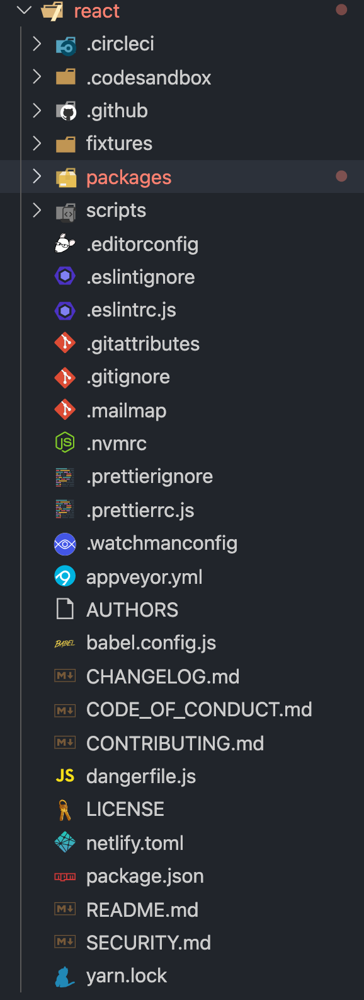
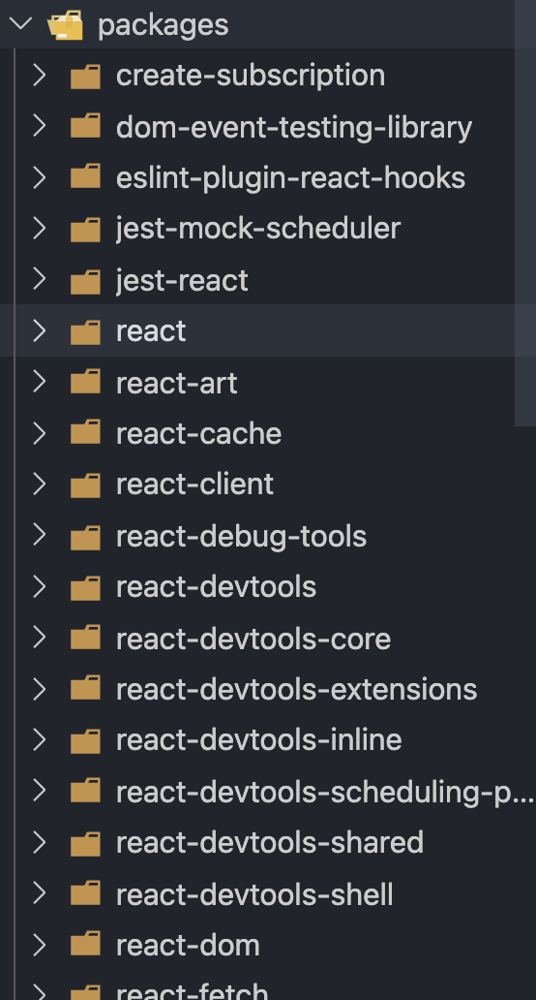

# React 目录结构

> 注意 ⚠️：本目录结构为 React v17.0.1

## 1.目录介绍

从 github 拉取 react 源码后目录是这样的；react 和 react-dom 分开后，react 源码已经非常精简，很多逻辑都放在了 react-dom 里了。



根目录的主要文件夹是下面三个：

```javascript
// 根目录
├── fixtures        # 包含一些给贡献者准备的小型 React 测试项目
├── packages        # 包含元数据（比如 package.json）和 React 仓库中所有 package 的源码（子目录 src）
├── scripts         # 各种工具链的脚本，比如git、jest、eslint等

```

我们主要关注的是 packages 目录.

## 2.packages 文件夹

> packages 目录里的内容很多，react、react-dom 等都在此目录

packages 目录共 34 个，它们是可以分为几类来看的。

packages 文件夹部分截图：



### 2.1 react 文件夹

> 很显然，这是 react 核心代码的目录，单独成包的 react 源码都在这里了。

它包含所有全局 React API 等：

```js
// 在react目录里的 index.js 可以看到react很多核心的API
// 文件位置 /react/packages/react/index.js
...
export {
  Children,
  createRef,
  Component,
  PureComponent,
  createContext,
  forwardRef,
  lazy,
  memo,
  useCallback,
  ...
}
...

```

### 2.2 scheduler 文件夹

Scheduler（调度器）的实现。

### 2.3 react-reconciler 文件夹

我们需要重点关注 react-reconciler，在接下来源码学习中 80%的代码量都来自这个包。

虽然他是一个实验性的包，内部的很多功能在正式版本中还未开放。但是他一边对接 Scheduler，一边对接不同平台的 Renderer，构成了整个 React16 的架构体系。

### 2.4 share 文件夹

源码中其他模块公用的方法和全局变量都放在这里了。如 react 元素类型标记：

```js
// 文件位置 /react/packages/shared/ReactSymbols.js
...
export let REACT_ELEMENT_TYPE = 0xeac7;
...

```

### 2.5 Renderer 相关的文件夹

```js
- react-art
- react-dom                 # 注意这同时是DOM和SSR（服务端渲染）的入口
- react-native-renderer
- react-noop-renderer       # 用于debug fiber（后面会介绍fiber）
- react-test-renderer

```

### 2.6 试验性包的文件夹

React 将自己流程中的一部分抽离出来，形成可以独立使用的包，由于他们是试验性质的，所以不被建议在生产环境使用。包括如下文件夹：

```js
- react-server        # 创建自定义SSR流
- react-client        # 创建自定义的流
- react-fetch         # 用于数据请求
- react-interactions  # 用于测试交互相关的内部特性，比如React的事件模型
- react-reconciler    # Reconciler的实现，你可以用他构建自己的Renderer

```

### 2.7 辅助包的文件夹

React 将一些辅助功能形成单独的包。包括如下文件夹：

```js
- react-is       # 用于测试组件是否是某类型
- react-client   # 创建自定义的流
- react-fetch    # 用于数据请求
- react-refresh  # “热重载”的React官方实现

```
