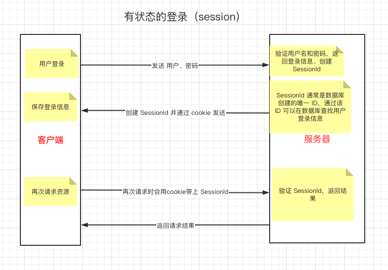
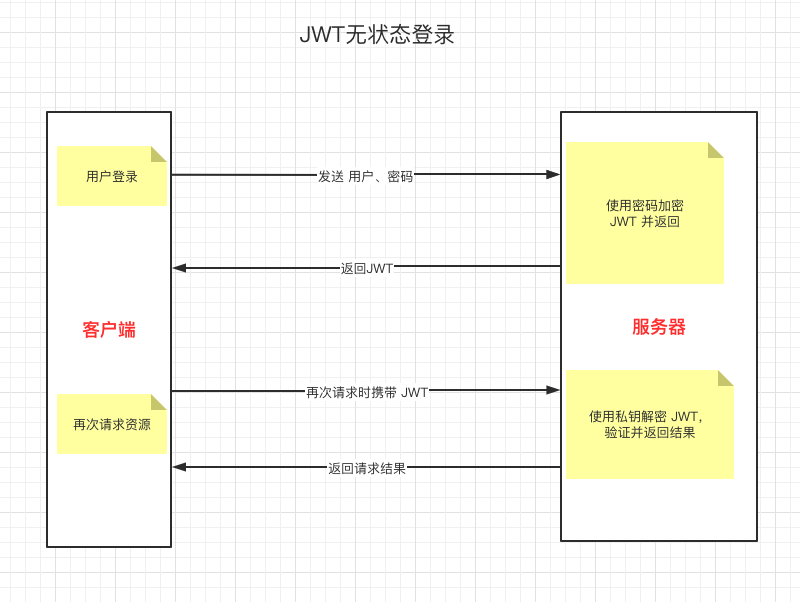
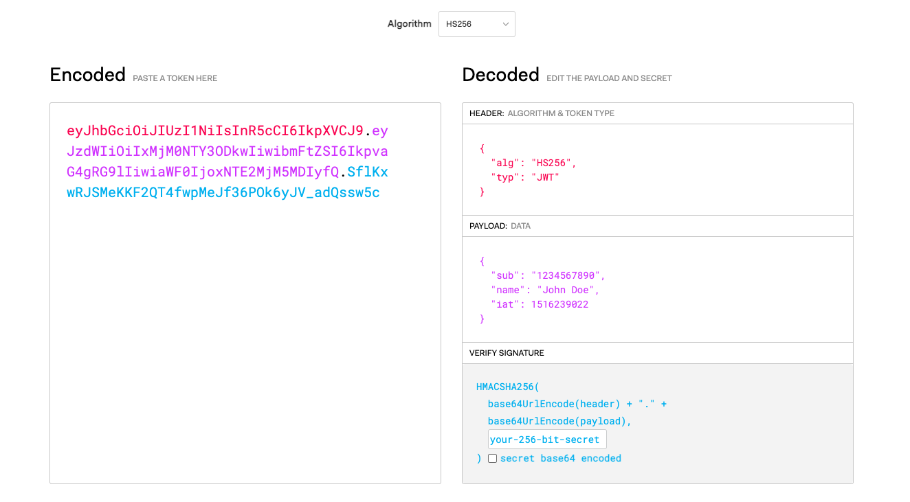

# JWT 与 登录持久化

## 1. 什么是 JWT？

JWT（JSON Web Token）的作用是 <code style="color: #708090; background-color: #F5F5F5;">用户授权(Authorization)</code>,而不是用户的<code style="color: #708090; background-color: #F5F5F5;"> 身份认证(Authentication)</code>。

官网解释：JWT 是凭据，可以授予对资源的访问权限。

**用户认证**：是指验证用户密码等登录。

- 返回错误码应该是 401（未授权）

**用户授权**：是指验证登录用户的权限，是否允许请求到特定的资源。

- 返回错误码应该是 403 （禁止访问）

## 2. 传统的有状态登录（session）



## 3. 无状态登录（JWT）



## 4. session 和 JWT 区别

<span style="color: #ff0000; font-size: 16px;">session 需要服务器保存 session 信息, JWT 则不需要服务器保存。</span>

JWT 优势：**适合分布式，同一个 JWT 可以发给不同的服务器，得到相同的结果**。

## 5. 一个 JWT 是怎样的



左边是一个 JWT，是一个字符串，分为 3 部分：红色、紫色、蓝色。

**右边是解析后的数据：**

- 红色对应加密算法
- 紫色对应具体用户信息
- 蓝色对应是验证签名，<span style="color: #ff0000; font-size: 16px;">使用非对称加密算法（RSA）生成，服务器用私钥来验证 JWT 是否有效、是否被串改</span>

_紫色字段详解：_

- sub: 用户 ID
- name: 用户名
- iat(issue at): 发布于
- exp: _过期时间_（单位：ms）

## 6. 是否需要 JWT

想使用 <code style="color: #708090; background-color: #F5F5F5;">有状态的 session</code> 访问多个系统的方案叫 <code style="color: #708090; background-color: #F5F5F5;">单点登录(SSO)</code>。

目前单点登录方案比较成熟，有付费和开源的轮子供我们使用。

**JWT 的优点：**

- 无状态，简单、方便，完美支持分布式
- 非对称加密，Token 安全性高

**JWT 的缺点：**

- 无状态，token 已经发布则无法取消
- 明文传递信息，Token 部分信息安全性低

## 7. 用户登录

> 用户登录后才能设置 JWT，方便下次请求资源时认证权限。

### 7.1 用户登录的处理逻辑

#### 7.1.1 注册/登录流程

用户填写注册信息并发起注册请求。

**整体流程**

- 验证用户信息，注册时将用户信息保存到数据库，登录时到数据库查询用户
- 注册密码要做加密处理（bcrypt、MD5、SHA1、SHA2、SHA3 ...），比对用户加密密码是否正确
- 返回注册/登录结果和 JWT 给客户端
- 客户端保存 JWT 到本地 Cookie 或 localStorage
- 再次请求资源时带上 JWT，用于服务器进行身份认证
- 服务器通过身份认证后返回数据给客户端

#### 7.1.2 密码加密

用户注册时的密码肯定不能用明文保存啊，会及其容易破解，且传输等过程容易泄漏。

使用加密算法库（bcrypt、MD5 等）进行加密，然后将加密后的 hash 保存成用户密码；

用户登录时用解密算法对比 hash 和 登录密码。

#### 7.1.3 生成 JWT

HTTP 是无状态的，用户登录后我们就无法得知用户的状态了，用户登录是一个认证过程，认证用户是否合法。

为了保持这种登录连接状态，我们需要一种方式来解决这个问题，那就是用户授权，通过 JWT 来验证用户权限。

用户注册/登录成功后需要生成一个 JWT，然后将 JWT 返回给客户端。

nodeJs 的 Passport 包是个认证库，可以完成用户授权。

Passport 提供了多种策略，如 Passport-local、Passport-jwt,我们需要安装它们来实现特定身份验证策略。

所以我们需要安装一下包（Node 环境，其他环境另说）：

```shell
npm install --save @nestjs/passport passport passport-local
npm install --save-dev @types/passport-local
npm install @nestjs/jwt passport-jwt
npm install --save-dev @types/passport-jwt
```

#### 7.1.4 创建受 JWT 保护的 API 路由

服务器生成 JWT 返回给客户端，客户端保存到本地，然后再次请求资源时会携带 JWT。

我们需要**创建基于 token 的有效 JWT 的存在而受保护的 API 路由**。

#### 7.1.5 实施 Passport JWT

我们的最终需求:<span style="color: #ff0000; font-size: 16px;">通过要求在请求时提供有效的 JWT 来保护端点</span>。

### 8. JWT 安全建议

- 保证密钥的保密性
- 签名算法固定在后端，不以 JWT 里的算法为标准
- 避免敏感信息保存在 JWT 中
- 尽量让 JWT 的有效时间足够短

--- 未完待续...

## 参考

[JWT 官网](https://jwt.io/#libraries-io)

[How To Safely Store A Password](https://codahale.com/how-to-safely-store-a-password/)
