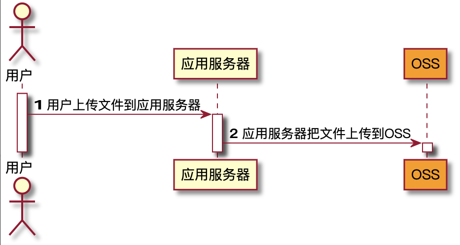
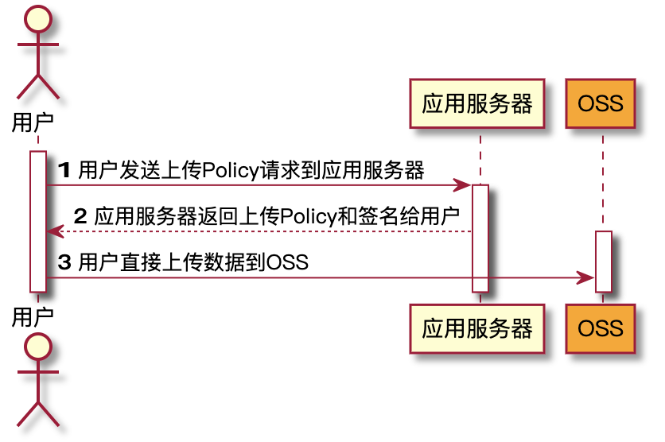
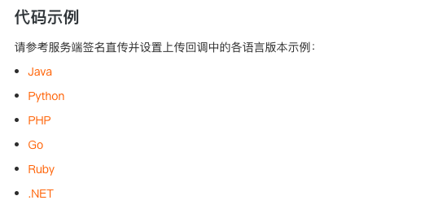

# 阿里云 OSS（对象存储）文件上传

## 1. 什么是对象存储

## 2. 基本概念

## 3. 文件上传

### 3.1 Web 服务端上传

[Web 端上传介绍--官方文档](https://help.aliyun.com/document_detail/112718.htm?spm=a2c4g.11186623.2.16.2db8f2ee30uqOq#concept-xjz-zyp-fhb)

_上传流程：_



因为需要先上传到**应用服务器**，所以这种方案有明显缺点：

- 1. 上传慢
- 2. 扩展性差
- 3. 费用高

### 3.2 Web 端 PostObject 直传

数据直传至 <code style="color: #708090; background-color: #F5F5F5; font-size: 18px">OSS</code> 是利用 <code style="color: #708090; background-color: #F5F5F5; font-size: 18px">OSS</code> 的 PostObject 接口，使用**表单上传**方式上传文件至 <code style="color: #708090; background-color: #F5F5F5; font-size: 18px">OSS</code>。

PostObject 直传有 3 中方式：

- 1. 客户端通过 JavaScript 代码完成签名，然后利用表单上传到 OSS
- 2. 服务端完成签名，然后通过表单直传到 OSS
- 3. 在服务端完成签名，并设置 OSS 上传回调

#### 3.2.1 JavaScript 客户端签名直传

**注意 ⚠️：**：**AccesssKeyID 和 AccessKeySecret 写在代码里面有泄露的风险**。

**步骤：**

1. 下载浏览器客户端代码
2. 修改配置文件
3. 设置 OSS 的 CORS，解决跨域问题
4. JavaScript 客户端签名直传

#### 3.2.2 服务端签名后直传

<span style="color: #ff0000; font-size: 16px;">服务端签名直传可以解决暴露 AccessKey ID 和 AcessKey Secret 的问题，是比较成熟的方案</span>。



上面最重要的应该是第 2 步，正是这里避免了暴露我们的账号和密码。

我们需要到应用的服务器去请求得到签名，然后根据签名来上传文件。

但是，但是啊，经过仔细查找发现，OSS 上传的签名不支持 NodeJs. 😳😳😳！～

_阿里云服务端签名示例语言列表：_



感觉像在开玩笑呢，别的服务几乎都是支持的（如：视频点播），这里居然不支持，难道让应用服务端换个语言？？

太不友好啊。

只能无奈放弃！！！

#### 3.2.3 JavaScript 客户端签名直传 + STS

官网并没有给出这种方法，但是为了避免暴露 AccessKey ID 和 AcessKey Secret，我们可以尝试用 STS 的方式。

和 3.2.1 中的方式略有不同，AccessKey ID 和 AcessKey Secret 不是直接写死在前端代码中的，而是通过应用服务接口到 OSS 的 STS 服务获取的。

**获取 STS 的步骤：**

- 1. 服务端安装 ‘ali-oss’ 依赖

  ```bash
  npm install ali-oss --save
  ```

- 2. 创建一个只用 OSS put/post 等 权限的 RAM 用户

- 3. 创建一个 RAM 角色，并设置权限 “AliyunSTSAssumeRoleAccess”

- 4. 创建一个 token

```js
async getToken(userId: string) {
  let STS = OSS.STS;
  // 初始化 sts 实例
  let sts = new STS({
    accessKeyId: User.StsAccessId,
    accessKeySecret: User.StsAccessSecret,
  });
  async function assumeRole () {
    try {
      // 参数：角色Arn（必须格式正确，可以在阿里云控制台设置），授权策略，过期时间，session数据
      let token = await sts.assumeRole("acs:ram::1747782275303727:role/sts-token", "", 30 * 60, userId);
      return token && token.credentials;
      console.log('token:', token.credentials);
    } catch (e) {
      console.log('getOss error:', e);
    }
  }
  return assumeRole();
}
```

此时，我们获取到了一个权限十分有限，且有过期时间的 **Assume Role**.

然后可以利用 3.2.1 中的方法处理上传了。

## 总结

---

- 阿里云 OSS 服务不支持 NodeJs 签名（简直无语 😓）

- 官网给的示例太过老旧，几乎没有参考性，需要自己去尝试

- 阿里云文档比较复杂，需要花点时间慢慢找
