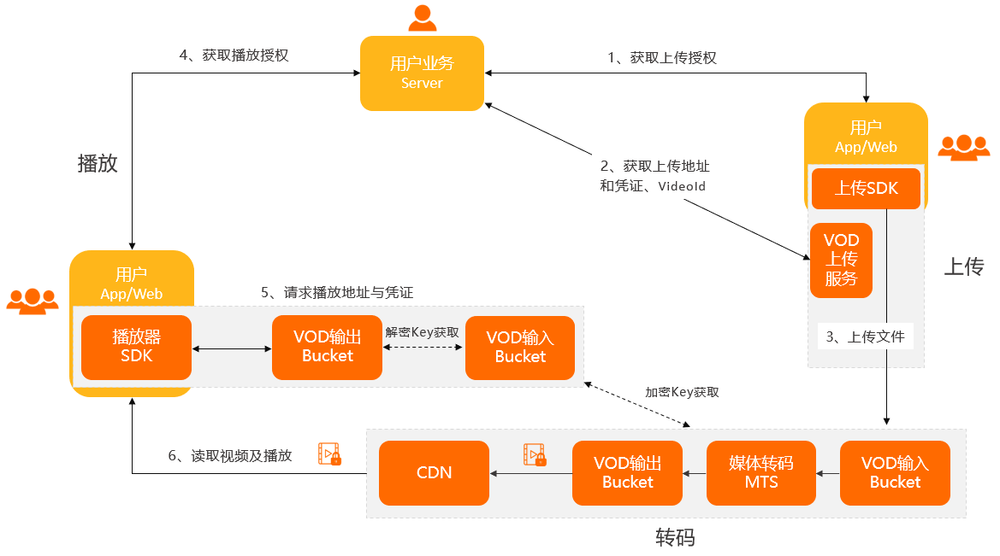
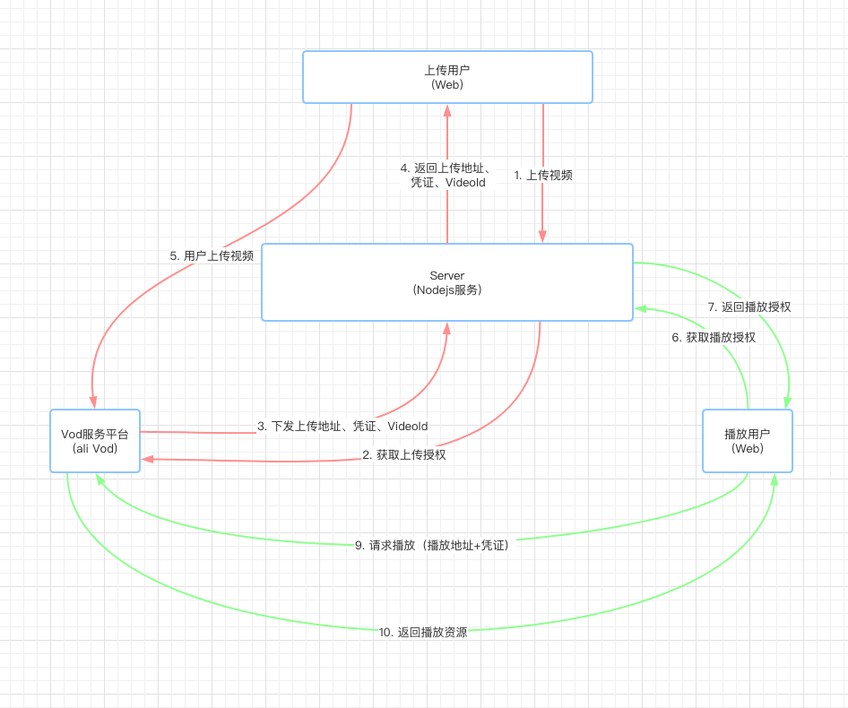
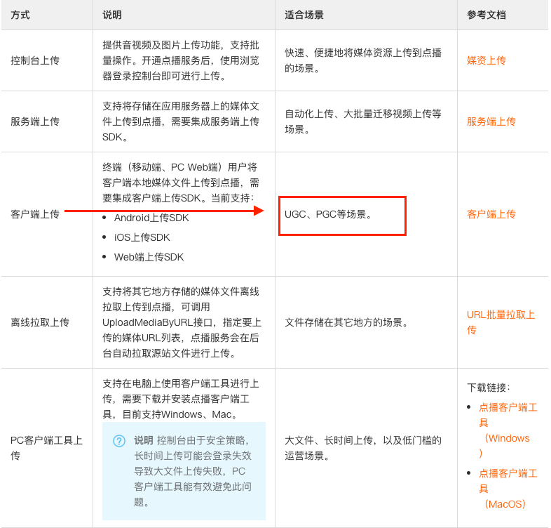
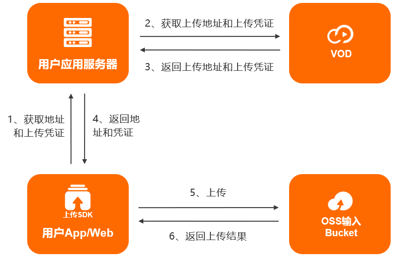

# 阿里云视频点播（Vod）实战

**说明：**

> Web 端实现视频上传
> 前端主要技术栈： React + Antd
> Server 主要技术栈： NodeJs + NestJs
> 视频点播服务商：阿里云

## 1. 什么是 Vod(视频点播)

<code style="color: #708090; background-color: #F5F5F5; font-size: 18px">视频点播（VoD: Video on Demand）</code> 是集视频**采集**、**编辑**、**上传**、**媒体资源管理**、**自动化转码处理（窄带高清 TM）**、**视频审核分析**、**分发加速**于一体的一站式音视频点播解决方案。

_视频点播实现音视频上传、存储、处理和播放的整体流程:_



**流程解析：**

1. 用户获取上传授权

2. VOD 下发上传地址和凭证及 VideoId

3. 用户上传视频并保存视频 ID（VideoId）

4. 用户服务端获取播放授权

5. 用户客户端请求播放地址与凭证，VOD 下发播放地址与带时效的播放凭证

6. 用户服务端将播放凭证下发给客户端完成视频播放

## 2. 开发流程

根据我们选择的技术栈，可以得到整体的开发流程：



整理了开发流程后，我们将按照开发流程一步步完成整个需求。

## 2. 【Web】上传视频

第一步是要用户上传。

### 2.1 选择上传方式

_阿里云 VoD 上传方式：_



**我们的需求是 PGC 场景**。

- **UGC**：User-generated Content 的缩写，用户生产内容。又作 UCC。

- **PGC**：Professionally-generated Content 的缩写，专业生产内容。又作 PCC。

PGC 和 UGC 的区别是生产者的角色不同，PGC 比 UGC 更加专业，一般来说生产的内容更加优质。

如：抖音、B 站属于 UGC；慕课网、在线教育网站一般属于 PGC。

### 2.2 客户端上传

**1. 服务端安装 SDK**

NodeJs 版本为 6.X

```bash
npm install @alicloud/pop-core --save
```

**2. 服务端初始化**

使用账号的 **AccessKey** 信息进行初始化。

```js
var RPCClient = require("@alicloud/pop-core").RPCClient;

function initVodClient(accessKeyId, accessKeySecret) {
  var regionId = "cn-shanghai"; // 点播服务接入区域
  var client = new RPCClient({
    accessKeyId: accessKeyId,
    accessKeySecret: accessKeySecret,
    endpoint: "http://vod." + regionId + ".aliyuncs.com",
    apiVersion: "2017-03-21",
  });

  return client;
}
```

**3. 服务端获取视频上传地址和凭证**

调用 [CreateUploadVideo](https://help.aliyun.com/document_detail/55407.htm?spm=a2c4g.11186623.2.10.7753d418JxYo6M#doc-api-vod-CreateUploadVideo) 接口，完成获取视频上传地址和凭证功能。

**主要请求参数：**

- Action(必填)：固定值“CreateUploadVideo”
- FileName(必填): 视频源文件名（如：User/Desktop/\*\*\*.mp4）
- Title(必填): 视频标题
- CoverURL: 自定义封面地址（https://\*\*\*.png）
- Description: 视频描述
- Tags: 视频标签（如：tag1,tag2）最多 16 个

**正确返回结果：**

- RequestId：请求 ID
- VideoId：视频 ID
- UploadAddress：上传地址
- UploadAuth：上传凭证

```js
// 请求示例
var client = initVodClient("<Your AccessKeyId>", "<Your AccessKeySecret>");

client
  .request(
    "CreateUploadVideo",
    {
      Title: "this is a sample",
      FileName: "filename.mp4",
    },
    {}
  )
  .then(function (response) {
    console.log("VideoId = " + response.VideoId);
    console.log("UploadAddress = " + response.UploadAddress);
    console.log("UploadAuth = " + response.UploadAuth);
    console.log("RequestId = " + response.RequestId);
  })
  .catch(function (response) {
    console.log("ErrorCode = " + response.data.Code);
    console.log("ErrorMessage = " + response.data.Message);
    console.log("RequestId = " + response.data.RequestId);
  });
```

最后，<span style="color: #ff0000; font-size: 16px;">顺利的话我们将获取到**上传地址和凭证**，我们需要对其进行**Base64 解码**，再调用 OSS SDK 将视频文件上传到指定的 bucket 中</span>。

注意 ⚠️：

如果视频较大，上传时间超过 3000s(50min)，需要[刷新视频上传凭证](https://help.aliyun.com/document_detail/55408.html?spm=a2c4g.11186623.6.765.37025d4a7M149W)。

[NodeJs 媒体上传文档](https://help.aliyun.com/document_detail/101396.html?spm=a2c4g.11186623.6.1113.6e0a5cceAb0lUE)

**4. 客户上传：**

客户端上传，是指<span style="color: #ff0000; font-size: 16px;">将移动端（Web、iOS、Android）或 PC 端媒体文件上传到点播存储</span>，**适合 UGC、PGC、运营后台等场景**。

_客户端上传流程：_



1-4 步的工作我们在上面已经完成了，现在要做的是 5-6 步，即 **上传**和**获取上传结果**。

客户端想要上传视频到 Vod(实际是上传到指定的 bucket)，需要<code style="color: #708090; background-color: #F5F5F5; font-size: 18px">客户端 SDK</code>。

**操作步骤：**

- 1. 页面引入 SDK 脚本

  ```js
  <script src="../lib/aliyun-oss-sdk6.10.0.min.js"></script>
  <script src="../aliyun-vod-upload-sdk1.5.2.min.js"></script>
  ```

- 2. 初始化上传实例

```js
var uploader = new AliyunUpload.Vod({
  //阿里账号ID，必须有值
  userId: "122",
  //分片大小默认1 MB，不能小于100 KB
  partSize: 1048576,
  //并行上传分片个数，默认5
  parallel: 5,
  //网络原因失败时，重新上传次数，默认为3
  retryCount: 3,
  //网络原因失败时，重新上传间隔时间，默认为2秒
  retryDuration: 2,
  //是否上报上传日志到视频点播，默认为true
  enableUploadProgress: true,
  //开始上传
  onUploadstarted: function (uploadInfo) {
    log(
      "onUploadStarted:" +
        uploadInfo.file.name +
        ", endpoint:" +
        uploadInfo.endpoint +
        ", bucket:" +
        uploadInfo.bucket +
        ", object:" +
        uploadInfo.object
    );
    //上传方式1，需要根据uploadInfo.videoId是否有值，调用视频点播的不同接口获取uploadauth和uploadAddress，如果videoId有值，调用刷新视频上传凭证接口，否则调用创建视频上传凭证接口
    if (uploadInfo.videoId) {
      //如果uploadInfo.videoId存在，调用刷新视频上传凭证接口
    } else {
      //如果uploadInfo.videoId不存在，调用获取视频上传地址和凭证接口
      //从视频点播服务获取的uploadAuth、uploadAddress和videoId，设置到SDK里
      uploader.setUploadAuthAndAddress(
        uploadInfo,
        uploadAuth,
        uploadAddress,
        videoId
      );
    }
  },
  //文件上传成功
  onUploadSucceed: function (uploadInfo) {
    log(
      "onUploadSucceed: " +
        uploadInfo.file.name +
        ", endpoint:" +
        uploadInfo.endpoint +
        ", bucket:" +
        uploadInfo.bucket +
        ", object:" +
        uploadInfo.object
    );
  },
  //文件上传失败
  onUploadFailed: function (uploadInfo, code, message) {
    log(
      "onUploadFailed: file:" +
        uploadInfo.file.name +
        ",code:" +
        code +
        ", message:" +
        message
    );
  },
  //文件上传进度，单位：字节
  onUploadProgress: function (uploadInfo, totalSize, loadedPercent) {
    log(
      "onUploadProgress:file:" +
        uploadInfo.file.name +
        ", fileSize:" +
        totalSize +
        ", percent:" +
        Math.ceil(loadedPercent * 100) +
        "%"
    );
  },
  //上传凭证超时
  onUploadTokenExpired: function (uploadInfo) {
    console.log("onUploadTokenExpired");
    //实现时，根据uploadInfo.videoId调用刷新视频上传凭证接口重新获取UploadAuth
    //从点播服务刷新的uploadAuth，设置到SDK里

    uploader.resumeUploadWithAuth(uploadAuth);
  },
  //全部文件上传结束
  onUploadEnd: function (uploadInfo) {
    console.log("onUploadEnd: uploaded all the files");
  },
});
```

- 3. 列表管理

  - 添加上传文件：

    使用 input 方式选择文件，文件小于 10GB。

    ```js
    <form action="">
      <input type="file" name="file" id="files" multiple />
    </form>;
    userData = "";
    document
      .getElementById("files")
      .addEventListener("change", function (event) {
        for (var i = 0; i < event.target.files.length; i++) {
          //逻辑代码
        }
      });
    ```

    获取到用户选择的文件后，添加到上传列表中。

    ```js
    uploader.addFile(event.target.files[i], null, null, null, paramData);
    ```

  - 删除上传文件: index 对应 listFiles 接口返回列表中元素的索引

    ```js
    uploader.deleteFile(index);
    ```

  - 取消单个文件上传

    ```js
    uploader.cancelFile(index);
    ```

  - 获取上传文件列表

  ```js
  uploader.listFiles();
  var list = uploader.listFiles();
  for (var i = 0; i < list.length; i++) {
    log(
      "file:" +
        list[i].file.name +
        ", status:" +
        list[i].state +
        ", endpoint:" +
        list[i].endpoint +
        ", bucket:" +
        list[i].bucket +
        ", object:" +
        list[i].object
    );
  }
  ```

- 4. 上传控制

  - 开始上传

    ```js
    uploader.startUpload();
    ```

  - 上传凭证失效后恢复上传

  ```js
  uploader.resumeUploadWithAuth(uploadAuth);
  ```

**断点续传：**

_上传地址和凭证方式上传时：_

```js
onUploadstarted : function (uploadInfo) {
  if(!uploadInfo.videoId) //这个文件没有上传异常
  {
    //实际环境中调用调用视频点播的获取上传凭证接口
    uploader.setUploadAuthAndAddress(uploadInfo, uploadAuth, uploadAddress,videoId);
  }
  else //如果videoId有值，根据videoId刷新上传凭证
  {
    //实际环境中调用视频点播的刷新上传凭证接口，获取凭证
    uploader.setUploadAuthAndAddress(uploadInfo, uploadAuth, uploadAddress);
  }
}
```

## 3. 【Server】处理上传的视频

## 参考

[视频点播 -- wikipedia](https://zh.wikipedia.org/wiki/%E9%9A%A8%E9%81%B8%E8%A6%96%E8%A8%8A)

[视频点播开发指南 -- 阿里云](https://help.aliyun.com/document_detail/193174.html?spm=a2c4g.11186623.6.641.1e164e28qWSdYs)
