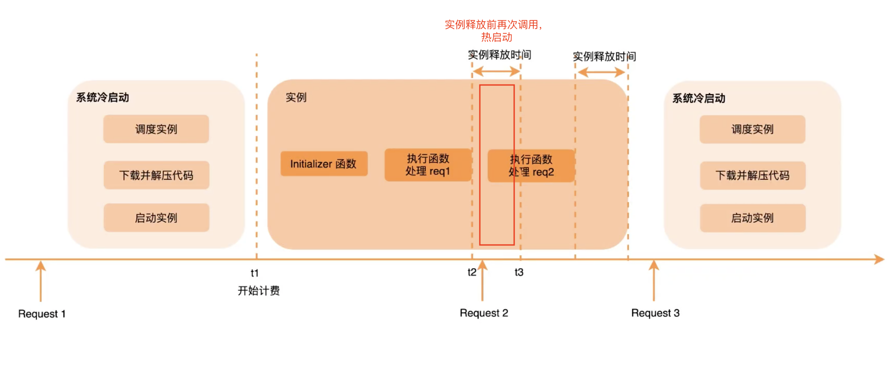

# 阿里云 Serverless 实践

**阿里云的无服务器计算(Serverless Computing)叫[函数计算（Function Compute）](https://www.aliyun.com/product/fc)。**

**函数计算**是一个事件驱动的全托管 Serverless 计算服务。

_什么是阿里的函数计算：_

用户无需管理服务器等基础设施，只需编写代码并上传，函数计算会为您准备好计算资源，并以弹性、可靠的方式运行您的代码。

## 1.认识阿里云函数计算

### 1.1 函数计算和普通应用构建对比

_应用构建方式对比：_

**可以看出，我们只需要做两件事：**

- **开发、部署应用**
- **监控应用运行**

### 1.2 函数计算工作流程

_函数计算工作流程：_

### 1.3 优势与使用场景

_核心优势：_

- 敏捷：省去了服务器购买、自动伸缩、负载均衡等问题，只关注核心业务代码
- 弹性：根据请求了自动弹性扩容，毫秒级调度计算资源
- 稳定：函数计算分布式集群化部署
- 省钱：按实际使用计算资源收费，不计算不收费

_适用场景：_

- Web 应用：如 Web 单页面应用、小程序后端等
- 弹性计算需求的应用：如 AI 推理、音视频和图文处理
- 异步数据处理系统：如阿里云 OSS、云监控、CDN

### 1.4 函数计算的调用

_函数计算请求和调用链路：_

函数计算 可以由事件源调用和 SDK 直接调用两种方式。（当然也可以在阿里云控制台手动执行）

- 事件源调用：阿里云其他服务（如：OSS、API 网关等）自动触发调用函数计算
- 各种语言的 SDK 执行函数（如：NodeJs SDK）

_调用方式：_

调用方式有两种：<code style="color: #708090; background-color: #F5F5F5;">同步调用</code>和<code style="color: #708090; background-color: #F5F5F5;">异步调用</code>。

**同步调用:适用于单次调用，需要尽快知道函数结果（如：HTTP 请求、网关）**

- 服务端会立即返回计算结果
- 执行过程中遇到错误，会将错误返回给客户端，函数不会进行错误重试，需客户端添加错误重试机制

_同步调用场景示例：_

**异步调用：适用于不急于得到函数执行结果（如：批量数据处理）**

- 将触发请求放到队列中就返回，不会等待函数调用结束
- 执行中遇到错误会重试，函数错误会重试 3 次，系统错误会以指数退避方式无限重试直至成功
- 适用于批量处理等，（如：OSS 触发音视频处理、日志触发器来触发日志清洗）

需要了解失败的请求，并对请求做自定义处理，可以使用 <code style="color: #708090; background-color: #F5F5F5;">Destination</code> 功能。

_同步调用场景示例：_

_函数执行过程示例：_

流程说明：

- 第一次调用会有一个冷启动过程，冷启动会调度示例、下载、启动函数，这个过程可能导致延时
- 然后就是函数的初始化和执行
- 当执行完后不会立马释放，而是等一段时间，如果释放之前再次调用，则执行函数会直接处理 req2
- 如果一定时间没有函数执行，则释放执行环境，再次调用会重启冷启动

**避免冷启动：**

- 避免冷启动：使用预留实例，用户控制实例环境释放
- 降低冷启动延时：降低代码包大小，使用 Initializer 函数、保持请求稳定

## 2.如何使用

函数计算步骤较复杂，请参考[函数计算文档](https://help.aliyun.com/product/50980.html?spm=a2c4g.11186623.6.540.be7e1744bB3Zij)

本文主要讲述使用函数计算的主要概念和流程，结合实际操作，实战一下。

_[使用流程](https://help.aliyun.com/document_detail/73329.html?spm=a2c4g.11186623.6.559.12585c7393J5sL)：_

流程说明：

- 1. **创建服务**

  **服务（Service）**是函数计算的基本资源单位。我们可以在服务级别上授权、配置日志和创建函数等。

- 2. **创建函数，编写代码，将应用部署到函数中**

  **函数（Function）**是调度与运行的基本单位，更是一段代码的处理逻辑。

  我们需要根据函数计算提供的函数接口形式编写代码，并将代码以函数的形式部署到函数计算；

  函数计算中的服务对应于软件应用架构领域中的微服务；

  在函数计算平台构建应用时，首先根据需求将业务逻辑抽象为微服务，然后再实现为函数计算中的服务。

- 3. **以事件源触发函数**

  函数计算支持直接触发函数或者通过事件触发函数。

  **触发方式：**

  - 使用控制台、命令行工具 fcli 或者 SDK 等方式直接触发函数的执行
  - 例如配置 OSS 触发器后，当 OSS 对应的 Bucket 中有对象新增或删除后都会触发函数的执行，方便您处理上传的对象。配置日志服务触发器，当日志服务对应的 Logstore 中有新日志写入后可以触发函数的执行，方便您处理写入的日志。您需要设置触发器来设置事件触发的方式。

- 4. **查看执行日志**

  查看日志是帮助您调试的一个重要环节

- 5. **查看服务的监控**

  可以在函数计算控制台上查看服务监控。

### 2.1 创建服务与函数

创建服务官方文档已经写的很具体，请直接点击链接查看官方文档吧！

创建服务的方式有 3 种：

- [在函数控制台创建](https://help.aliyun.com/document_detail/51783.html?spm=a2c4g.11186623.6.560.517b49f3YfKCZT)
- [使用命令行工具 Funcraft 创建](https://help.aliyun.com/document_detail/155100.html?spm=a2c4g.11186623.6.561.b1d61744X5SZEf)
- [使用 VSCode 插件创建](https://help.aliyun.com/document_detail/155679.html?spm=a2c4g.11186623.6.562.2d261744r6iCRC)

需要注意的几点：

1. 创建的服务可以本地调试，但是需要安装 Docker
2. 本地调试第一次执行会拉取执行环境的镜像到本地，耗时较长

_1.新建服务页面_

_2.选择函数类型_

- **事件函数**：可以通过事件触发，如 OSS 上传成功事件

- **http 函数**：HTTP 请求可以触发，可以自己配置触发器

_http 入口函数 handler_:

### 2.2 如何安装依赖

Serverless 应用的依赖安装比较困难，因为它运行在 FaaS 平台上。

FaaS 平台的运行环境是有云厂商提供的，我们只能**做有限的定制**。

_FaaS 平台中函数实例_:

可以看出，函数实例的运行环境在容器中，我们能控制的只有<code style="color: #708090; background-color: #F5F5F5; font-size: 18px"> 函数代码</code>。

不同语言的项目依赖是不同的，如：Java 项目需要在部署前编译，因此，我们可以直接将依赖在编译时安装好。

Node.js 项目的依赖一般放在项目文件的 <code style="color: #708090; background-color: #F5F5F5; font-size: 18px">node_modules</code> 目录中，使用 NPM 安装即可。

但是，<code style="color: #708090; background-color: #F5F5F5; font-size: 18px">node_modules</code>通常依赖较为复杂，包的体积通常很大，需要使用 <code style="color: #708090; background-color: #F5F5F5; font-size: 18px">Webpack</code> 等进行打包优化，只打包需要的模块。

## 3. 性能优化

_函数的调用链路用时：_

- InvokeFunction：函数执行总时间
- ClodStart：是函数冷启动时间（热启动不会有这个阶段）
- PrepareCode：冷启动过程中，下载代码或下载自定义镜像的时间
- RuntimeInitialize：是执行环境启动的时间，包括启动容器和函数运行环境
- Invocation：是执行函数的时间

可以看出，<code style="color: #708090; background-color: #F5F5F5; font-size: 18px">Serverless 应用</code>的性能优化主要是优化**冷启动**。

**提升性能方法**：

- 1. 提前给函数预热（对明确流量高峰期的应用比较适用，如：外卖平台、电商活动）
- 2. 适用预留资源
- 3. 减少代码体积、减少不必要的依赖（会加快冷启动下载时间）
- 4. 执行上下文重用
- 5. 为函数设置并发
- 6. 选择冷启动耗时少的语言（Java 冷启动耗时较多，Node.js、PHP、Python 耗时较少）
- 7. 为函数选择合适的内存（内存越大启动越快，但费用高）

--- 持续更新中...

## 参考

[Serverless 技术公开课 - 阿里云](https://developer.aliyun.com/lesson_2024_18991?spm=5176.10731542.0.0.2fe1cda8c6B96V#_18991)
