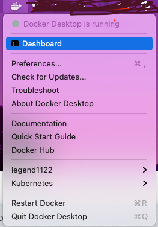
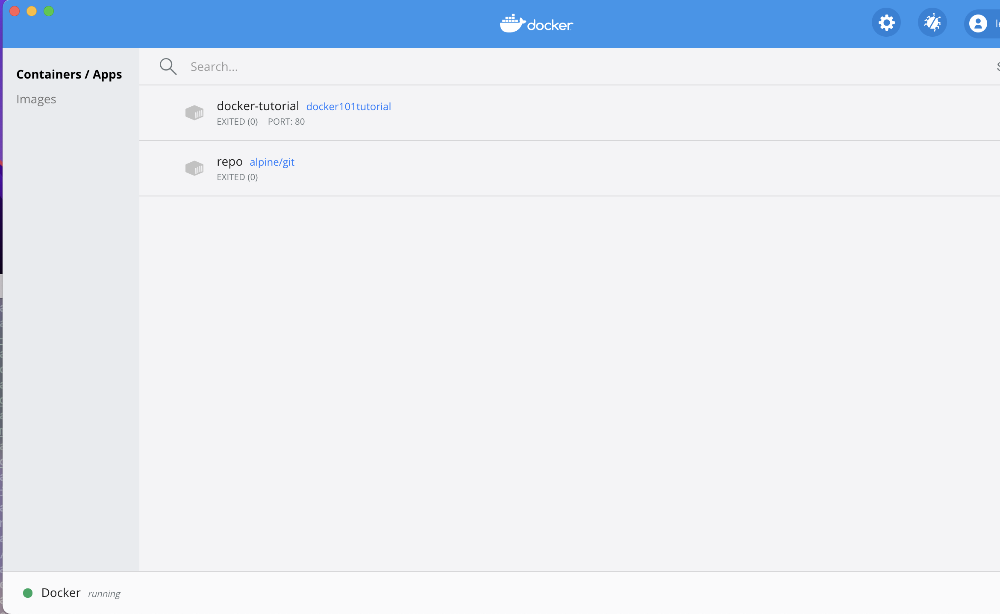
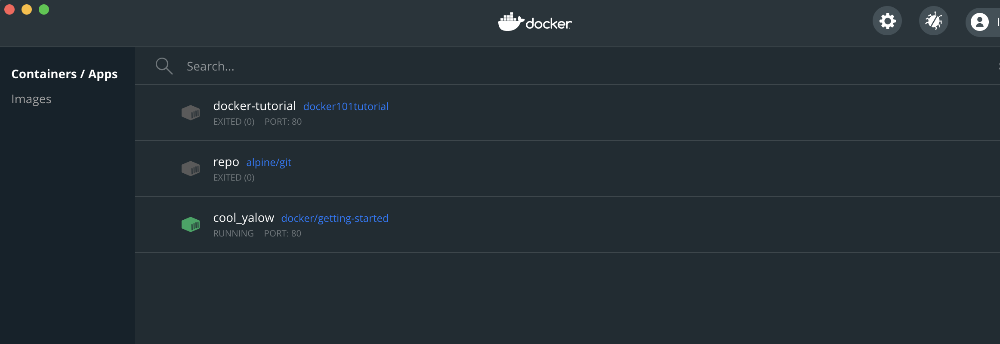

## 4.Docker

**Docker 属于 Linux 容器的一种封装，提供简单易用的容器使用接口。**

**Docker 将应用程序与该程序的依赖，打包在一个文件里面。运行这个文件，就会生成一个虚拟容器。**

程序在这个虚拟容器里运行，就好像在真实的物理机上运行一样。有了 Docker，就不用担心环境问题。

总体来说，Docker 的接口相当简单，用户可以方便地创建和使用容器，把自己的应用放入容器。容器还可以进行版本管理、复制、分享、修改，就像管理普通的代码一样。

### 4.1 Docker 引擎

**Docker 引擎** 是一个 **客户端-服务器(client-server)** 应用。

Docker 引擎主要构成：

- **server**: 一个长期运行的守护进程
- **REST API**: 指定了程序可以用来与守护进程对话并指示它做什么的接口
- **CLI**: 客户端命令行工具（执行 docker 操作命令）


### 4.2 Docker 用途

分为三类：

1. **提供一次性的环境**:比如，本地测试他人的软件、持续集成的时候提供单元测试和构建的环境
2. **提供弹性的云服务**:因为 Docker 容器可以随开随关，很适合动态扩容和缩容
3. **组建微服务架构**:通过多个容器，一台机器可以跑多个服务，因此在本机就可以模拟出微服务架构

### 4.3 Docker 架构

**Docker 使用 客户端-服务器 架构。**

- **Docker Client 和 Docker daemon 对话，可以完成构建、运行和分发 Docker 容器的重任。**

- **Docker Client 和 Docker daemon 可以运行在同一个系统，或者将 Docker Client 和一个远端 ocker daemon 链接。**

- **Docker Client 使用 REST API, 或通过 UNIX sockets 或 网络接口 来通信.**


_查看本地 docker 版本可以看到 Docker Client 和 Docker Server_:

```bash
➜ docker version
Client: Docker Engine - Community
 Cloud integration: 1.0.4
 Version:           20.10.0
 API version:       1.41
 Go version:        go1.13.15
 Git commit:        7287ab3
 Built:             Tue Dec  8 18:55:43 2020
 OS/Arch:           darwin/amd64
 Context:           default
 Experimental:      true

Server: Docker Engine - Community
 Engine:
  Version:          20.10.0
  API version:      1.41 (minimum version 1.12)
  Go version:       go1.13.15
  Git commit:       eeddea2
  Built:            Tue Dec  8 18:58:04 2020
  OS/Arch:          linux/amd64
  Experimental:     false
 containerd:
  Version:          v1.4.3
  GitCommit:        269548fa27e0089a8b8278fc4fc781d7f65a939b
 runc:
  Version:          1.0.0-rc92
  GitCommit:        ff819c7e9184c13b7c2607fe6c30ae19403a7aff
 docker-init:
  Version:          0.19.0
  GitCommit:        de40ad0

```

## 5. Docker 核心概念

> Docker 架构各部分就是 Docker 的核心

### 5.1 The Docker daemon

Docker 守护进程（dockerd）监听 Docker API 请求，并管理 Docker 对象，如 image、container、 networks, 和 volumes(卷)。守护进程还可以与其他守护进程通信，管理 Docker 服务。

### 5.2 The Docker client

Docker 客户端（docker）是许多 Docker 用户与 Docker 交互的主要方式。当你使用 docker run 等命令时，客户端将这些命令发送给 dockerd，由 dockerd 执行。docker 命令使用的是 Docker API。Docker 客户端可以与多个守护进程通信。

### 5.3 Docker registries

Docker registries(注册表)可以存储 Docker image(镜像)。Docker Hub 是一个公共注册表，任何人都可以使用，Docker 默认配置为在 Docker Hub 上寻找镜像。你甚至可以运行自己的私有注册表。

当您使用 docker pull 或 docker run 命令时，所需的镜像将从您配置的注册表中拉出。当你使用 docker push 命令时，你的镜像会被推送到你配置的注册表中。

### 5.4 Docker objects

> 使用 Docker 时，就是在创建和使用镜像、容器、网络、卷、插件和其他 docker 对象。

#### 5.4.1 IMAGES

image(镜像)是一个只读的模板，包含创建 Docker 容器的说明。

**A Docker image is a private file system just for your container.It provides all the files and code your container needs.**

这是 Docker 仪表盘的初始化教程里的一句话。翻译一下就是 👇：

**Docker 镜像是一个只属于你的容器的私有文件系统。它提供了你的容器所需的所有文件和代码。**

通常情况下，一个镜像是基于另一个镜像的，但有一些额外的定制。例如，你可以建立一个基于 ubuntu 镜像的镜像，但安装了 Apache 网络服务器和你的应用程序，以及使你的应用程序运行所需的配置细节。

#### 5.4.2 CONTAINERS

**container(容器，或许叫集装箱更合适)是一个映像的可运行实例。**

可以使用 Docker API 或 CLI 创建、启动、停止、移动或删除容器。

也可以将容器连接到一个或多个网络，将存储连接到它，甚至根据其当前状态创建一个新的镜像。

默认情况下，容器与其他容器及其主机的隔离相对较好。

当然，自己也可以控制容器的网络、存储或其他底层子系统与其他容器或主机的隔离程度。

## 6. 使用 Docker

[获取并安装 Docker](https://docs.docker.com/get-docker/)

安装 Docker 后，启动 docker,可以看到 Docker 仪表盘主要包括两部分：**container/app** 和 **image**。

_Mac 启动 Docker 后的图标：_



_Docker 仪表盘：_



### 6.1 创建 container

仪表盘默认是空的，需要我们创建 container.

```bash
➜ docker run -d -p 80:80 docker/getting-started
Unable to find image 'docker/getting-started:latest' locally
latest: Pulling from docker/getting-started
188c0c94c7c5: Pull complete
617561f33ec6: Pull complete
7d856acdaa9c: Pull complete
a0d3c6e28e6d: Pull complete
af69a9b963c8: Pull complete
0739f3815ad8: Pull complete
7c7b75d0baf8: Pull complete
Digest: sha256:b821569034e3b5fae03b40e64a866017067f3bf17effe185b782bdbf02179528
Status: Downloaded newer image for docker/getting-started:latest
45623b655d4a96e12c491b4b8ca9c93a0b05033496341cf4dcf67252165aa68e
```

从打印的信息中可以看到，这行命令使用‘docker/getting-started’这个 image 来创建一个 container。

首先它从本地查询 ‘docker/getting-started’这个 image,本地没有找到就到默认的 registry(Docker Hub)去找这个 image。

然后就是拉取 image 的内容，根据 image 创建 container.

_Docker Dashboard 已经成功创建并启动了'docker/getting-started':_



## 7. 构建一个 node 应用

--- 未完待续... ---

## 参考

[Docker 文档](https://docs.docker.com/get-started/overview/)

[Docker 入门教程](http://www.ruanyifeng.com/blog/2018/02/docker-tutorial.html)
