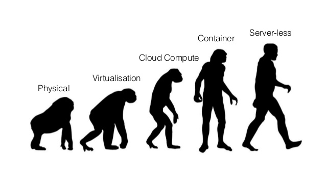
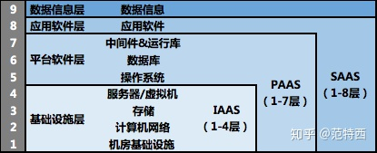
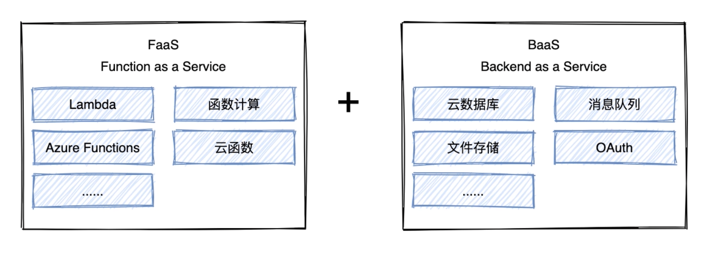
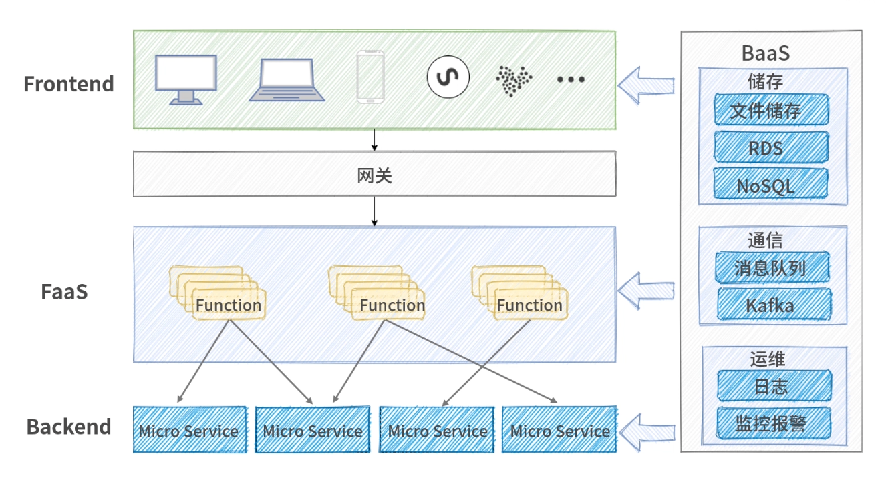
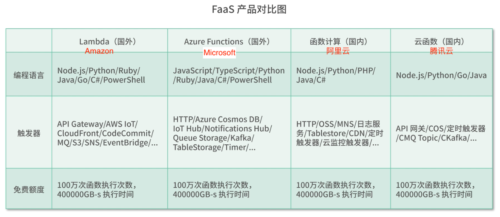
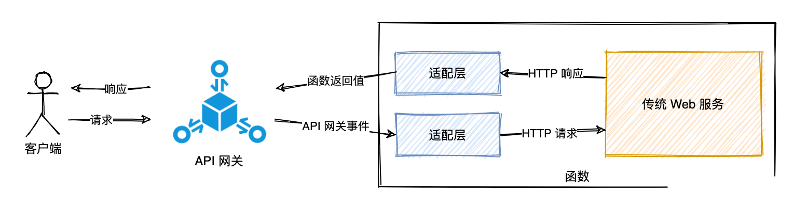
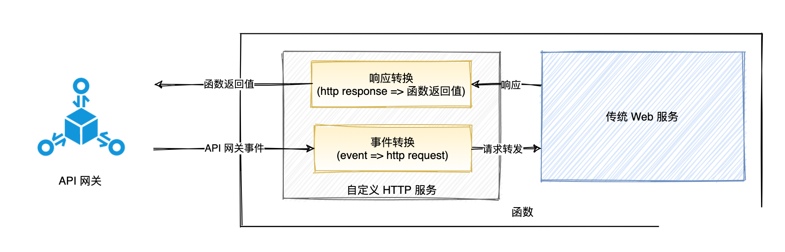
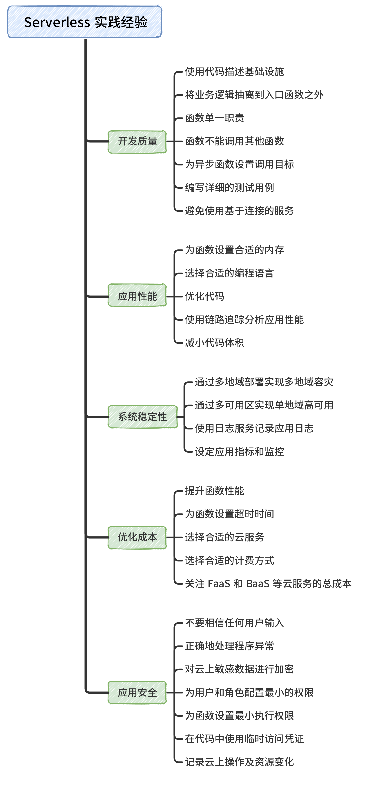

# Serverless computing(无服务器计算)

> Serverless 为什么翻译成无服务器？不应该是少服务器吗？

我们通常说的<code style="color: #708090; background-color: #F5F5F5; font-size: 18px">Serverless</code>全称是<code style="color: #708090; background-color: #F5F5F5; font-size: 18px">Serverless computing</code>（无服务器计算），为什么强调它的全称呢？因为我觉得<code style="color: #708090; background-color: #F5F5F5; font-size: 18px">Serverless</code>这个称呼并不利于我们理解它，<code style="color: #708090; background-color: #F5F5F5; font-size: 18px">Serverless computing</code>这个称呼能清晰的告诉我们，**serverless**是一个**计算服务**。

## 1. 服务器发展历程：虚拟与隔离

> 开发人员为了保证开发环境的正确（即，这个 Bug 不是环境因素造成的），想出了一系列的隔离方式：虚拟机、容器虚拟化、语言虚拟机、应用容器（如 Java 的 Tomcat）、虚拟环境（如 Python 中的 virtualenv），甚至是独立于语言的 DSL。



- 我们使用 XEN、KVM 等虚拟化技术，隔离了硬件以及运行在这之上的操作系统
- 我们使用云计算进一步地自动管理这些虚拟化的资源
- 我们使用 Docker 等容器技术，**隔离**了<code style="color: #708090; background-color: #F5F5F5; font-size: 18px">应用的操作系统</code>与<code style="color: #708090; background-color: #F5F5F5; font-size: 18px">服务器的操作系统</code>
- 有了 Serverless，我们可以**隔离操作系统**，乃至更底层的技术细节

## 2.云计算

<code style="color: #708090; background-color: #F5F5F5; font-size: 18px">云计算</code>是相对之前的部署服务而言的，过去通常需要自行采购物理机，并将其托管到机房；

后来，有了虚拟机。

再后来，<code style="color: #708090; background-color: #F5F5F5; font-size: 18px">云计算</code>的概念被 Netflix 使用并流行。

<code style="color: #708090; background-color: #F5F5F5; font-size: 18px">云计算</code>通过将计算资源“虚拟化”，让用户无需了解计算资源背后的细节，也无需具备相应的专业知识，就能直接使用。

**云计算**按服务模式分类：

- IaaS(Infrastructure as a Service，基础设置即服务)。云计算服务中提供计算资源，如服务器、虚拟机、存储空间、网络资源等基本的资源。

  如：Amazon AWC EC2、阿里云 ECS 等

- PaaS(Platform as a Service, 平台即服务)。这些服务也没称为中间件，云服务商提供给开发者在<span style="color: #ff0000; font-size: 16px;">应用中直接使用的功能层服务</span>，如：CDN。

- SaaS(Software as a Service, 软件即服务)。提供直接可用的软件，如：手机里的软件，微信、支付宝、高德地图。

- BaaS(Backend as a Service, 后端即服务)。云服务商提供**后端接口**作为服务。如：阿里云 OSS、Amazon S3 等。

- FaaS(Function as a Service, 函数即服务)。提供函数平台来处理服务。如：Amazon Lambda、阿里云 FC(函数计算)



## 3. Serverless 是什么

> 至今，Serverless 仍在发展中，并没有一个确切的定义。

**广义上来说**：

<code style="color: #708090; background-color: #F5F5F5; font-size: 18px">Serverless</code>指<span style="color: #ff0000; font-size: 16px;">构建和运行软件时不需要关心服务器</span>的一种架构思想。

**狭义上来说**：

<code style="color: #708090; background-color: #F5F5F5; font-size: 18px">Serverless</code> = <code style="color: #708090; background-color: #F5F5F5; font-size: 18px">FaaS</code> + <code style="color: #708090; background-color: #F5F5F5; font-size: 18px">BaaS</code>.

<code style="color: #708090; background-color: #F5F5F5; font-size: 18px">FaaS</code><span style="color: #ff0000; font-size: 16px;">本质上是对容器化技术的进一步封装，它对 Dockfile 文件进行了屏蔽（帮我们自动构建容器）</span>，由 <code style="color: #708090; background-color: #F5F5F5; font-size: 18px">FaaS</code>的提供商来维护。

这就代表，<span style="color: #ff0000; font-size: 16px;">依赖软件的安装、代码的部署逻辑、应用程序的启动方式都无需关心</span>，开发者只需编写代码片段即可。

<code style="color: #708090; background-color: #F5F5F5; font-size: 18px">BaaS</code>(Backend as a Service)即“后端即服务”，常见的有 github pages，我们只需简单的配置就能生成一个静态网站。常见的 BaaS 有，阿里云 OSS 等。



### 3.1 FaaS 与 BaaS

<code style="color: #708090; background-color: #F5F5F5; font-size: 18px">FaaS</code>(Function as a Service)实际上是一个函数运行平台，大多 FaaS 产品都支持 Node.js、Python、Java 等编程语言，你可以选择你喜欢的编程语言编写函数并运行。让<code style="color: #708090; background-color: #F5F5F5; font-size: 18px">FaaS</code>来<span style="color: #ff0000; font-size: 16px;">负责资源的调度和运维</span>。

如何使用<code style="color: #708090; background-color: #F5F5F5; font-size: 18px">FaaS</code>中的函数？

通过**事件驱动**来触发<code style="color: #708090; background-color: #F5F5F5; font-size: 18px">FaaS</code>，<code style="color: #708090; background-color: #F5F5F5; font-size: 18px">FaaS</code>来管理<code style="color: #708090; background-color: #F5F5F5; font-size: 18px">BaaS</code>。

_使用 serverless 的应用架构工作流程示意图:_



_FaaS 产品对比:_



### 3.2 Serverless 优缺点

- 好处是什么？

  1. 不用运维
  2. 弹性伸缩
  3. 按流量付费
  4. 开发简单
  5. 降低风险

- 缺点也显而易见：

  1. 应用**严重依赖于特定的云平台、第三方服务**
  2. 底层硬件无法确定（平台负责）
  3. 应用性能瓶颈（每次调用 FaaS 都是新的上下文）
  4. 函数通信效率低
  5. 开发调试复杂

## 4.Serverless 框架

> Serverless 框架 是云计算模型的具体实现，我们使用 Serverless 框架来使用云计算公司的 Serverless 服务。

各大云计算公司的 Serverless 框架：

- AWS Lambda，最早被大众所认可的 Serverless 实现
- Knative，谷歌开源的 Serverless 架构方案
- Azure Functions，来自微软公有云的 Serverless 实现
- OpenWhisk，Apache 社区的开源 Serverless 框架
- Kubeless，基于 Kubernetes 架构实现的开源 Serverless 框架
- Fission，Platform9 推出的开源 Serverless 框架
- OpenFaaS，以容器技术为核心的开源 Serverless 框架
- Fn，来自 Oracle 的开源 Serverless 框架
- 阿里云函数计算
- 无服务器云函数（Serverless Cloud Function，SCF）是腾讯云推出的函数式计算平台

## 5. 传统应用迁移到 Serverless

一般传统应用我们会使用一些框架，如 Node.js 的 Express/Koa 等。

这些<code style="color: #708090; background-color: #F5F5F5; font-size: 18px">框架</code>和<code style="color: #708090; background-color: #F5F5F5; font-size: 18px">Serverless 服务</code>的 API 是有差别的，尽管差别不是很大。

如：Express 处理 HTTP 请求的参数和 阿里云函数计算的 API 不同。

_传统 Web 服务 Serverless 化流程:_



解决办法通常有如下几种方案：

- 1. 通过适配层，由适配层将 serverless 事件对象转换为标准 Web 请求

  适配层用来格式化函数计算的请求，进而调用传统 Web 服务; 然后获取传统 Web 服务的结果，再次处理成函数的返回值。

  _serverless 适配原理：_

  

  _适配层_：

  ```js
  function forwardResponseToApiGateway(server, response, resolver) {
    const buf = [];
    response
      .on("data", (chunk) => buf.push(chunk))
      .on("end", () => {
        // 根据 response 构造函数执行结果
        const data = {
          statusCode: response.statusCode,
          body: Buffer.concat(buf),
          headers: getResponseHeaders(response),
          isBase64Encoded: isContentTypeBinaryMimeType(response),
        };
        // 返回函数执行结果
        resolver(data);
      });
  }
  ```

  _使用适配层转发服务：_

  ```js
  const express = require("express");

  const app = express();
  app.all("*", (req, res) => {
    res.send("hello world!");
  });

  // 我们项目自定义的 Node.js Server
  const server = createServer(app);

  module.exports.handler = function (event, context, callback) {
    // 将 event 对象转换为 HTTP reqest 并转发到 Node.js Server
    forwardRequestToNodeServer(server, event, context, callback);
  };
  ```

- 2. 自定义运行时，在函数计算中创建一个 HTTP 服务，该 HTTP 服务**将函数事件处理后转发给传统 Web 服务**

- 3. 自定义运行时，**将传统 Web 服务构建为自定义镜像**

## 6. 经验

### 6.1 提升开发质量

> 1.使用代码描述基础设施

手动来写资源配置不仅效率低、易出错，而且更新不方便。

<code style="color: #708090; background-color: #F5F5F5; font-size: 18px">基础设施即代码</code>（Infrastructure as Code, IaC）就是这样一个功能。

- AWA SAM
- 阿里云资源编排

> 2.将业务逻辑抽离到入口函数之外

入口函数中只应该处理函数参数，不应该处理业务逻辑。

优点是**降低代码和云服务的耦合度**、**容器重用时被重复利用，不用重新初始化**。

_坏的示例：_

```js
exports.handler = async (event, callback) => {
  const name = event.user.name;
  // 初始化数据库连接
  const connection = await mysql.createConnection({
    host: "localhost",
    user: "root",
    database: "test",
  });
  // 查询用户信息
  const [rows, fields] = await connection.execute(
    "SELECT * FROM `table` WHERE `name` = ?",
    [name]
  );
  return rows;
};
```

_好的示例：_

```js
// 初始化数据库连接
const connection = await mysql.createConnection({
  host: "localhost",
  user: "root",
  database: "test",
});
// 查询用户信息
function getUser(name) {
  const [rows, fields] = await connection.execute(
    "SELECT * FROM `table` WHERE `name` = ?",
    [name]
  );
  return rows;
}
exports.handler = async (event, callback) => {
  const name = event.user.name;
  const res = await getUser(name);
  return res;
};
```

> 3.函数单一职责

> 4.函数不能调用其他函数

> 5.为异步函数设置调用目标

> 6.编写详细的测试用例

> 7.避免使用基于连接的服务

### 6.2 怎样保障应用安全

> 1.不要相信任何用户输入

> 2.正确地处理程序异常

> 3.对云上敏感数据进行加密

> 4.为用户和角色配置最小的权限

> 5.为函数设置最小执行权限

> 6.在代码中使用临时访问凭证

> 7.函数单一职责 3.函数单一职责 3.函数单一职责 3.函数单一职责 3.函数单一职责

_serverless 开发经验：_



--- 未完待续... ---

## 参考

[函数计算入门-HelloWorld 应用开发](https://developer.aliyun.com/adc/scenario/20c4bead7e0b4758a6ab857bce793187?spm=5176.137990.J_8779010650.1.24c76320n6OALj&accounttraceid=31e3aa120a3b425db19b35140de87df3xikn)
