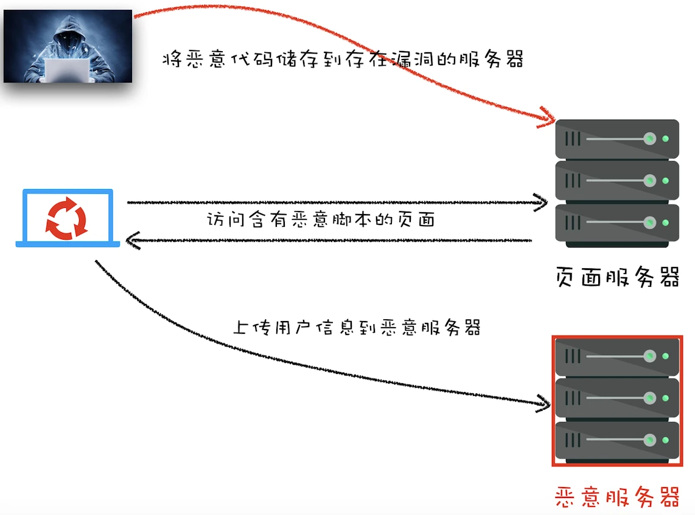

# 安全

## 1. XSS 跨站脚本攻击

### 1.2 XSS 如何注入恶意脚本

**有三种方式：**

- 1. 存储型 XSS 攻击
- 2. 反射型 XSS 攻击
- 3. 基于 DOM 的 XSS 攻击

#### 1.2.1 存储型 XSS 攻击

_XSS 攻击示意图_



- step1: 黑客利用*站点漏洞*将一段恶意 JavaScript 代码提交到**网站的数据库中**
- step2: 用户向网站请求包含了恶意 JavaScript 脚本的页面
- step3: 恶意脚本就会将用户的 Cookie 信息等数据上传到服务器

如：用户把一个视频名称“script”脚本，然后成功上传到“youtube”等视频平台；最后“script”被存放到服务器，有人访问这个视频时，会执行该“script”里的代码。

#### 1.2.2 反射型 XSS 攻击

**黑客**将恶意 JS 脚本作为发送给网站请求中的一部分，随后网站又把恶意 JavaScript 脚本返回给用户。

如：请求下面的链接

```js
http://localhost:3000/?xss=<script>alert('你被xss攻击了')</script>
```

服务器直接把请求的内容返回：

```js
var express = require("express");
var router = express.Router();

router.get("/", function (req, res, next) {
  // 直接返回url总的 xss 信息给客户端
  res.render("index", { title: "Express", xss: req.query.xss });
});

module.exports = router;
```

如何实施？

- 1. 可以通过这样的方式，在 QQ 群、邮件等渠道发布这样的恶意链接
- 2. 用户点击恶意链接，**将一段含有恶意代码的请求提交给 Web 服务器**
- 3. 这样就利用用户把**恶意脚本**注入到页面中执行

#### 1.2.3 基于 DOM 的 XSS 攻击

基于 DOM 的 XSS 攻击是**不牵涉到页面 Web 服务器**，黑客通过各种手段直接将恶意脚本注入用户的页面中。

主要是*通过网络劫持在页面传输过程中修改 HTML 页面的内容*，比如：

- 1. 通过 WiFi 路由器劫持的
- 2. 通过本地恶意软件来劫持的

### 1.3 如何防止 XSS 攻击

- 1. 服务器对输入脚本进行过滤或转码
- 2. 充分利用 [CSP](https://developer.mozilla.org/zh-CN/docs/Web/HTTP/CSP)

  **CSP**主要是通过 <code style="color: #708090; background-color: #F5F5F5; font-size: 18px">Content-Security-Policy</code> HTTP 头部来指定你的策略。

  _如：一个网站管理者想要所有内容均来自站点的同一个源 (不包括其子域名)_

  ```js
  Content-Security-Policy: default-src 'self'
  ```

- 3. 使用 [Set-Cookie 的 HttpOnly 属性](https://developer.mozilla.org/zh-CN/docs/Web/HTTP/Cookies#%E9%99%90%E5%88%B6%E8%AE%BF%E9%97%AE_cookie)

  很多 XSS 攻击都是来盗用 Cookie 的，因此还可以通过使用 HttpOnly 属性来保护我们 Cookie 的安全。

## 2. CSRF 跨站请求伪造

## 参考
