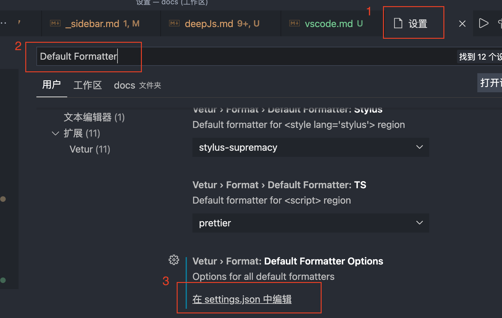

# VS Code

> 前端 IDE 目前过了纷争的时代，VS Code 很有可能会大一统。

## 1. 格式化

### 1.2 prettier 美化格式

1. 编辑器左下角，打开 VS Code 设置，快捷键 “cmd + ,”

2. 在上方的搜索栏输入“Default Formatter”

3. 点击下发“配置 json”文件

4. 输入相应的配置信息

[官方 vscode 配置 prettier](https://marketplace.visualstudio.com/items?itemName=esbenp.prettier-vscode)

## 2. 调试

## 参考

[VSCode 调试中 launch.json 配置不完全指南](https://www.barretlee.com/blog/2019/03/18/debugging-in-vscode-tutorial/)
