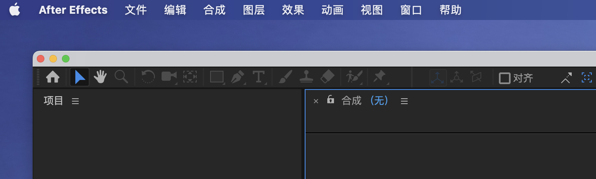
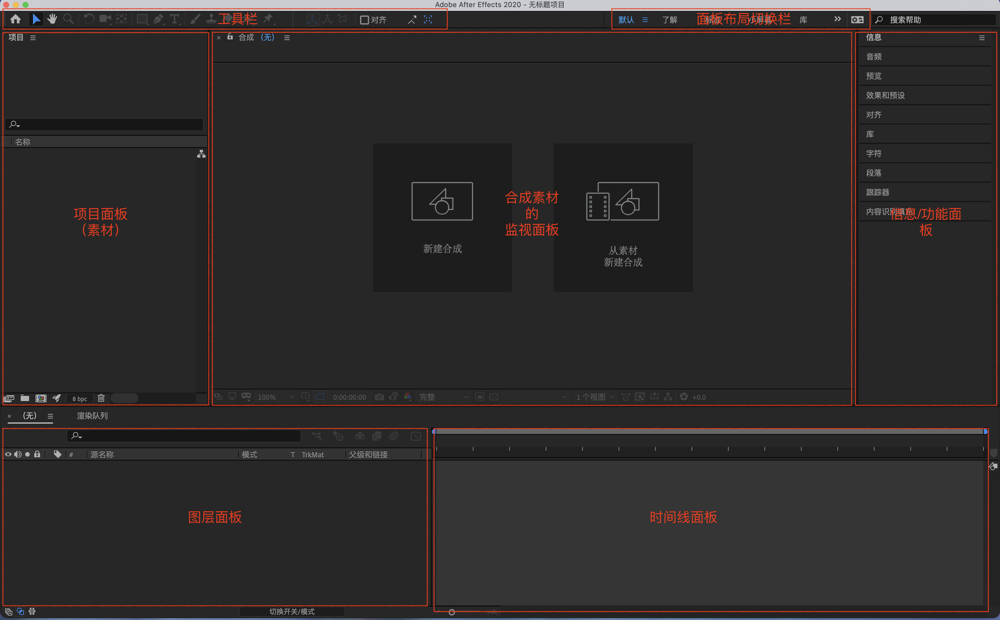
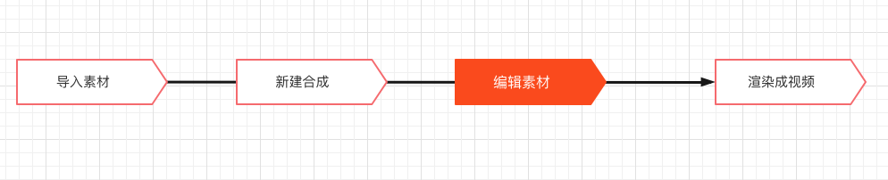

# After Effects

> 动效让视频更加生动。

<code style="color: #708090; background-color: #F5F5F5; font-size: 18px">After Effects</code>(AE)一套影片制作软件。

<code style="color: #708090; background-color: #F5F5F5; font-size: 18px">AE</code>主要用于<code style="color: #708090; background-color: #F5F5F5; font-size: 18px">动画制作</code>和<code style="color: #708090; background-color: #F5F5F5; font-size: 18px">视觉特效</code>。

## 1. AE 基本概念

### 1.1 菜单栏与工作界面

_ae 2020 菜单栏：_

_ae 2020 工作界面：_

### 1.2 内容相关的概念

- 项目：一个 AE 文件（.aep）就是一个项目，项目中将<code style="color: #708090; background-color: #F5F5F5; font-size: 18px">素材</code>处理成多个**合成**

- 素材：可以是图片、视频、音频、3D 文件、合成等

- 合成：对一个或多个<code style="color: #708090; background-color: #F5F5F5; font-size: 18px">素材</code>的所有操作

- 层：每个单独的媒体对象（影片剪辑，音讯剪辑，静态图像等）都有自己**独立的轨道**，称作一个<code style="color: #708090; background-color: #F5F5F5; font-size: 18px">层</code>

- 关键帧：元素“动作”的关键节点

- 动作：让<code style="color: #708090; background-color: #F5F5F5; font-size: 18px">素材</code>按<code style="color: #708090; background-color: #F5F5F5; font-size: 18px">关键帧</code>动起来

- 时间轴：控制每一层元素<code style="color: #708090; background-color: #F5F5F5; font-size: 18px">动作</code>的执行时间

- 蒙板：透过上一层看到下一层

### 1.3 操作相关的概念

## 2. AE 工作流

- 工具栏
- 关键帧
- 图层工具
