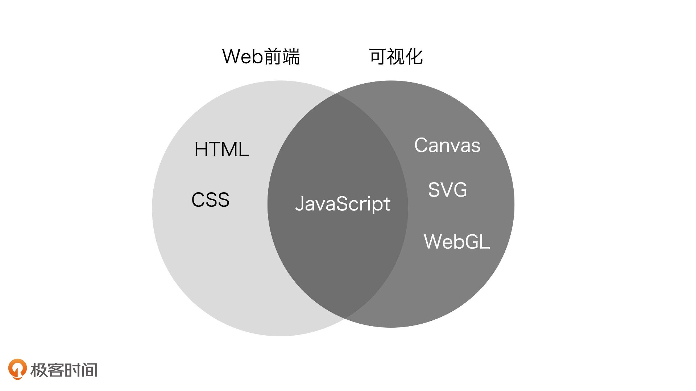
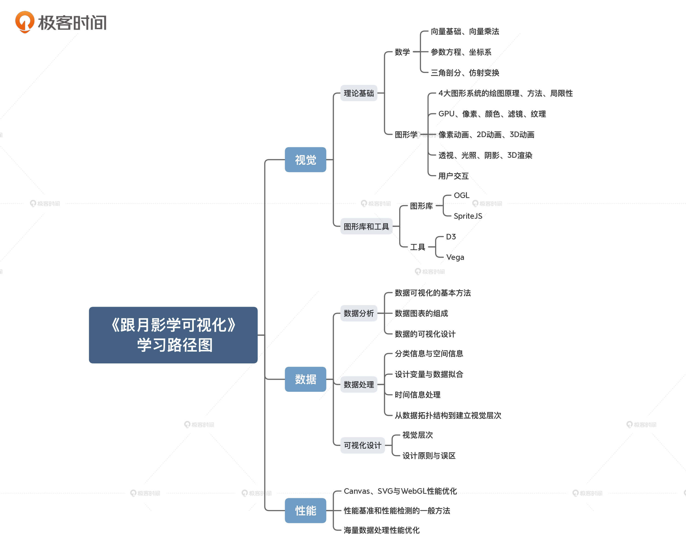
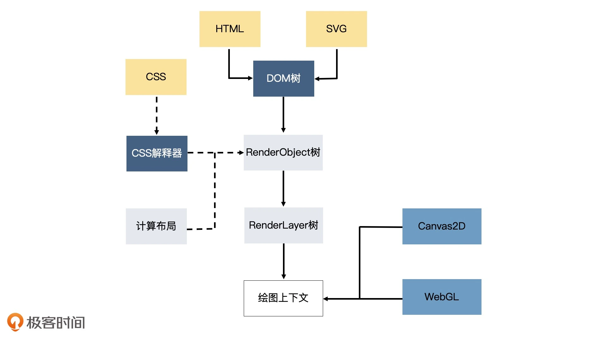
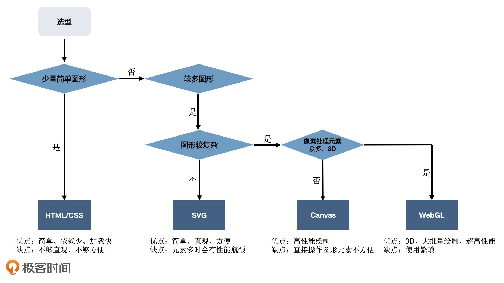
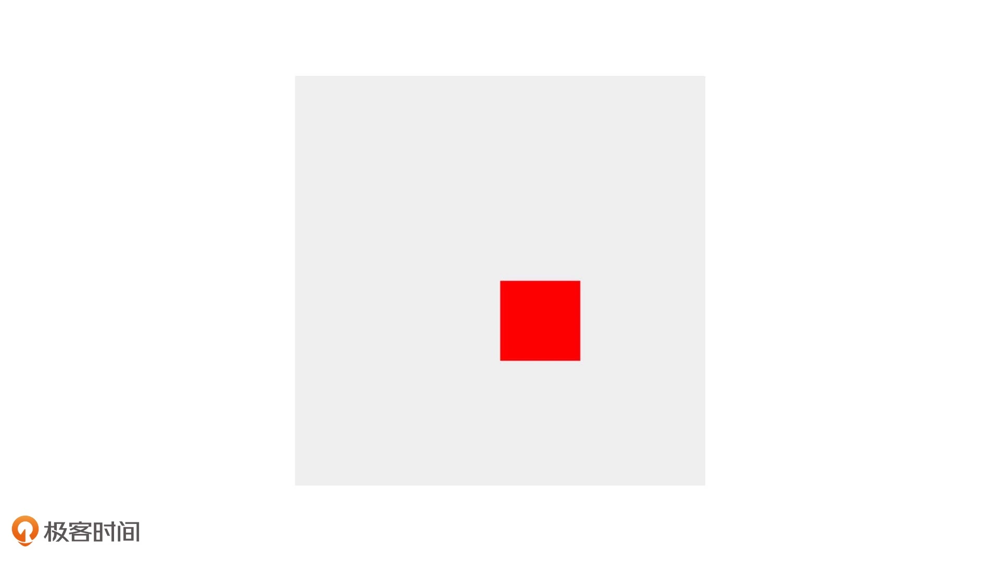
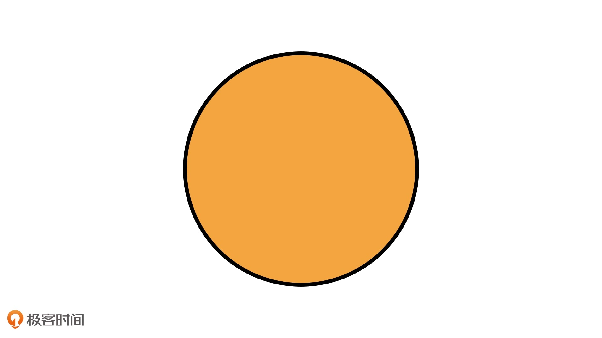
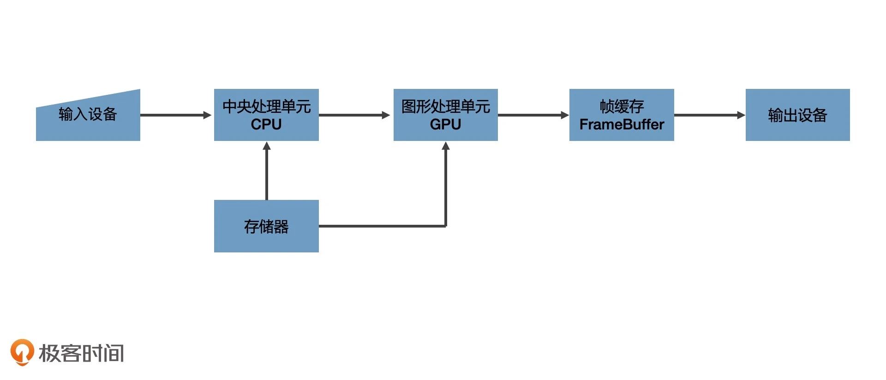
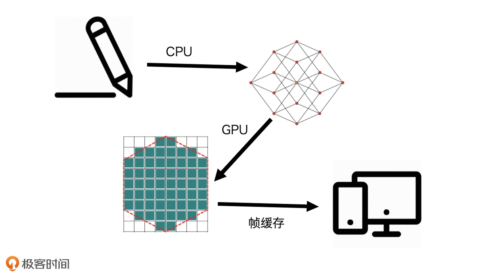
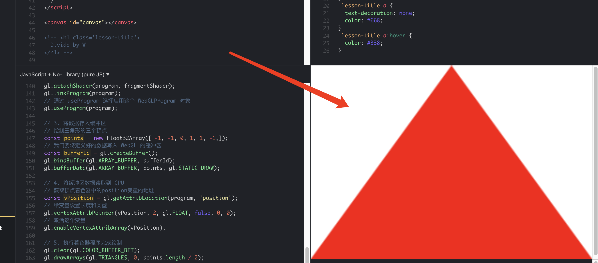

# 可视化基础

## 1. 什么是可视化

[可视化](https://zh.wikipedia.org/wiki/%E5%8F%AF%E8%A7%86%E5%8C%96)

> 可视化是指用于创建图形、图像或动画，以便交流沟通讯息的任何技术和方法。 -- wikipedia

### 1.1 Web前端与可视化



### 1.2 可视化领域的工具

- 图表库：封装集成快速绘制各种类型图表，如 ECharts、G2

- 地理库：处理地图、地理位置的可视化，GIS 地图库：[Mapbox](https://www.mapbox.com/)、[Leaflet](https://leafletjs.com/)、Deck.gl、CesiumJS 等等

- 渲染库：处理视觉呈现,绘制其他更灵活的图形、图像或者物理模型: [ThreeJS](https://threejs.org/)、Pixi.js、[Rough.js](https://github.com/rough-stuff/rough)(手绘风格的图形库)、ZRender(ECharts 依赖的图形渲染引擎)

- 数据驱动框架：处理数据，[D3.js]()数据驱动,门槛高



## 2. 可视化基础技术及对比

> 库再多，都是为了简化我们对基础的图形API的使用。

- HTML/CSS

- Svg：

  优点：声明式，绘制图片比较便利

  缺点：需要

- Canvas：

  优点：性能比SVG和HTML/CSS好，直接操作绘图上下文

  缺点：命令式，操作灵活性差，不能方便地控制它内部的图形元素，

- WebGL：可以画3D，API更加底层，使用难度大。但是，可以使用GPU提高性能，在渲染大量数据、滤镜、光影等场景不可替代





## 3. Canvas

SVG 属于**声明式**绘图系统，即：根据数据创建各种不同的图形元素。

Canvas2D 通过调用绘图指令，然后引擎直接在页面上绘制图形，是一种**指令式**的绘图系统。

### 3.1 什么是 Canvas

### 3.2 Canvas 原理

Canvas 元素在浏览器上**1. 创造一个空白的画布**，通过提供渲染上下文，赋予我们绘制内容的能力。

我们只需要调用渲染上下文，**2. 设置各种属性**，然后**3. 调用绘图指令**完成输出，就能在画布上呈现各种各样的图形了。

Canvas 能够直接操作绘图上下文，不需要经过 HTML、CSS 解析、构建渲染树、布局等一系列操作。

因此单纯绘图的话，Canvas 比 HTML/CSS 和 SVG 要快得多。

### 3.3 Canvas 优缺点

**缺点**：

- Canvas 绘制整个柱状图的过程就是一系列指令的执行过程，这让我们很难单独对 Canvas 绘图的**局部进行控制**，如：添加点击事件。

如何解决？

通过数学计算我们是可以**通过定位的方式来获取局部图形**。

**优点**：

- 简单易用
- 渲染起来相当高效

### 3.4 Canvas 使用

1. 设置画布大小

```html
<body>
  <canvas width="512" height="512"></canvas>
</body>
```

2. 获取 canvas 上下文

```js
// 获取canvas对象
const canvas = document.querySelector("canvas");
// 获取canvas上下文
const context = canvas.getContext("2d");
```

3. 调用 canvas 上下文方法绘图

```js
// 在canvas中心点绘制一个 100 * 100 的红色正方形
// 定义尺寸
const rectSize = [100, 100];
// 定义填充颜色
context.fillStyle = "red";
context.beginPath();
// 绘图
context.rect(0.5 * canvas.width, 0.5 * canvas.height, ...rectSize);
// 填充颜色
context.fill();
```

步骤总结：

---

1. 获取 Canvas 对象，通过 getContext(‘2d’) 得到 2D 上下文；
2. 设置绘图状态，比如填充颜色 fillStyle，平移变换 translate 等等；
3. 调用 beginPath 指令开始绘制图形；
4. 调用绘图指令，比如 rect，表示绘制矩形；
5. 调用 fill 指令，将绘制内容真正输出到画布上。



### 3.5 Canvas 知名库与原理

- Echarts

## 4. Svg

### 4.1 什么是 Svg

<code style="color: #708090; background-color: #F5F5F5; font-size: 18px">SVG</code>（Scalable Vector Graphics，可缩放矢量图）是一种基于 XML 语法的**图像格式**，可以用图片（img 元素）的 src 属性加载。

<code style="color: #708090; background-color: #F5F5F5; font-size: 18px">SVG</code> 则弥补了 HTML/CSS 绘制不规则图形的不足，让不规则图形的绘制变得更简单了。

**缺点**：

- 在渲染引擎中，SVG 元素和 HTML 元素一样，在输出图形前都需要经过引擎的解析、布局计算和渲染树生成

- 一个 SVG 元素只表示一种基本图形，数据复杂时绘制图形很多，性能急剧下降

**结论**：

> 只适合应用于元素较少的简单可视化场景.

### 4.2 Svg 怎么用

```html
<svg xmlns="http://www.w3.org/2000/svg" version="1.1">
  <circle
    cx="100"
    cy="50"
    r="40"
    stroke="black"
    stroke-width="2"
    fill="orange"
  />
</svg>
```

- svg 元素: 是 SVG 的根元素
- xmlns 属性: 值是"http://www.w3.org/2000/svg"，浏览器根据这个属性值就能够识别出这是一段 SVG 的内容了
- circle 元素: 表示这是一个绘制在 SVG 图像中的圆形
- cx 和 cy 是坐标: 表示圆心的位置在图像的 x=100、y=50 处



## 5. WebGL

WebGL 是基于 OpenGL ES 规范的浏览器实现，API 相对更底层，使用起来略微麻烦。

WebGL 是浏览器提供的功能强大的绘图系统，它使用比较复杂，但是功能强大，能够充分利用 GPU 并行计算的能力，来快速、精准地操作图像的像素，在同一时间完成数十万或数百万次计算。

另外，它还内置了对 3D 物体的投影、深度检测等处理，这让它更适合绘制 3D 场景。

*图形系统绘制的流程：*

1. 输入设备接收绘制信息
2. CPU 处理，成为具有特定结构的**几何信息**，即：对给定的数据结合绘图的场景要素（例如相机、光源、遮挡物体等等）进行计算，最终将图形变为屏幕空间的 2D 坐标
3. 信息会被送到 GPU 中进行处理，经过两个步骤生成**光栅信息**,为屏幕空间的每个像素点进行着色，把最终完成的图形输出到显示设备上
4. 





### 5.1 WebGL 如何绘制一个三角形

1. 创建 WebGL 上下文
2. 创建 WebGL 程序（WebGL Program）
3. 将数据存入缓冲区
4. 将缓冲区数据读取到 GPU
5. GPU 执行 WebGL 程序，输出结果

```javascript
// 1. 创建 WebGL 上下文
const canvas = document.querySelector('canvas');
const gl = canvas.getContext('webgl');

// 2. 创建 WebGL 程序，编写两个着色器（着色器是用 GLSL 语言编写）
// 顶着色器（Vertex Shader），负责处理图形的顶点信息，可理解为GPU需要处理的代码，可以改变顶点的信息（如顶点的坐标、法线方向、材质等等），从而改变我们绘制出来的图形的形状或者大小等等
const vertex = ` attribute vec2 position; void main() { gl_PointSize = 1.0; gl_Position = vec4(position, 1.0, 1.0); }`;
// 片元着色器（Fragment Shader），负责处理图形的像素信息，就是处理光栅化后的像素信息
const fragment = ` precision mediump float; void main() { gl_FragColor = vec4(1.0, 0.0, 0.0, 1.0); } `;
// 创建JS可以调用的 shader 对象
const vertexShader = gl.createShader(gl.VERTEX_SHADER);
gl.shaderSource(vertexShader, vertex);
gl.compileShader(vertexShader);
const fragmentShader = gl.createShader(gl.FRAGMENT_SHADER);
gl.shaderSource(fragmentShader, fragment);
gl.compileShader(fragmentShader);
// 创建 WebGLProgram 对象，并将这两个 shader 关联到这个 WebGL 程序上
const program = gl.createProgram();
gl.attachShader(program, vertexShader);
gl.attachShader(program, fragmentShader);
gl.linkProgram(program);
// 通过 useProgram 选择启用这个 WebGLProgram 对象
gl.useProgram(program);

// 3. 将数据存入缓冲区
// 绘制三角形的三个顶点
const points = new Float32Array([ -1, -1, 0, 1, 1, -1,]);
// 我们要将定义好的数据写入 WebGL 的缓冲区
const bufferId = gl.createBuffer();
gl.bindBuffer(gl.ARRAY_BUFFER, bufferId);
gl.bufferData(gl.ARRAY_BUFFER, points, gl.STATIC_DRAW);

// 4. 将缓冲区数据读取到 GPU
// 获取顶点着色器中的position变量的地址
const vPosition = gl.getAttribLocation(program, 'position');
// 给变量设置长度和类型
gl.vertexAttribPointer(vPosition, 2, gl.FLOAT, false, 0, 0);
// 激活这个变量
gl.enableVertexAttribArray(vPosition);

// 5. 执行着色器程序完成绘制
gl.clear(gl.COLOR_BUFFER_BIT);
gl.drawArrays(gl.TRIANGLES, 0, points.length / 2);
```

*绘制结果如下：⬇️*



### 5.5 WebGL 知名库与原理

3D 框架

- Babylon.js -- 3D 引擎，微软出品
- Three.js -- 3D 开发工具箱，功能丰富，开源社区
- PlayCanvas -- Web 游戏引擎框架，被 Snapchat 收购
- Cocos Creator -- 跨平台 2D、3D 游戏创造工具

组件化开发库

- React Three Fiber 封装 React 组件的 Three.js

## 7. 数学基础

> 计算机绘制图形，就是控制像素点在一个坐标系内的展现。

### 7.1 坐标系


## 8. 视觉呈现

基础阶段，我们主要讨论如何以像素化的方式处理图案，来实现各种细节效果。

在高级阶段，我们讨论动画、3D 和交互等更深入的话题。

## 9. 性能优化


----

**参考**

[跟月影学可视化](https://time.geekbang.org/column/article/252076)
