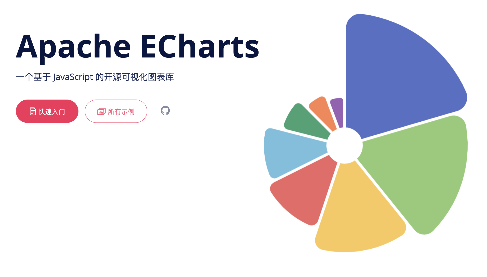
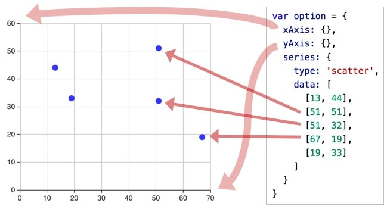

# 深入ECharts

> ECharts 应该是应用最广泛的图表库，我们一起来探究下。

## 1. ECharts 能做什么

_官网首页：_



从 <code style="color: #708090; background-color: #F5F5F5; font-size: 18px">ECharts</code> 官网首页可以看出，<code style="color: #708090; background-color: #F5F5F5; font-size: 18px">ECharts</code> 是一个基于 JavaScript 的开图表源库。

_官网给我们总结好了 ECharts 的特性：_


## 2. ECharts 怎么用

- 1. 引入 ECharts：ECharts

  - <code style="color: #708090; background-color: #F5F5F5; font-size: 18px">\<script\></code> 标签引入；

  - npm 在项目中安装 ECharts 包；[在打包环境中使用 ECharts](https://echarts.apache.org/zh/tutorial.html#%E5%9C%A8%E6%89%93%E5%8C%85%E7%8E%AF%E5%A2%83%E4%B8%AD%E4%BD%BF%E7%94%A8%20ECharts)

  ```shell
  npm install echarts --save
  ```

  ```js
  // 像上面一样，基于准备好的dom，初始化echarts实例
  import * as echarts from "echarts";
  ```

  _JS 中按需引入：_

  ```js
  // 引入 echarts 核心模块，核心模块提供了 echarts 使用必须要的接口。
  import * as echarts from "echarts/core";
  // 引入柱状图图表，图表后缀都为 Chart
  import { BarChart } from "echarts/charts";
  // 引入提示框，标题，直角坐标系组件，组件后缀都为 Component
  import {
    TitleComponent,
    TooltipComponent,
    GridComponent,
  } from "echarts/components";
  // 引入 Canvas 渲染器，注意引入 CanvasRenderer 或者 SVGRenderer 是必须的一步
  import { CanvasRenderer } from "echarts/renderers";

  // 注册必须的组件
  echarts.use([
    TitleComponent,
    TooltipComponent,
    GridComponent,
    BarChart,
    CanvasRenderer,
  ]);

  // 接下来的使用就跟之前一样，初始化图表，设置配置项
  var myChart = echarts.init(document.getElementById("main"));
  myChart.setOption({});
  ```

- 2. 为 ECharts 准备一个具备大小（宽高）的 DOM 元素

  ECharts 想要展示，总得有个容器吧.

- 3. 基于准备好的 dom，初始化 echarts 实例

  ```js
  var myChart = echarts.init(document.getElementById("main"));
  ```

- 4. 指定图表的配置项和数据

  <span style="color: #ff0000; font-size: 16px;">配置项</span>告诉 ECharts **如何展示**，如：tittle(标题)、legend(图例)、xAxis(X 轴)、yAxis(Y 轴)、series(系列);

  <span style="color: #ff0000; font-size: 16px;">数据</span>告诉 ECharts **要展示什么**。

  ```js
  var option = {
    title: {
      text: "ECharts 入门示例",
    },
    tooltip: {},
    legend: {
      data: ["销量"],
    },
    xAxis: {
      data: ["衬衫", "羊毛衫", "雪纺衫", "裤子", "高跟鞋", "袜子"],
    },
    yAxis: {},
    series: [
      {
        name: "销量",
        type: "bar",
        <!-- 这里指定要展示的数据 -->
        data: [5, 20, 36, 10, 10, 20],
      },
    ],
  };
  ```

- 5. 使用刚指定的配置项和数据显示图表

  ```js
  myChart.setOption(option);
  ```

## 3. ECharts 的基础概念

官网文档写的非常详细 👉 [ECharts 基础概念概览](https://echarts.apache.org/zh/tutorial.html#ECharts%20%E5%9F%BA%E7%A1%80%E6%A6%82%E5%BF%B5%E6%A6%82%E8%A7%88)

### 3.1 ECharts 实例

> 一个图表就是一个实例.

### 3.2 系列（series）

> <span style="color: #ff0000; font-size: 16px;">一组**数值**以及他们映射成的**图**</span>，所以记住啦，<code style="color: #708090; background-color: #F5F5F5; font-size: 18px">系列（series）</code>**不单单指一系列数据，也包含数据映射成为的图**。

1. <code style="color: #708090; background-color: #F5F5F5; font-size: 18px">系列（series）</code>是个数组，一个实例可以有多个<code style="color: #708090; background-color: #F5F5F5; font-size: 18px">系列（series）</code>.

2. 系列类型（series.type）就是**图表类型**,如：pie（饼图系列）、line（折线图系列）、bar（柱状图系列）

3. 系列数据（series.data）描述了要展示的**图表内容**


### 3.3 组件（component）

> echarts 中各种内容，被抽象为<code style="color: #708090; background-color: #F5F5F5; font-size: 18px">组件（component）</code>，<code style="color: #708090; background-color: #F5F5F5; font-size: 18px">系列（series）</code>也是一种<code style="color: #708090; background-color: #F5F5F5; font-size: 18px">组件（component）</code>。


### 3.4 选项（options）

> ECharts 根据 <code style="color: #708090; background-color: #F5F5F5; font-size: 18px">选项（options）</code>来生成**实例**。

ECharts 官网有一篇关于**ECharts 论文**的介绍：


论文的题目是：[ECharts: A Declarative Framework for Rapid Construction of Web-based Visualization](http://www.cad.zju.edu.cn/home/vagblog/VAG_Work/echarts.pdf)

翻译一下：

> ECharts: 用于快速构建基于 Web 的可视化的**声明式**框架.

我们重点关注的是这个词 -- <code style="color: #708090; background-color: #F5F5F5; font-size: 18px">Declarative（声明式）</code>。

什么是[声明式编程](https://zh.wikipedia.org/wiki/%E5%AE%A3%E5%91%8A%E5%BC%8F%E7%B7%A8%E7%A8%8B)?

> **声明式编程**是与**命令式编程**相对的。假如我们想回家，你有两种回家方式，一种是 -- **自驾（命令式）**，每一步都需要你亲自来做，打方向盘、刹车、踩油门、等红路灯...; 还有一种方式 -- **打车（声明式）**，你直接告诉司机：“我要去汤臣一品”，“我要去汤臣一品”这个就是你的“声明”，然后你不用管具体的开车过程。这里汽车可以类比我们的 ECharts。对于前端来说，另一个声明式与命令式的例子是**React**与**JQuery**。

那么，ECharts 是个如何声明呢？

> 答：options.

**options 的作用**🌟🌟🌟

<code style="color: #708090; background-color: #F5F5F5; font-size: 18px">options</code>声明了：<span style="color: #ff0000; font-size: 16px;">数据</span>、<span style="color: #ff0000; font-size: 16px;">数据如何映射成图形</span>、<span style="color: #ff0000; font-size: 16px;">交互行为</span>。

```js
// 创建 echarts 实例。
var dom = document.getElementById('dom-id');
var chart = echarts.init(dom);

// 用 option 描述 `数据`、`数据如何映射成图形`、`交互行为` 等
// option 是个大的 JavaScript 对象。
var option = {
  // option 每个属性是一类组件。
  legend: {...},
  grid: {...},
  tooltip: {...},
  toolbox: {...},
  dataZoom: {...},
  visualMap: {...},
  // 如果有多个同类组件，那么就是个数组。例如这里有三个 X 轴
  xAxis: [
      // 数组每项表示一个组件实例，用 type 描述“子类型”。
      {type: 'category', ...},
      {type: 'category', ...},
      {type: 'value', ...}
  ],
  // 这里有2个 Y 轴
  yAxis: [{...}, {...}],
  // 这里有多个系列，也是构成一个数组
  series: [
      // 每个系列，也有 type 描述“子类型”，即“图表类型”。
      {type: 'line', data: [['AA', 332], ['CC', 124], ['FF', 412], ... ]},
      {type: 'line', data: [2231, 1234, 552, ... ]},
      {type: 'line', data: [[4, 51], [8, 12], ... ]}
  }]
};

// 调用 setOption 将 option 输入 echarts，然后 echarts 渲染图表。
chart.setOption(option);
```

### 3.5 坐标系

> 想要精确画出图表，有时坐标系是必不可少的，有时又不需要坐标系。

line（折线图）、bar（柱状图）、scatter（散点图）、heatmap（热力图）等等需要**坐标系**；

pie（饼图）、tree（树图）等等，并**不依赖坐标系**；

graph（关系图）等，既能独立存在，也能布局在坐标系中。

> 一个坐标系，可能由多个组件协作而成。

**坐标系分类：**

- 直角坐标系: 包括有**三种组件**;

  - 1. xAxis（直角坐标系 X 轴）
  - 2. yAxis（直角坐标系 Y 轴）
  - 3. grid（直角坐标系底板）

  <span style="color: #ff0000; font-size: 16px;">xAxis、yAxis 被 grid 自动引用并组织起来，共同工作</span>。

  _echarts 暗自为他们创建了 grid 并关联起 xAxis 和 yAxis:_

  

- 极坐标系
- 地理坐标系（GEO）
- 单轴坐标系
- 日历坐标系

一个<code style="color: #708090; background-color: #F5F5F5; font-size: 18px">系列（series）</code>，往往能运行在不同的<code style="color: #708090; background-color: #F5F5F5; font-size: 18px">坐标系中</code>。

例如，一个 scatter（散点图）能运行在 直角坐标系、极坐标系 、地理坐标系（GEO） 等各种坐标系中。

一个<code style="color: #708090; background-color: #F5F5F5; font-size: 18px">坐标系</code>，也能承载不同的<code style="color: #708090; background-color: #F5F5F5; font-size: 18px">系列（series）</code>。

如上面出现的各种例子，直角坐标系 里承载了 line（折线图）、bar（柱状图）等等。

### 3.6 组件的定位

<code style="color: #708090; background-color: #F5F5F5; font-size: 18px">ECharts</code>的定位有三种：

- 绝对定位：**grid 组件**（也就是直角坐标系的底板）设置 left、right、height、bottom

  

- 中心半径定位

  有些组件可以使用“中心半径定位”，例如，pie（饼图）、sunburst（旭日图）、polar（极坐标系）；

  中心半径定位，往往依据 center（中心）、radius（半径）来决定位置。

- 其他定位

  - 少数组件有自己特殊的定位方式，在他们的文档介绍中会有说明

## 4. ECharts 源码解读

**》Step1: 下载源码**

```shell
git clone https://github.com/apache/echarts.git
```

**》Step2: 安装依赖**

```shell
cd echarts
npm i
```

**》Step3: 目录结构分析**


- package.json: NPM 管理的前端项目，必须先看它的 package.json 文件是怎样的


## 5. 自己实现一个 ECharts

实现的主要功能：
- 可以画一个pipe图

## 6. ECharts 新特性

使用详情看这里：[5 分钟上手 ECharts](https://echarts.apache.org/zh/tutorial.html#5%20%E5%88%86%E9%92%9F%E4%B8%8A%E6%89%8B%20ECharts)

## 参考

[ECharts 官网](https://echarts.apache.org/zh/index.html)

[ECharts github 地址](https://github.com/apache/echarts)
